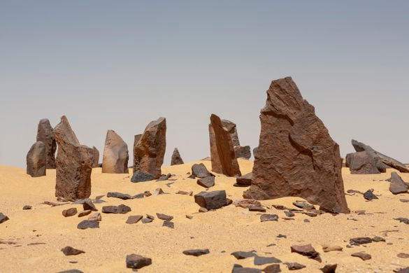
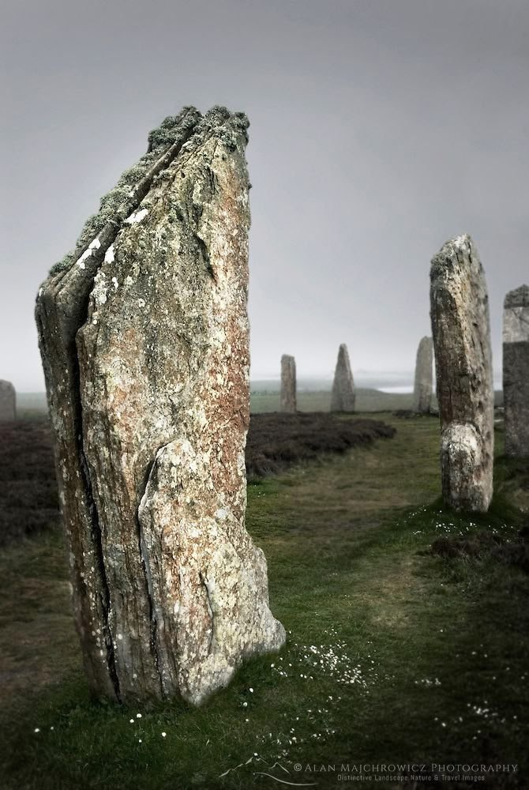
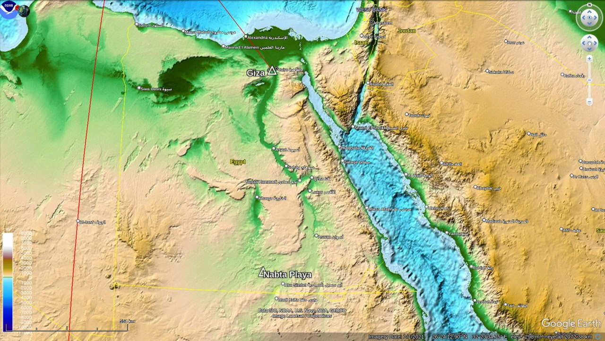
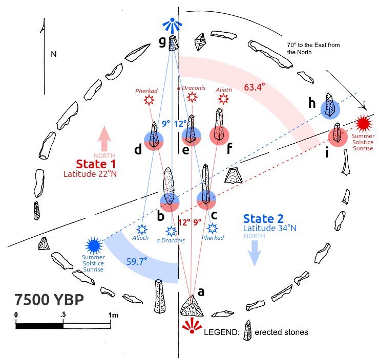
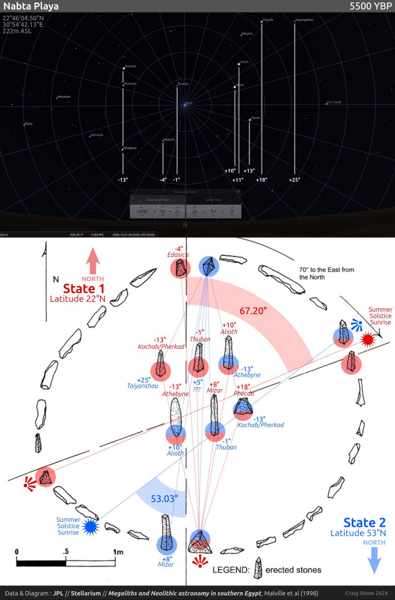
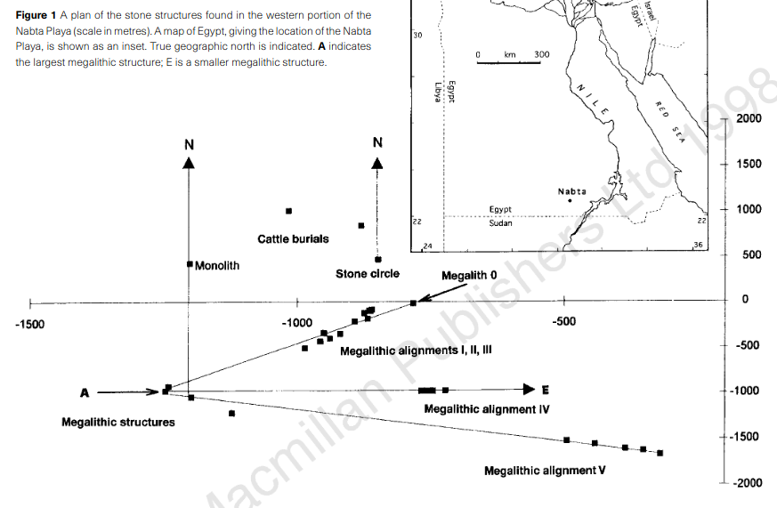
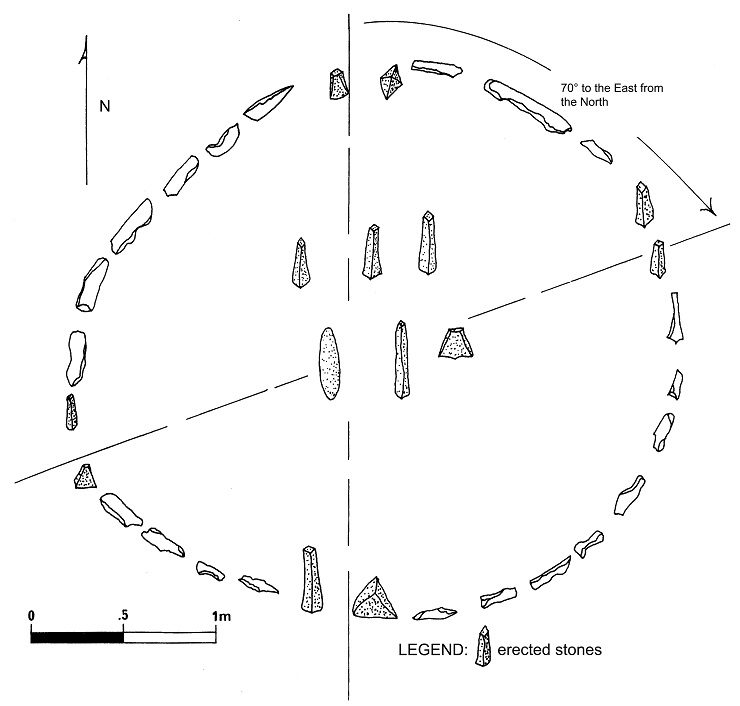
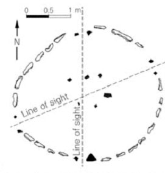

# Nabta Playa [1]

Nabta Playa is located approximately 800 km south of Cairo[1] or about 100 km west of Abu Simbel in southern Egypt, 22.51° north, 30.73° east (on the same longitude as the Giza Plateau). The megalithic circle, for which this Nubian Desert site is most well known, bears a remarkable resemblance (both aesthetic and astronomical) to the works of the Grooved Ware culture found across Britain and Europe, 5,000 km away.[2] 

This site is old, with evidence of human activity going back at least 9ka. "Beginning slightly before 8000 bp and continuing until about 7300 years ago, there was a long humid period when groups using the EI Nabta and Al Jerar varieties of Early Neolithic occupied the area."[3] This is the period during which the astronomical calendar and other structures in the area were apparently erected, and then something happened...

"Shortly after 7300 bp, there was another decline in rainfall, accompanied by renewed aeolian activity and a reduction of the vegetation cover on the surrounding elevated areas. The seasonal torrential rains again carried a heavy sediment load. In less than 100 years these resulted in thick alluvial deltas at the mouths of the wadis entering the basin, and the deposition of over 6 m of playa sediments in the center of the Nabta Basin. It was also the last time that lacustrine sands and silts accumulated in the center of the Nabta Basin. This period of rapid playa accumulation was followed by a brief, sharp interval of hyper-aridity when the landscape was heavily deflated by high winds accompanied by heavy sandstorms. This deflation created a basin several hundred meters in diameter. This is where Site E-75-8 is located. Known as the "Post-AI Jerar Arid Phase," this dry period is bracketed between the latest Al Jerar occupation and the onset of the moist period associated with El Ghanam Middle Neolithic, between 7300 and 7100 years ago."[3]

The combination of heavy sediment and brief hyper-aridity could be evidence of a Mediterranean inundation from the north 7400 years ago (2 x 3700 years, the V planetary harmonic), my strongest candidate for the Noahic Deluge. [4] 

Pic 1 is Nabta Playa, Nubian Desert. Pic 2 is the Ring of Brodgar, Orkney Islands.

1. https://en.wikipedia.org/wiki/Nabta_Playa
2. https://archive.org/details/urielsmachinepre0000knig
3. https://openlibrary.org/books/OL20644201M/Holocene_settlement_of_the_Egyptian_Sahara.
4. https://t.me/nobulart/2607

## Celestial Alignment [1]

This is an interesting site. The stones are arranged in such a way that it could have been used to make the same north celestial pole observation in both S1(red) and S2 (blue), and could also have possibly been used to observe the summer solstice sunrise in both states (at both 22N in S1, and 34N in S2). Draconis would have been the closest star to the NCP 7500YBP. Pherkad and Alioth are approximately 9 and 12 degrees on either side of Draconis (just as an example of how these stones may have been used for sighting).

The northern sky of Nabta Playa in 3500 BC (shortly before the site was abandoned). No less than seven stones have azimuthal stellar alignments with the brightest stars around the north celestial pole at the moment when Kochan, Pherkad and Athebyne line up vertically every night. This could have been used to monitor polar nutation and to measure the length of day with sub-minute precision, providing 7-point confirmation. In state 2, no less than 6 of the brightest north celestial stars (5 of them the same stars) are once again azimuthally aligned to the stones in the circle. Five stones provide 2- and 3-point alignments for the summer solstice sunrise in both State 1 and State 2 of the ECDO model.

The solar azimuth positions were drawn from JPL's Horizons app. The stellar positions were taken from Stellarium (which has had several papers published on the topic of its exceptional utility as an archaeoastronomy tool). The site diagram is from Megaliths and Neolithic astronomy in southern Egypt, Malville et al (1998). 4. A sighting location of 22°46'04.50"N 30°54'42.13"E and elevation of 222m was used for both [1] and [2] (the State 2 position would have to be calculated as a check on my own calc as well).

1. https://ssd.jpl.nasa.gov/horizons/
2. https://stellarium.org
3. https://sci-hub.ru/10.1038/33131

## Doube checking celestial alignment

### What the site consists of [2]

The calendar circle at Nabta Playa is the most famous and well-documented feature. It is a stone circle with several stones placed in such a way that they are aligned with the summer solstice sunrise.

Beyond the calendar circle, there are rows of standing stones that have been interpreted as being aligned with certain important stars or star systems.

About 200m in elevation.

### A closer look

So, let's take a look at these pictures.

This is a big site. We can see that the stones span over a kilometer in lateral distance.

Looking at Google Maps terrain, there are clear flow lines going vertically down near the site, parallel to the paths of rotation experienced at this point. This could have contributed to potential displacement of the original stone alignment.

### The circle

"During the 1997 season, we combined theodolite and differential global positioning system measurements to map the megaliths, and established the centre of structure A at 22,30,29.70 N, 30,43,31.20 W. We discovered two additional megalithic alignments, which also radiate out from the vicinity of structure A, with azimuths of 90.02 and 126." [3]

"The circle (E-92-9) of small upright and recumbent slabs, with a diameter slightly less than 4 m (Fig. 3a–c), contains four sets of upright slabs, which may have been used for sighting along the horizon. The circle is too small to have functioned as a precise sighting device. The centre lines of the two windows have azimuths of 358 and 62 [degrees]".

### S1 -> S2

After this place rotates, it goes from about 22.51 N, 30.73 E to 53.59 N, 148.45 West.

## Summer Solstice

When the axial tilt of 23.5 degrees is rotated directly towards the sun (summer solstice), this location at 22.51 N goes to 1.01 S in the orbital plane.

## Citations

1. [Craig Stone](https://nobulart.com)
2. GPT
3. https://sci-hub.ru/10.1038/33131