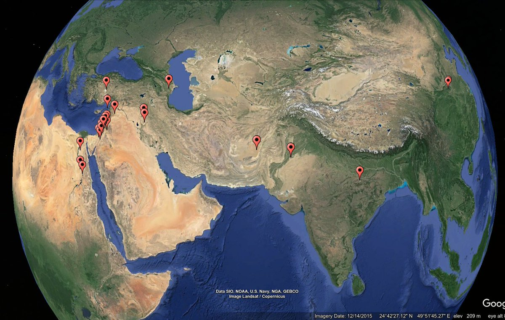
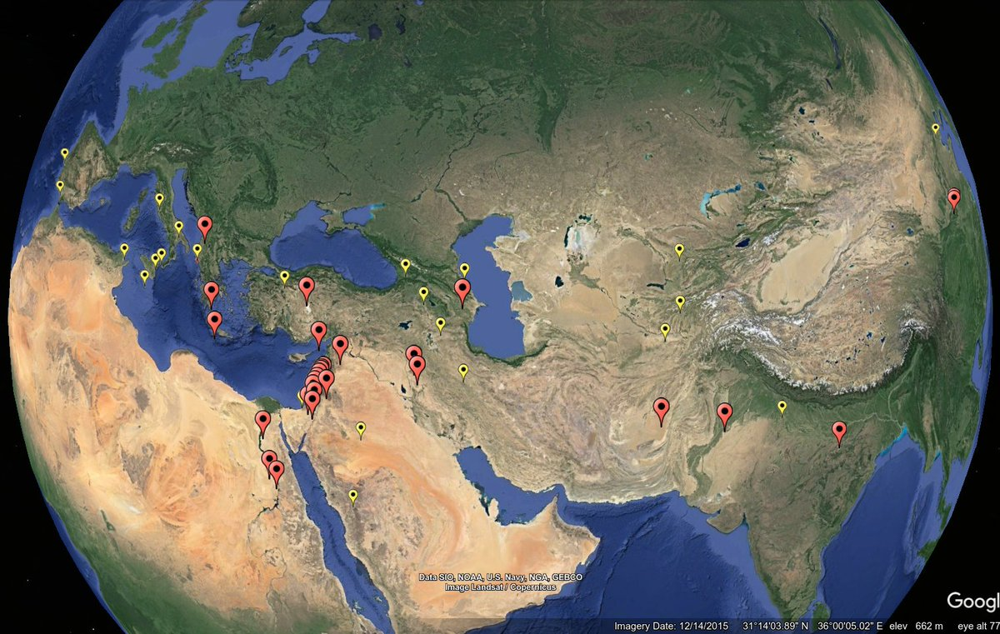

# Oldest Inhabited Cities

Could be a good heuristic for finding safe spots.

List of the oldest continuously inhabited cities: https://en.wikipedia.org/wiki/List_of_oldest_continuously_inhabited_cities

https://github.com/user-attachments/assets/c6d86a97-7b04-4f74-8cb5-ac36d6fcf0ec

S2 -> S1:

https://github.com/user-attachments/assets/b665ff45-333f-4fda-b0ce-367b8f63ea94

ECDO-derived visualization of S1 to S2 and S2 to S1, tracking Asia. The locations of cities continuously inhabited since 1200 BC or earlier are approximated with red markers.

## Mapping the longest continuously inhabited... [1]

Mapping the longest continuously inhabited cities in the world. All of these locations have been inhabited since 1200 B.C or before that time. https://t.co/2TrdQdwiiR https://t.co/8Ir7P57MCG

## Adding to this map. Red...

Adding to this map. Red markers are cities continuously inhabited since before 1200 B.C. Yellow markers are cities continuously inhabited since 1200-700B.C. https://t.co/7bzHm2Y49l

## Citations

1. Craig Stone: https://nobulart.com/ (visualization as well)
