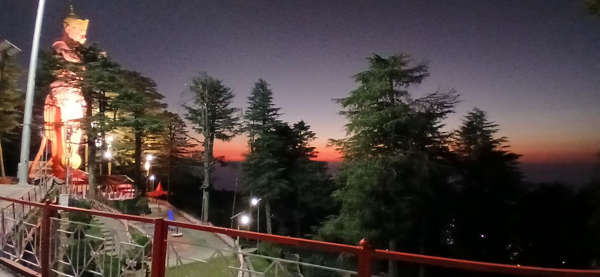
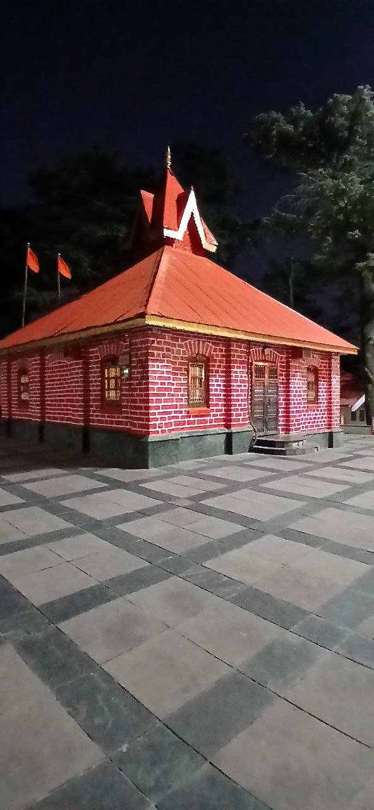

# Oldest Structures

## Jhaku Temple in Shimla India. 

2455m in elevation, called to be oldest temple in the city.

https://amp.theguardian.com/world/2015/feb/28/shimla-indian-summers-raj-colonial-legacy-lives-on