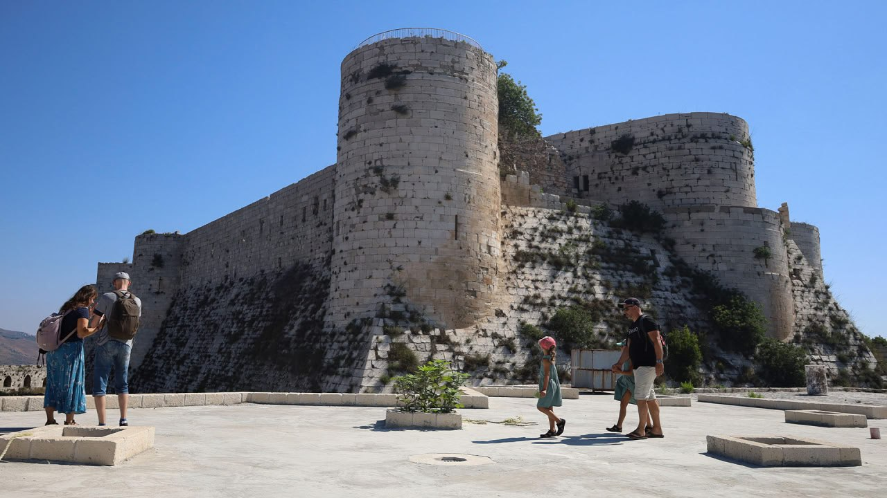
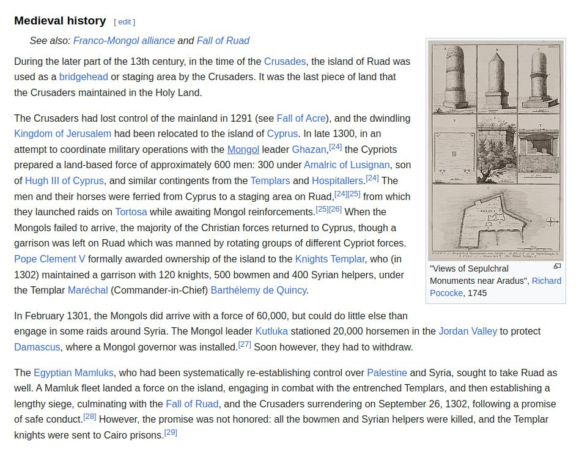

# Arwad, Syria

## Arwad

Arwad, an island off the coast of Syria, has been continuously inhabited for about 5,000 years. "Along the entire eastern coast of the Mediterranean, there is only one inhabited island: Arwad. Not much more than a dot of rock off the coast of Tartus, Syria, it once dominated a goodly stretch of that coast, ruling the mainland like an offshore castle. War galleys of Arwad fought on the side of the Egyptians, the Assyrians and even the Persians when the tide turned for Greece in the early fifth century bce. More than a millennium and a half later, the island became the last bastion in the entire Levant for the crusading Knights Templar before their final, dramatic expulsion. Though Arwad today is a quieter place, the remains of its massive stone fortifications have many a tale to tell.

Near the center of the island protrudes the Citadel of Arwad, a rectangular fortress raised sometime in the 13th century but now largely Ottoman, though it retains Mamluk and Crusader features. Two thousand years before its first stones were laid, on this site stood the palace of the Phoenician kings.

The island was once insulated also by a massive outer city wall made of gargantuan stone blocks. As historian Lawrence Conrad describes it, in Byzantine times “the great walls surrounding the island on all but the harbor side were at least 10 meters high in places and were built of tremendous blocks up to six meters long and two meters high.” The walls, according to Conrad, dated at least to the Seleucid era that followed Alexander the Great, and probably even to the Phoenician era before.

Much of this protective structure was razed after the Arab takeover in 650 ce; other parts of the walls were brought down after the Mamluk expulsion of the crusading Knights Templar in the autumn of 1302. Only a few segments of the great wall survive, and they tower dramatically near the water’s edge, relics of a seemingly impossible feat of engineering."

[1] https://aramcoworld.com/Articles/January-2016/Arwad-Fortress-at-Sea

## Citadel of Arwad, Syria

Citadel of Arwad, Syria. 3rd millennium BC. An historic Templar stronghold.

https://en.wikipedia.org/wiki/Arwad

## Island of Arwad Megawall

They built a 10m high wall around the entire island. I’m guessing it wasn’t to keep the crabs off the beaches. 

https://x.com/andtartary2/status/1834082117552406642?s=46