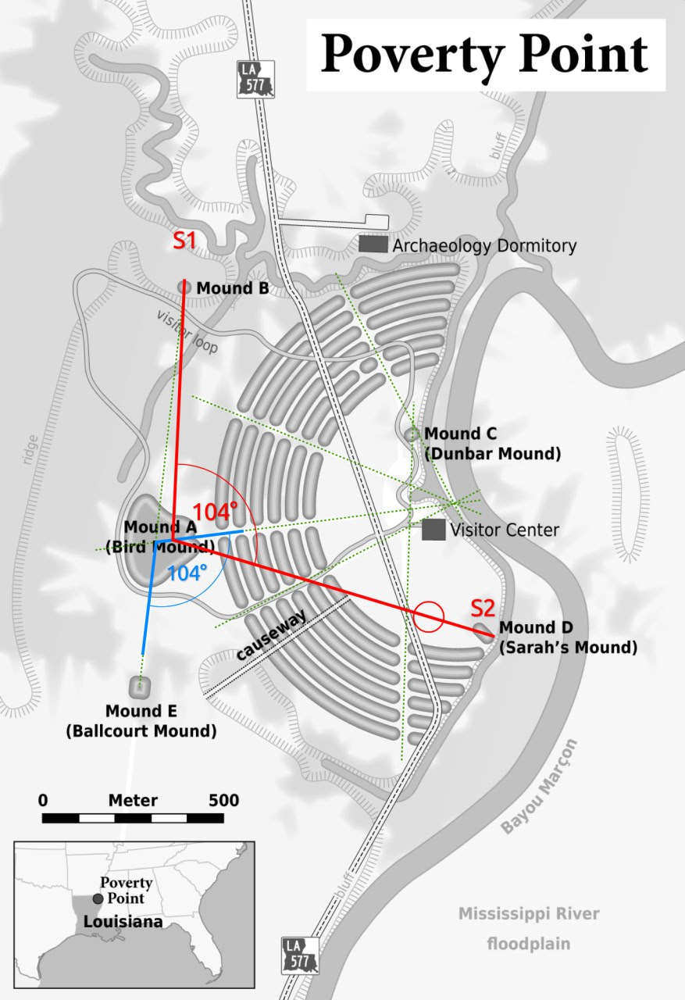
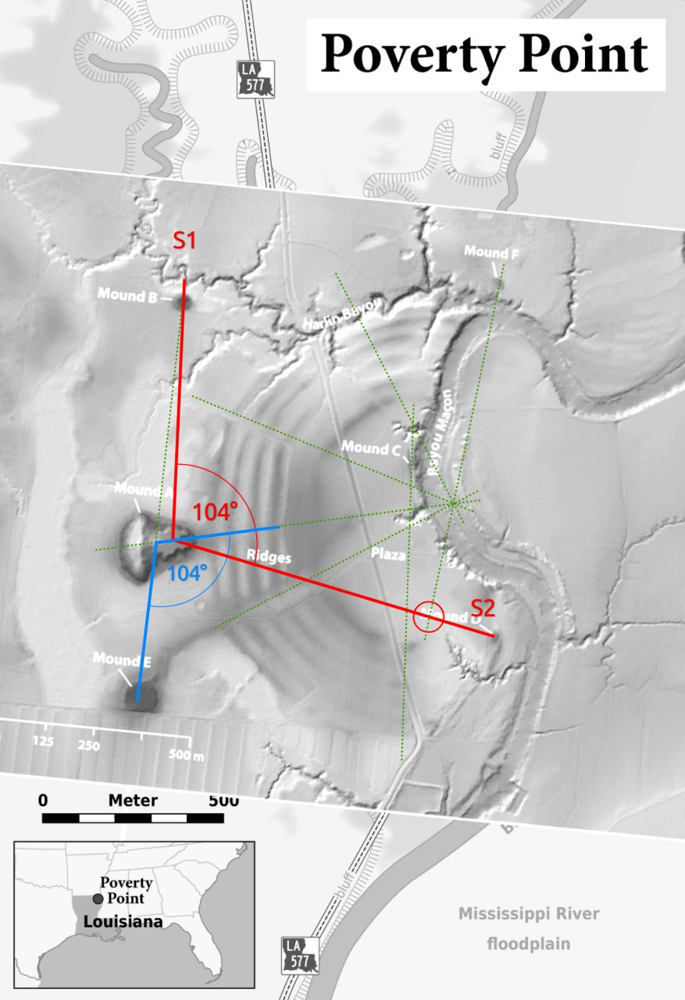

# Poverty Point

"Poverty Point State Historic Site/Poverty Point National Monument (French: Pointe de Pauvreté; 16 WC 5) is a prehistoric earthwork constructed by the Poverty Point culture, located in present-day northeastern Louisiana. Evidence of the Poverty Point culture extends throughout much of the Southeastern Woodlands of the Southern United States. The culture extended 100 miles (160 km) across the Mississippi Delta and south to the Gulf Coast."

"The Poverty Point site contains earthen ridges and mounds, built by indigenous people between 1700 and 1100 BCE during the Late Archaic period in North America.[4] Archaeologists have proposed a variety of possible functions for the site, including as a settlement, a trading center, and/or a ceremonial religious complex."

For those who might have been watching the new season of Ancient Apocalypse, a quick look at some of the geometry of Poverty Point. Schematic and LiDAR [1]

## Citations

1. Craig Stone
2. https://en.wikipedia.org/wiki/Poverty_Point
