# Stonehenge

Even now it's acknowledged that many of the original lintels are nowhere to be found.

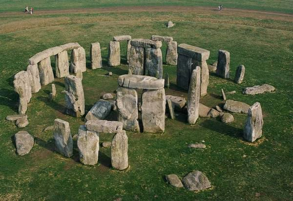

It's interesting that, apart from the nearby "Woodhenge" which is older than SH, there is evidence that SH was a built on the site of an even older wooden observatory which was less than 70m away. It's believed that the builders of SH were unaware of the existence of the previous site (evidence all being below ground), and built it there purely for astronomical reasons.

## Altar Stone of Stonehenge

New research shows that the Altar Stone of Stonehenge was transported 700km (450 miles) from northern Scotland

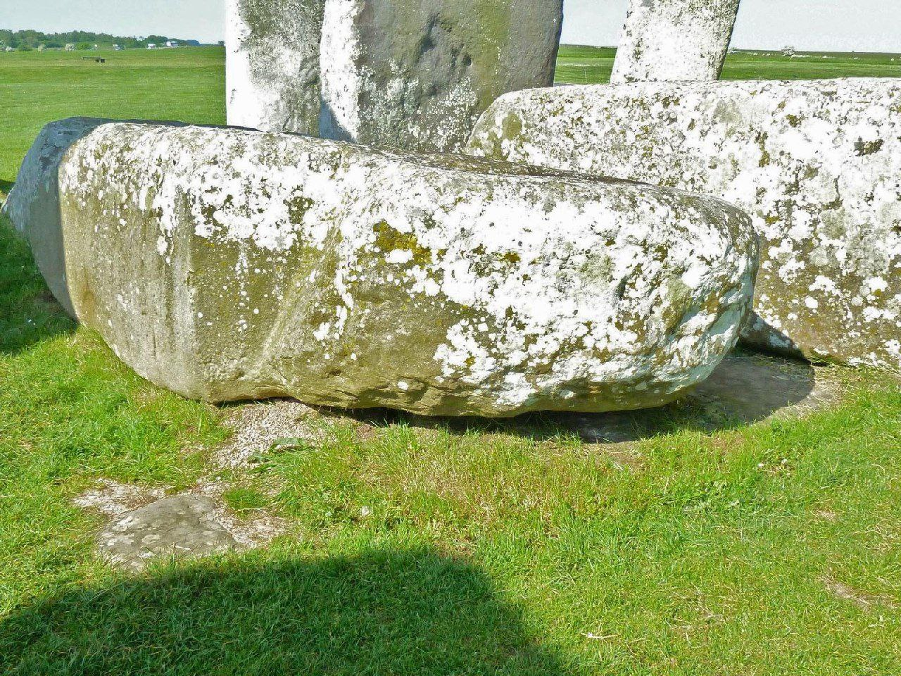

## Inconclusive forum analysis

Hi Ric,
Please bear in mind that you asked a Stonehenge question. The responsibility for the length of this is on you! Hee Hee.

OK - here we go ...

Thirty-five of the upright sarsen stones remain of forty originals. Twenty-six are standing, nine are fallen or broken, and five are missing. The previously undetected sockets for Stones -17 & -18 were discovered in July of 2013, so these are now accounted for, if only as placeholders.

Only forty-four bluestones remain out of a possible +/- ninety originals. Thirteen stand while the rest are either prone, or buried stumps.

By far the largest percentage of missing stones are the lintels, with only thirteen of forty originals on-site. Nine sit in place, four are fallen; the others are long gone. Out of the estimated 165 original stones, only ninety-two remain, or 60%.

Though 21 of the stones have been manipulated in one way or another during the three restoration projects of the 20th century, according to an admittedly sketchy historical record, nothing at Stonehenge has been robbed within at least the last 500 years or so. While 40% of the stones are missing, the greatest bulk of these have been the smallest of them. Only five of the outer sarsen orthostats are gone altogether and none of the Trilithons — whole, prone or broken — are absent.

There are several possible reasons for this. Though still quite massive, the outer stones would have been far easier to manage than the Trilithons. Not only would those ten megaliths be enormously cumbersome to manhandle, but retrieving the broken pieces from inside would be difficult. So even with the use of firepits and water, such as was used at Avebury in the 14th century, this common, efficient method would have been particularly arduous if performed within the stone circle.

But there is no evidence of firepits at Stonehenge.
The Slaughter Stone displays signs of a process called plug-and-feathering, which is a series of small holes drilled in a line, creating a fracture along which a rock can be broken. It’s the only one with such holes and the task was never completed. That process would have ruined expensive drills, meaning that perhaps the tough stone itself defeated the robbers. Alternatively, this effort may have seen more success on other stones, with gangs taking those instead, leaving the partially molested Slaughter Stone behind.

That being said, I believe only previously fallen stones were robbed, this being the path of least resistance. The same earthquake that brought down Stone-55 no doubt caused the collapse of others. Several of these are only remnants; evidence of easy picking. S-8, -9, -15 and -19 are the examples. Stones -12 and -25 likely fell after the robbing period, while the slow decline of -14 is actually chronicled in several pieces of artwork through the 18th and 19th centuries. This helps explain why those three are more or less intact. None of the standers in the northeast are missing or broken, and though the stones at the entrance did eventually require adjustment, we know that those in the southwest were of less quality and, having shallow sockets, more readily succumbed to the ravages of time. Lintels scattered by fallen uprights could be collected without too much fuss while the balance of seated others could have been brought down by a team of stout draft horses and good rope.

The fact remains that there’s no trace of sarsen or bluestone at any farm, inn, village, estate or home within a considerable radius from the site. No foundation, bridge or garden arrangement in the area is crafted from the missing material, which seems strange as it could have become a convenient rock quarry for the entire region.

So we have to go further back in time. While there’s no evidence, it’s possible the Romans did it during their occupation of Britain. There are hints they took more than a passing interest in the site and may have even rearranged some of the Bluestones. Also, the condition of S-11 is suspicious to me, in that it tips out to the opposite side of its erection ramp, suggesting an effort to pull it down. This may be why the upper third is broken off.

Alas, the Romans left us no record. But extraordinary by omission, there is little mention of any major monument throughout the vast Roman Empire; therefore Stonehenge is hardly the exception. So, being highly organized, accomplished engineers, they could have broken the stones up and carted the rubble off to distant projects which are now long vanished into misty, historically mundane venues, leaving none the wiser today.

As it’s become increasingly clear that Stonehenge actually was completed, there’s no real clue where the 70-odd lost stones might have gotten off to, and this has driven sane men mad.

Where's my pills ...

Best,
Neil

## Nice photo

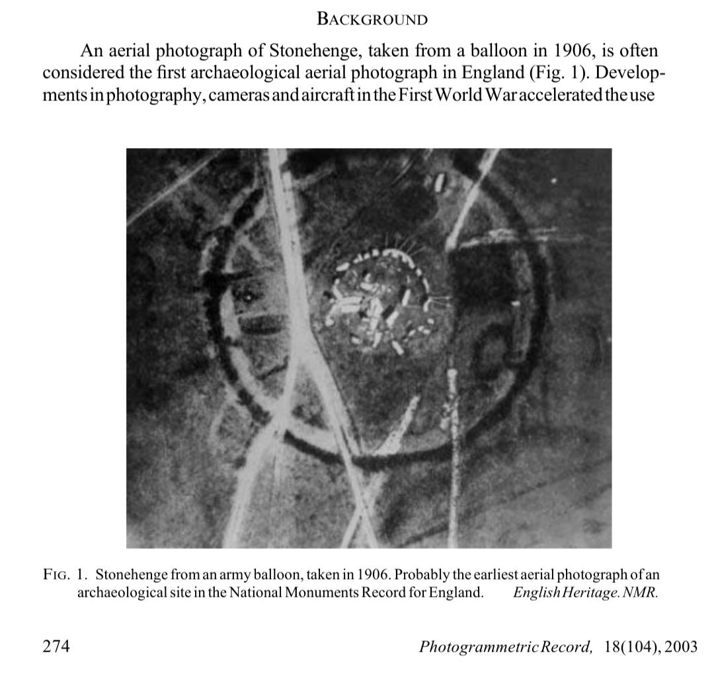

## Stone Circle Alignment

Just noticed something. The stone circles of Avebury, Brogar and Stonehenge are separated by over 500 miles and lie perfectly on this longitude.

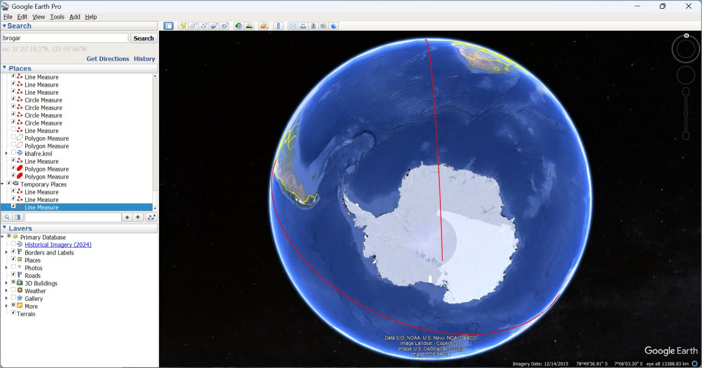

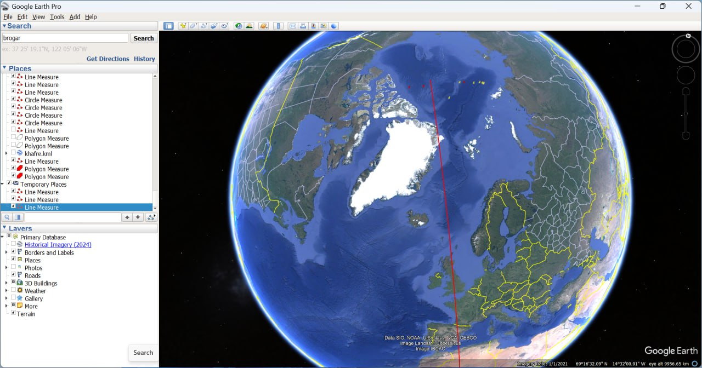

This is what prompted me to look...

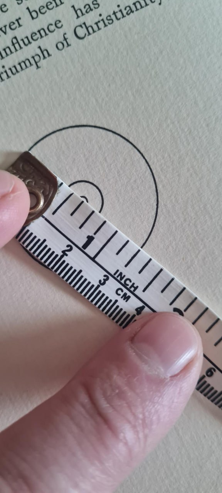

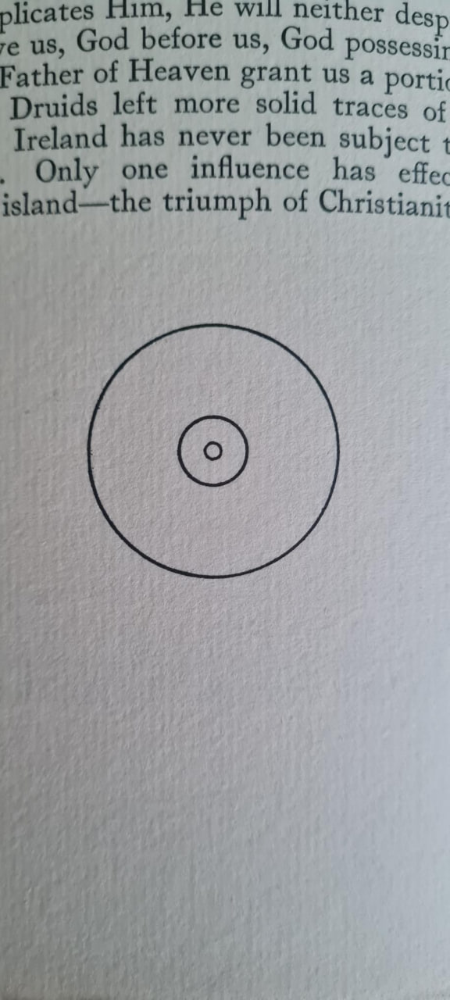

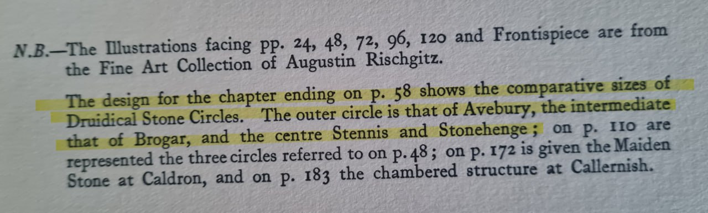

Came across this diagram and thought I'd draw a GE line from Khufu to Brodgar...

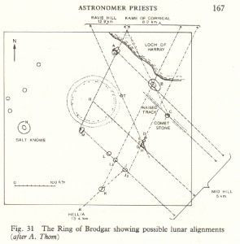

Line to Brodgar...

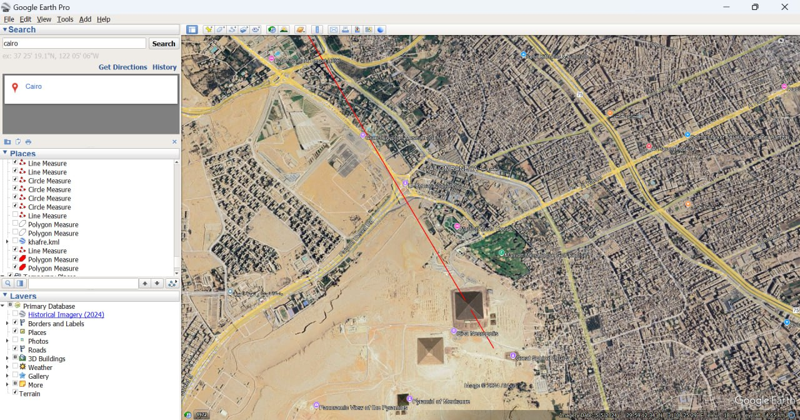

Line from Khufu...

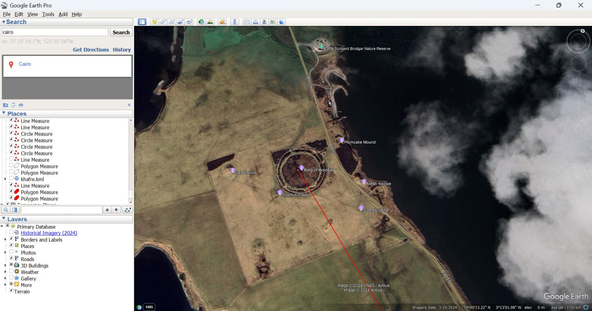

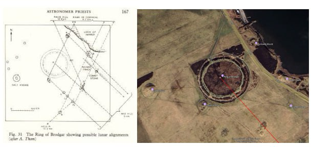

## Stonehenge Elongated Skulls

https://theaveburyexperience.co.uk/articles/the-elongated-skulls-of-stonehenge-and-a-forgotten-goddess-cult/

This shouldn't need any comment from me...

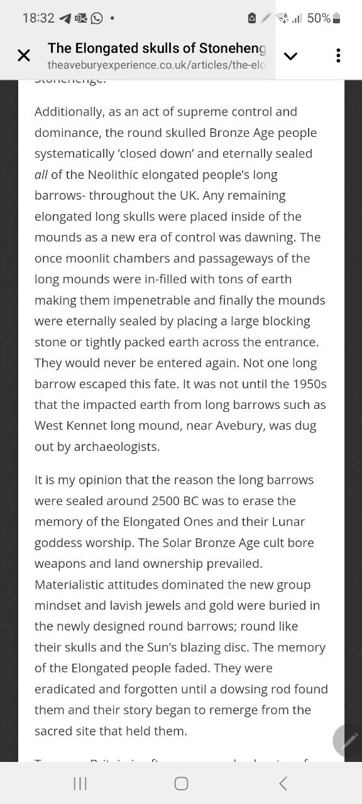

## Citations

1. [Craig Stone](https://nobulart.com)