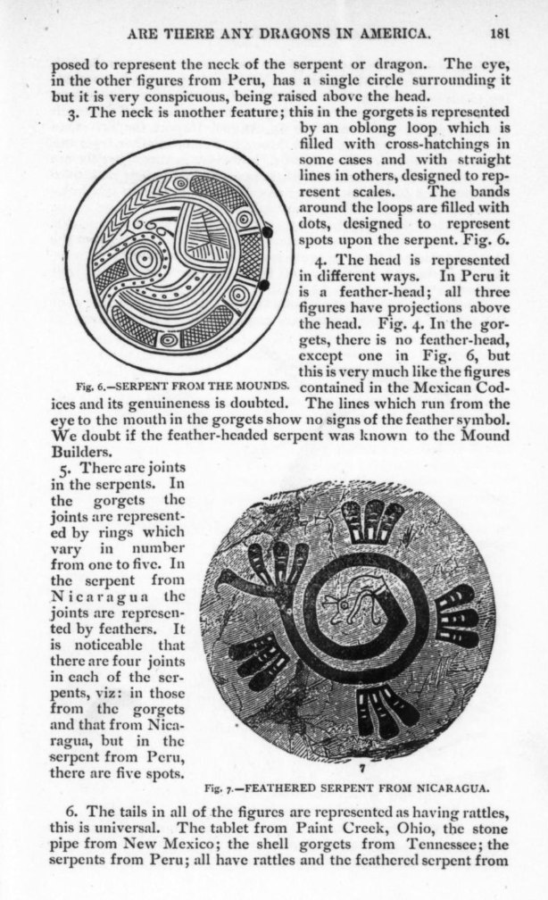
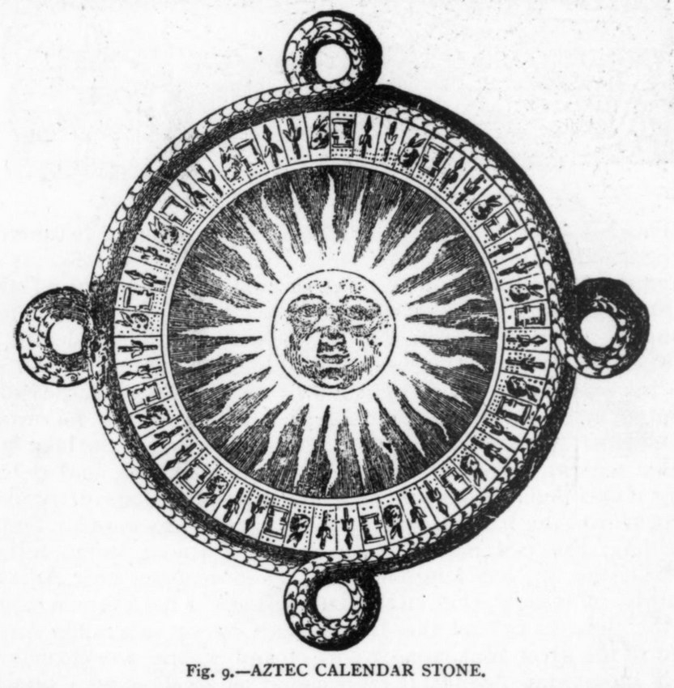

# Ancient Symbolism

## Feathered Serpent

Some notes on consistencies of the feathered serpent across cultures.
[1] https://archive.org/details/sim_american-antiquarian-and-oriental-journal_1887-05_9_3/page/180/mode/2up

## Serpent/Dragon Symbolism

I'm 99% certain that what we have in mythical evidence now thousands of years later is that the ancients were using the serpent / dragon imagery to represent a cyclical cosmic cataclysm

https://m.youtube.com/watch?v=1FT5sLVImwU

Almost every issue of The American Antiquarian contains articles about serpent imagery from all over the world.

## Aztec Calendar Stone

And an Aztec calendar stone. Also with four major divisions. 13 subdivisions in each quarter totaling 52.
[1] https://archive.org/details/sim_american-antiquarian-and-oriental-journal_1887-05_9_3/page/152/mode/2up

