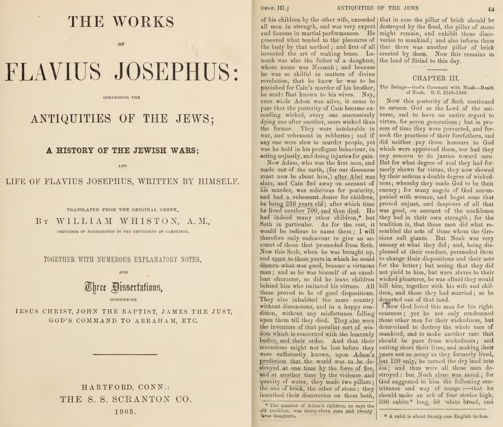

# Ancient Symbolism

## Feathered Serpent

Some notes on consistencies of the feathered serpent across cultures.
[1] https://archive.org/details/sim_american-antiquarian-and-oriental-journal_1887-05_9_3/page/180/mode/2up

## Serpent/Dragon Symbolism

I'm 99% certain that what we have in mythical evidence now thousands of years later is that the ancients were using the serpent / dragon imagery to represent a cyclical cosmic cataclysm

https://m.youtube.com/watch?v=1FT5sLVImwU

Almost every issue of The American Antiquarian contains articles about serpent imagery from all over the world.

## Aztec Calendar Stone

And an Aztec calendar stone. Also with four major divisions. 13 subdivisions in each quarter totaling 52.
[1] https://archive.org/details/sim_american-antiquarian-and-oriental-journal_1887-05_9_3/page/152/mode/2up

## Antiquities of the Jews, Two Pillars

"[The children of Seth (the son of Adam)] were the inventors of that peculiar sort of wisdom which is concerned with the heavenly bodies and their order.And that their inventions might not be lost before they were sufficiently known, they made two pillars upon Adam’s prediction that the world was to be destroyed at one time by the force of fire and at another time by the violence and quantity of water. The one was of brick, the other of stone, and they inscribed their discoveries on both, that in case the pillar of brick should be destroyed by the flood, the pillar of stone might remain, and exhibit these discoveries to mankind and also inform them that there was another pillar, of brick, erected by  them. Now this remains in the land of Siriad to this day."- Antiquities of the Jews, Flavinius Josephus (93-94 CE) as translated from the Greek by William Whiston (1905)
[1] https://archive.org/details/completeworksoff05jose

Tobias Churton seems to be an interesting author and historian...      https://www.innertraditions.com/blog/rediscovering-the-lost-pillars-of-enoch

https://tobiaschurton.com/4_books.html

Here is another fun one from Josephus that I appreciate as a farmer.

"for those ancients were beloved of God, and [lately] made by God himself; and because their food was then fitter for the prolongation of life, might well live so great a number of years: and besides, God afforded them a longer time of life on account of their virtue, and the good use they made of it in astronomical and geometrical discoveries, which would not have afforded the time of foretelling [the periods of the stars] unless they had lived six hundred years; for the great year is completed in that interval."

https://lexundria.com/j_aj/1.106/wst