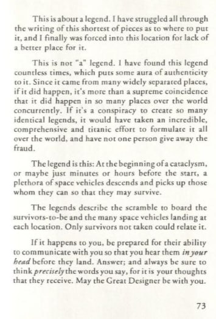
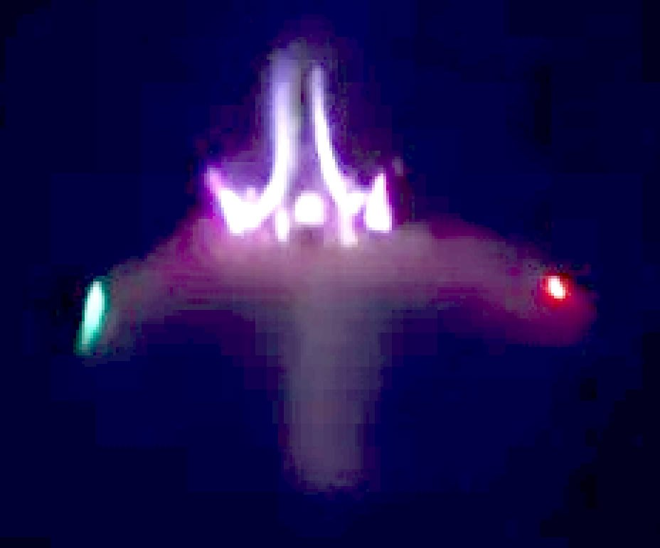
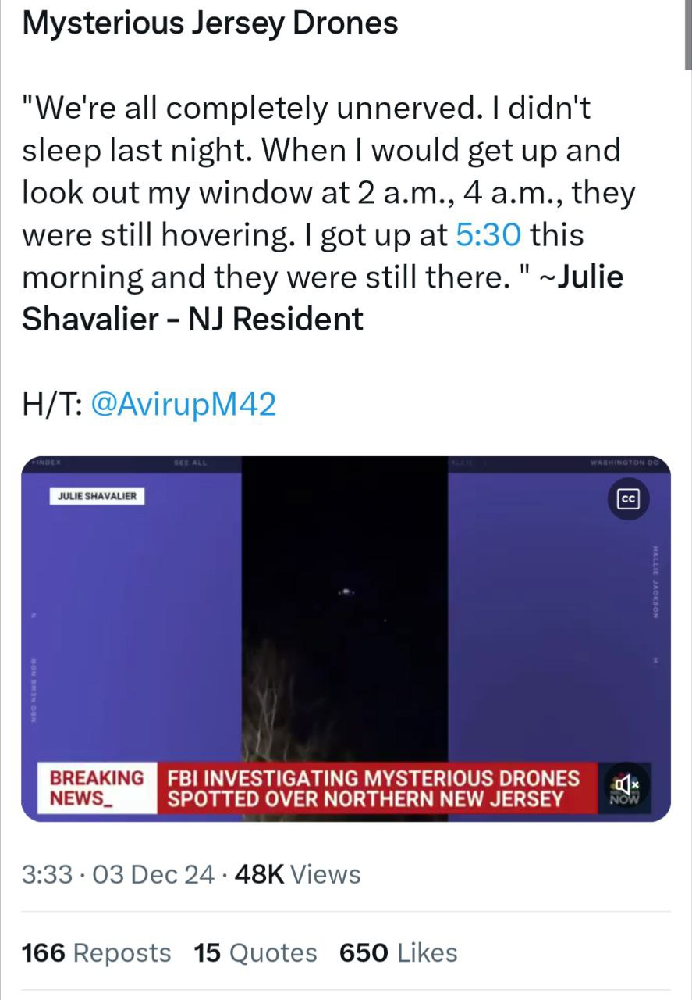
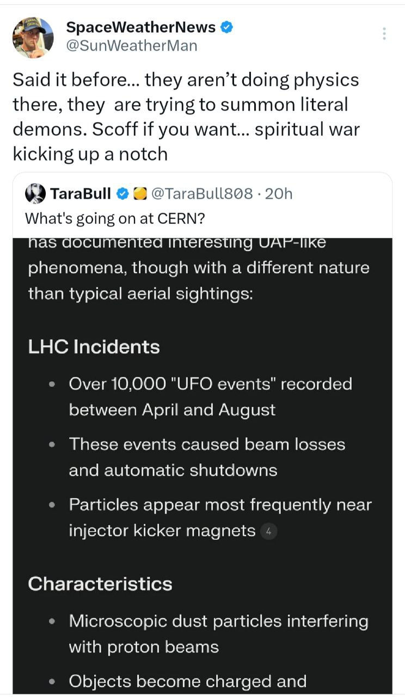
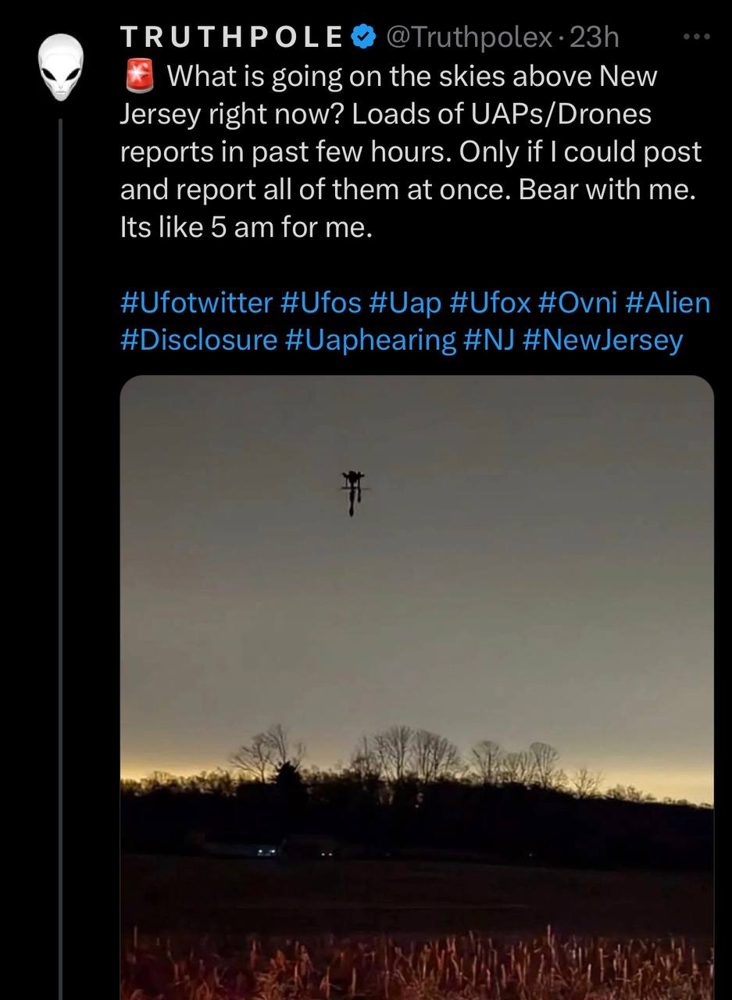
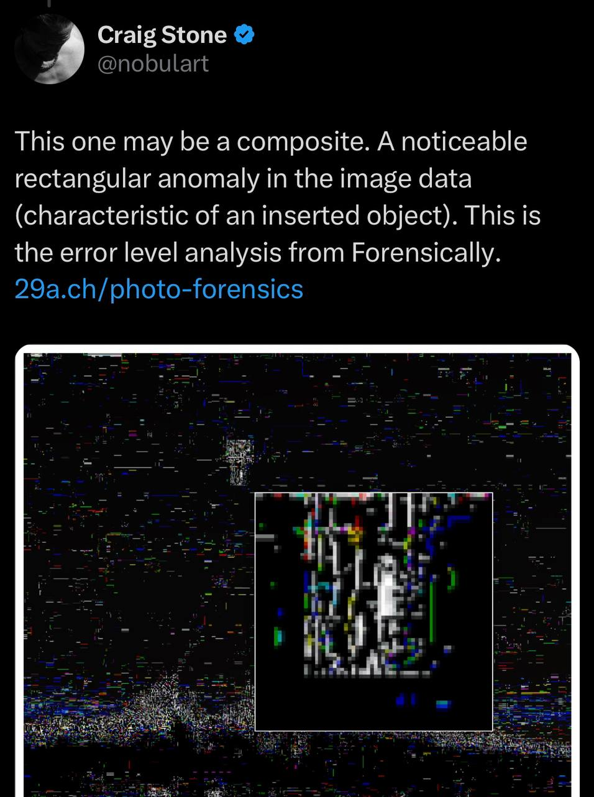
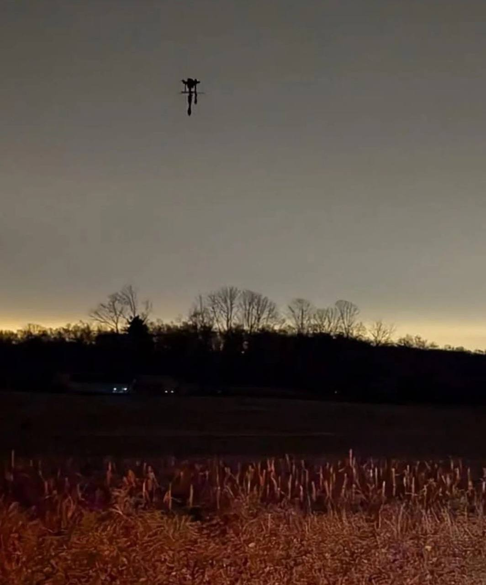
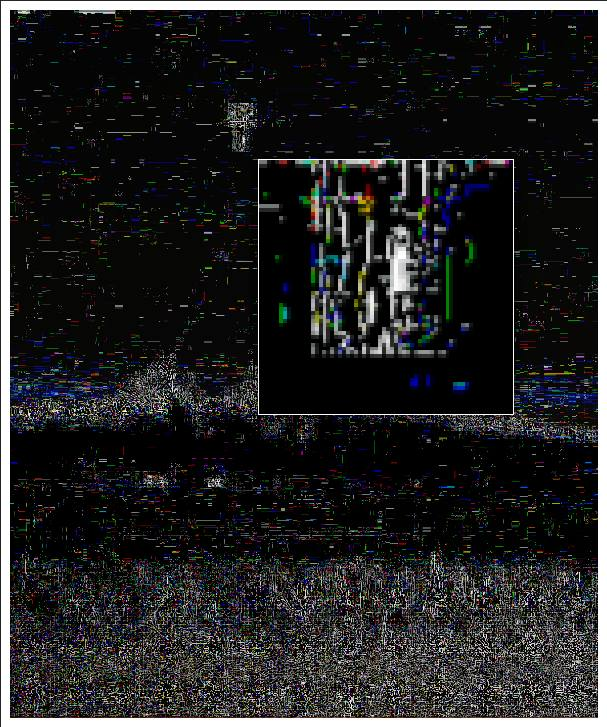

# Aliens

Your question is one I have wrestled with because we humans have a natural instinct to want to survive.  I believe what is coming is so devastating that without supernatural intervention there will be 99.999% of the worlds population will perish.  An extinction level event.  The slate will be wiped clean.  A small privileged group of people may try to survive in deep underground facilities.  But, they will beg for the hills to collapse on them before it is through.  I found this curious when I first read it.  There are a few fans of Chan Thomas here, and he pulls a classic Chan Thomas move by just making a statement and then not backing it up with any references.  But it hints to another option of escape that I believe is the only chance of salvation from this cataclysm.  I agree with Chan - However, my perspective is based on prophecies described in the Bible.

This is interesting, and this theme does reoccur in several different cultural mythologies, including isolated island cultures. It may be borne of a collective memory or desire for salvation. It also may be a temporal distortion of the truth. Consider a scenario. Just before the event the builders of the bunkers (which I assume to be people) airlift preselected individuals/families/groups to shelter. The event happens. The children of the survivors who were left to fend for themselves remember the story told to them by their parents, but they have no direct knowledge of what a flying machine or a pilot was.They have to use their imaginations and possibly some scribbles in the sand as their only visual guide. Thus the narrative becomes embellished with aliens or gods through the generations of storytelling.

## The Annunaki

Yahweh who is Yaldoboath - Father God of the Bible

They are an alien races(Reptilians) who have been preying on us through the last few cataclysms now. The nuclear war between Atlantis and Lemuria was also instigated by them to erase any forms of humans that would not co-operate with them. They control the elite/the kabbal etc. All major Religions of the world are made by this corrupt soulless Alien race like Judaism, Islam, Christianity and even Buddism

## Bluebeam?

Car-sized "drones" that can hover all night? Bluebeam Act I?
https://x.com/i/status/1863772536476954960

This has been going on a while. In October last year they were hovering over a major Pentagon base in Virginia for 17 nights straight & the Pentagon couldn't do anything about it. 

They had urgent meetings in DC for 2 weeks about it. 

If it were truly Bluebeam, that wouldn't have been the response.

Anyway, I said to send a sign a couple weeks ago. And they got the address wrong. It's OLD JERSEY. Not new JERSEY. Sigh. Courier services are pants these days.

Hah! My wife and I have been seeing these from afar for several nights. Large object standing still for hours in the sky. We saw the nav lights and thought it was manmade. The white light (tail light?) was excessively bright compared to the red/green. Green light went on and off as if the aircraft was rotating in place. There were 2-3 objects spaced far away from each other. We're in the area so I bet it's the same ones.

## 10k UFO Events

Monsters. 

https://x.com/SunWeatherMan/status/1863954412777127960?s=35

## Bluebeam fakes

Bluebeam is mostly a trick of the mind, not of the skies. This image is a very good composite but it’s still fake. 

https://x.com/nobulart/status/1864706015960105252?s=46

Yeah, you found some jpeg artifacts there - well done!  

Sad to say that we are at a point in technology that things look really good, but you just can't trust what you see on a screen these days.  Between some amazing software and people who are hungry for hits, it is the wild west of fakery

Interesting that this artifact is only visible around the sky object. There are no similar geometries to be seen around any of the other object edges (ie. the tree line).