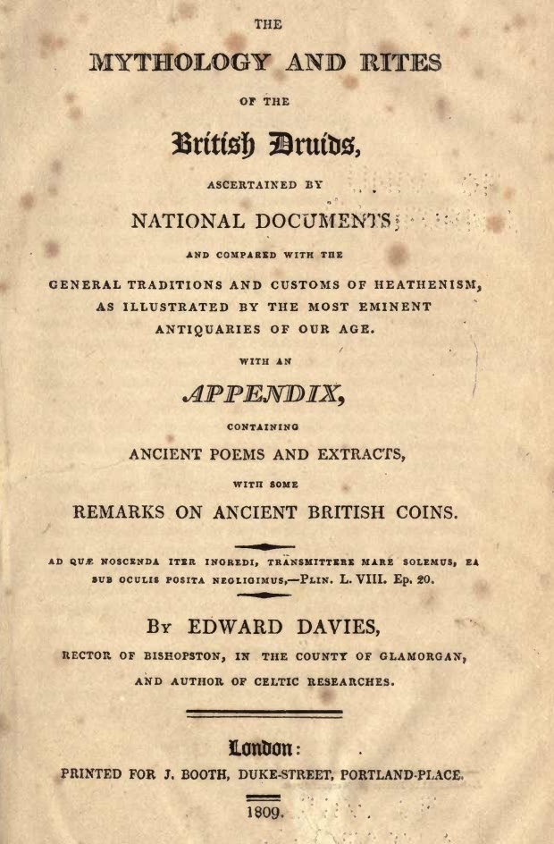
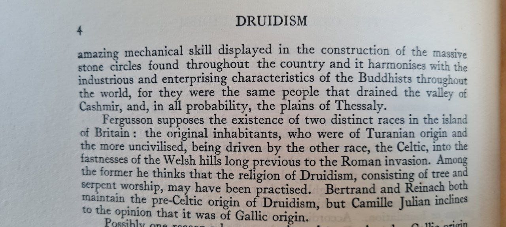

# Druids

## The Mythology and Rites of the British Druids

A quick search herein for the words 'deluge' or 'flood' reveals that this was very much the focal point of druidism.

## The Last Druid

https://www.youtube.com/watch?v=FIrYD7djFH8

24:34 for mention of an ancient corpus of knowledge.

## The Last Druid.

In On the Origin of Freemasonry (https://nobulart.com/on-the-origin-of-freemasonry/) (1808), Thomas Paine describes Freemasonry's druidic roots: "..when the christian religion over-ran the religion of the Druids in Italy, ancient Gaul, Britain, and Ireland, the Druids became the subject of persecution. This would naturally and necessarily oblige such of them as remained attached to their original religion to meet in secret, and under the strongest injunctions of secrecy. Their safety depended upon it. A false brother might expose the lives of many of them to destruction; and from the remains of the religion of the Druids, thus preserved, arose the institution which, to avoid the name of Druid, took that of Mason, and practiced under this new name the rites and ceremonies of Druids."

[1] https://nobulart.com/on-the-origin-of-freemasonry/
h/t to @Wrongwaythink (https://x.com/Wrongwaythink) for the video.

### Quote

"The profligacy of mankind had provoked the great supreme to send a pestilential wind upon the earth, a fierce poison descended, and every blast was death. Then the Patriarch, distinguished for his integrity, was shut up, together with his select company, in the enclosure with the strong door. Presently a tempest of fire arose; it spilt the earth asunder to the great deep. The lake Llion then burst its bounds. The waves of the sea lifted themselves on high round the borders of Britain. The rain poured down from heaven, and the waters covered the earth, but that water was intended to purify the polluted world, to render it fit for the renewal of life, and to wash away the contagion and evil of its former inhabitants into the chasms of the Abyss. The flood which swept away the patriarch's contemporaries raised his vessel on high, bore it safely upon the summit of the waters, and proved to him and to his associates to be the water of life and of renovation." - Mythology and Rites of British Druids, Davies

## Quotes

## Druidism Book

Got a bit further with this book. Main take outs so far it appears the Druids were in Britain long before the celts (No ones quite sure where they came from. Main contenders are the caucusus or Egypt or even North India) and they have their own deluge mythology would you believe?!

## Druidism Book Excerpt

Still chipping through the Druidism book when I get chance. Also occurred to me that Shakespeare is called the Divine Bard, purportedly written by Francis Bacon the father of modern freemasonry which ancient roots may lie in Druidism.

