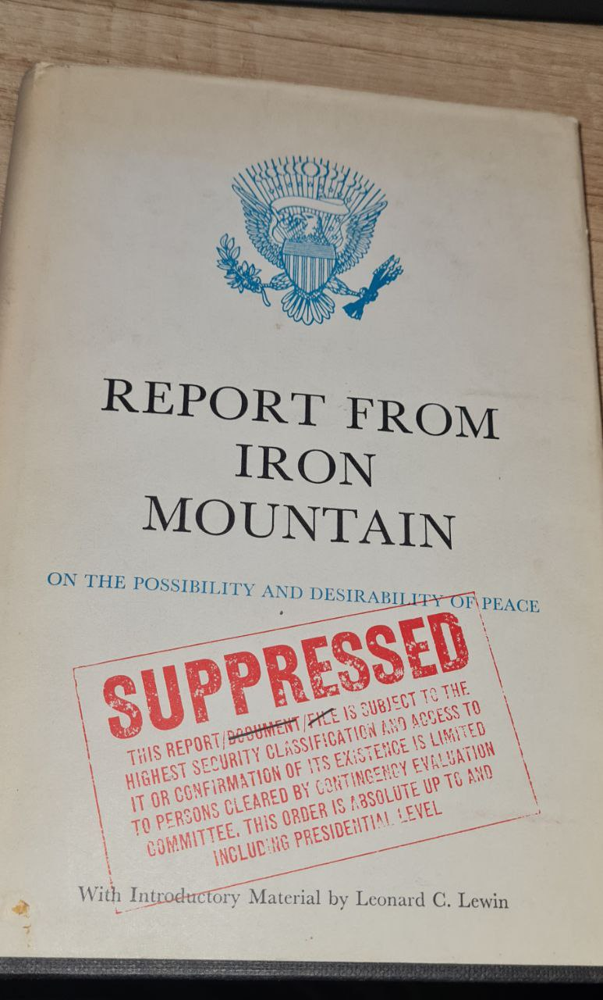
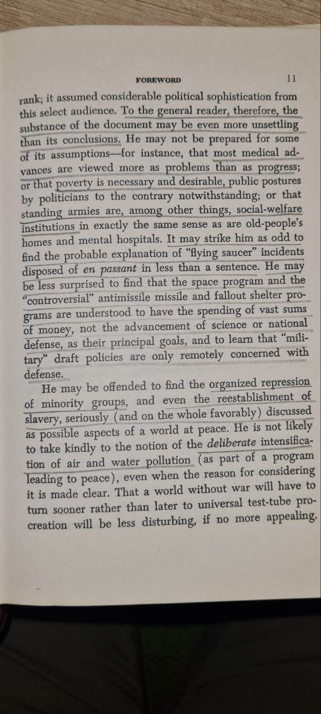

# Regime Management

## Conspiracy theories

Could the accelerating trend of north pole wander in 2019 have prompted them to hit the button early on the plandemic? Jackson Hole and Event 201 were important events later in 2019 leading up to the launch of the psyop in 2020 (To impose totalitarian controls and depop the planet). Are their modern day Khafre surveillance technologies all flashing red?

## Behind schedule? [1]

I think its already overdue and we've been holding it back. It wasn't expected to be prevented for as long as it has, thus Agenda 21 became Agenda 2030 and the script for the control narrative seems to have disintegrated into some B grade horror movie which was scrawled on the back of a napkin.

## Mowing the lawn?

## Pirbright Institute

## Gilgamesh

Published 2003. Not one word since.

Lots of conspiracy theories swirling around this topic. 👽

https://x.com/databreachez/status/1659903995454865410

https://m.youtube.com/watch?v=CBKv781wrSc

## UK 2050 Absolute Zero

https://api.repository.cam.ac.uk/server/api/core/bitstreams/75916920-51f6-4f9c-ade5-52cbf55d5e73/content

## The Secret History of the World

"The Control System, via the offices of its high priests of science, ensures that glaciologists do not cross over into astrophysics and that geologists do not cross over into archaeology. In this way, there is no such thing as Comparative Science." - The Secret History of the World, Laura Knight-Jadczyk (2005)

## GPT sci-fi novel

17.8. had a discussion with ChatGPT v 4, of the idea for a "scifi- novel", I was blown away how many of the issues raised are already manifesting themselves. Sorry, the text is in Finnish, if somebody could translate it to more common language even with ai, it would probably be easier to read. (Hard copy `kielimallin M2 iltasatu.txt`)

Some of its suggestions for responding to a 2030 pole reversal assuming an Elite group aiming to survive even at the rest of humanity's expense ....

AI does summarise ideas well.

## Report from Iron Mountain

https://nobulart.com/report-from-iron-mountain

## Finland war prep

In Finland "leaders" are preparing for a war. Related they have made it public that in the event of natural or man made emergency all the people will be evacuated to three areas. What I find peculiar is the similarity of the evacuation area to overlap with safe zone of envisioned deluge.It must be just another coincidence.

## "Attali's last 'revelation' should be...

"Attali's last 'revelation' should be taken very carefully - the 'Possessed' are preparing for a decisive move to seize power over the world." Prof. Valentin Katasanov, July 2021 https://t.co/SAr6AdepCr

## The planning and implementation of... [1]

The planning and implementation of this attack on humanity has been carried out over many lifetimes of the global elite. We can’t win if we’re still thinking in little boxes of nationality, race, gender or religion. We have to think on the scale that they do.

## Silent Weapons for Quiet Wars

“We believed that the entire world should know about this plan, so we distributed internationally one-hundred of these manuscripts, to ask individuals at top level positions their opinions. The consensus opinion was to… https://t.co/O1W5Bo2xVN

## "History and current events clearly...

"History and current events clearly expose how racism/equality has proven to be an incredibly efficient political weapon, and take note, as a weapon, they are as old as government itself." - Jeff Chiacchieri (2017) https://t.co/2xs84Nvc6B https://t.co/UkVs87TACW

## Tom Wheeler, former FCC chairman...

Tom Wheeler, former FCC chairman speaking at the National press Club in 2016. Say what? https://t.co/TnrO0ntywA

See img/1802719621121753449-X291ZxzJrFz55Or7.mp4.

## Mind control using sound waves. We ask a scientist how it works https://wef.ch/2RD4mME #science #gfc18

https://x.com/wef/status/1061846182094401536

## See C7... mp4.

Methods of conquest

## 5D Chess?

[1] is probably a nothing-burger because extradition would require that the US government are in agreement that a crime has been committed [2].  This class action suit it probably the real deal but it’s doubtful that it will go anywhere. 

1. https://www.petersweden.org/p/it-begins-court-rules-bill-gates
2. https://chatgpt.com/share/671b2e7d-94fc-8005-9c7d-7274dc719321
.
## Citations

1. [Craig Stone](https://nobulart.com)