# Elite Cult Symbolism

## Pyramid [1]

"In" the pyramid is hermetic. Very distinct from on it, which is Illuminist art.

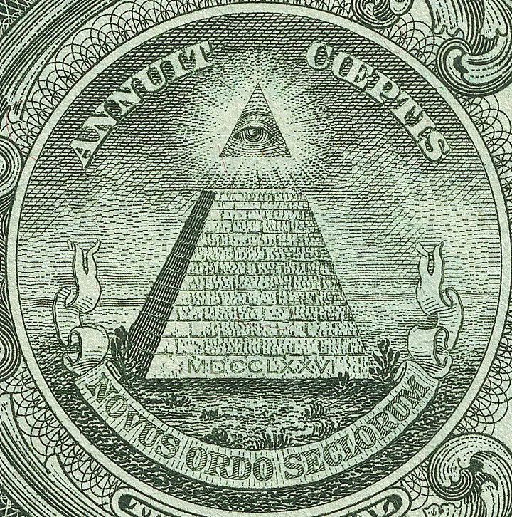

Within the context this art's masonic/hermetic origin, "Order From Chaos" could also be a reference to the destructive event that brought order to a previously chaotic planet.

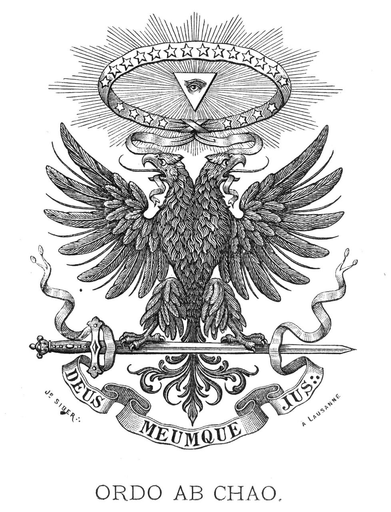

## Elite symbolism [1]

It's one of the things we know pretty much for sure, because they've been writing about it in hermetic texts for centuries. It's illustrated in most masonic art and symbolism.
- Curated examples of the occulted references: https://nobulart.com
- The two trains circling the globe in Snowpiercer could be seen as metaphoric representations of the Arctic and Antarctic following the equator from west to east at 1600km/h.

## Elite Symbolism - Marduk

The book in question is Sitchen's The 12th Planet (Cue groans). I am a aware that he was a member of the illuminati and had an office in the Rockefeller Centre but maybe that should actually prompt us to look at his work more closely. He postulates the existence of terrestrial planet called Marduk (Niburu) which orbits the sun every 3,600 years and allows the nephilim access to Earth around it's perigee. Whether you believe the Marduk planet and Nephilim theory or not this cycle length fits with our 3,700 year catastrophe cycle theory and he bases all his work on an in depth knowledge of ancient Sumerian artifacts, even if his writings may be smoke and mirrors there may contain vital information for the initiated.

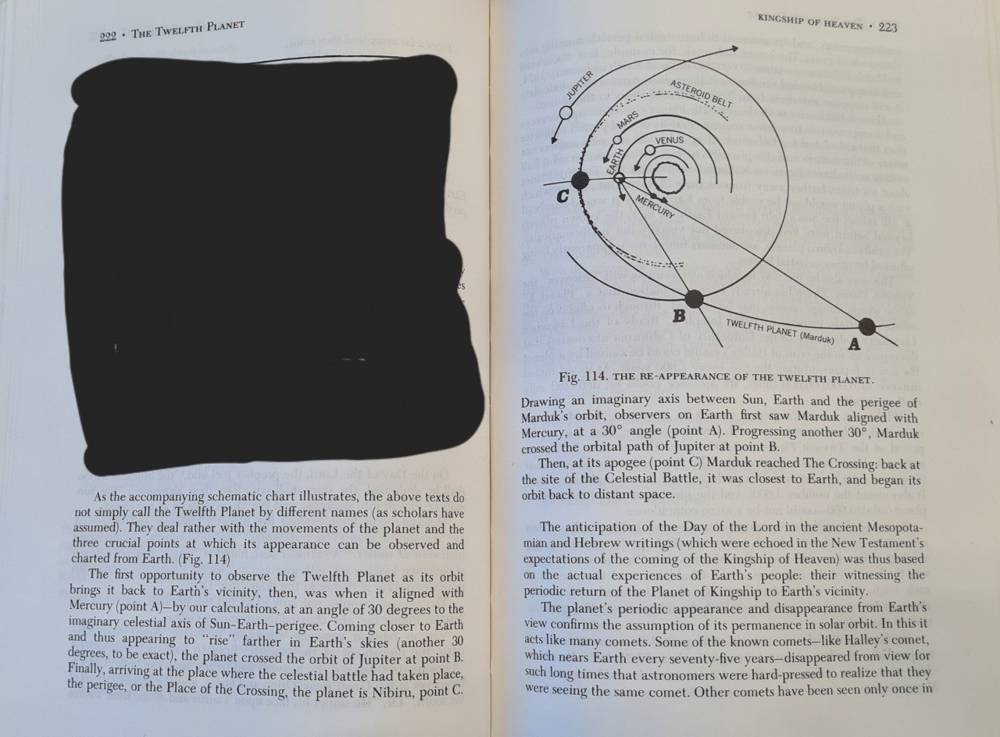
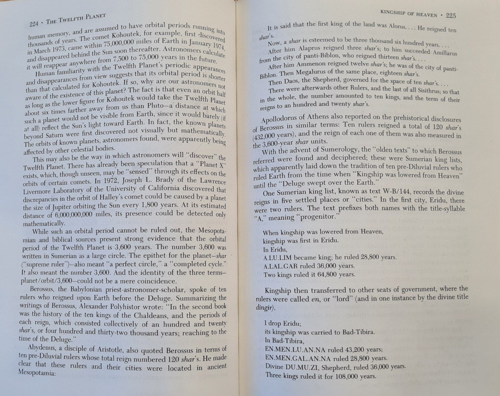
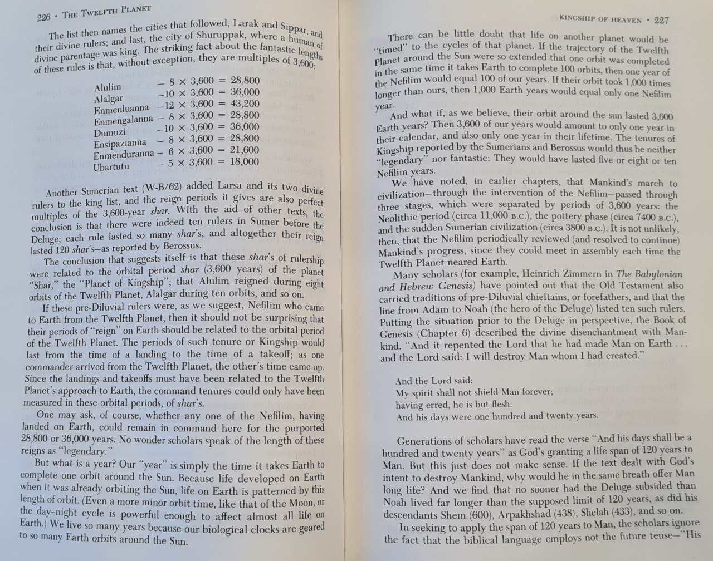
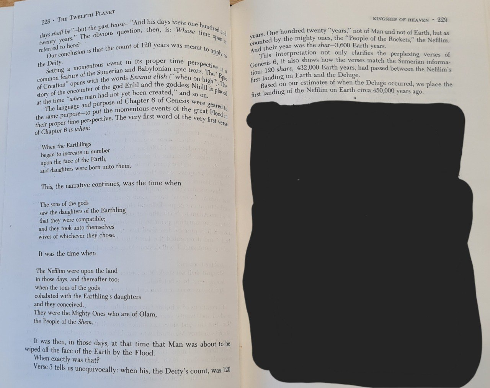

## Pillars of Joachim and Boaz [1]

I sometimes wonder whether the two great pyramids are in actual fact the pillars of Joachim and Boaz, and the recorded knowledge was stored in the sarcophagi, possibly along with an operators handbook for the pyramids themselves. This would suggest that pretty much everything we've been told about what came out of there was fabricated to cover the true discovery. Not beyond the realm of possibility at this point.

## The Templars (The Knights of Malta)

The Templars are also connected to Rosslyn Chapel - a scale model of Solomon's Temple (using stone likely imported from Jerusalem). I find it interesting that this masonic order is quite deeply connected to Arwad, being one of the oldest 'modern' strongholds at least since post-1700BC.

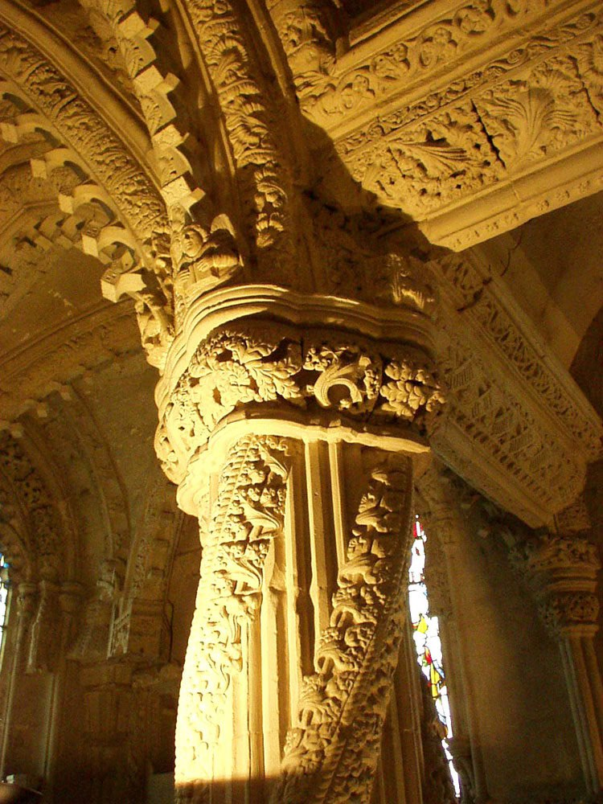
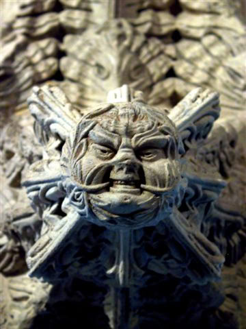
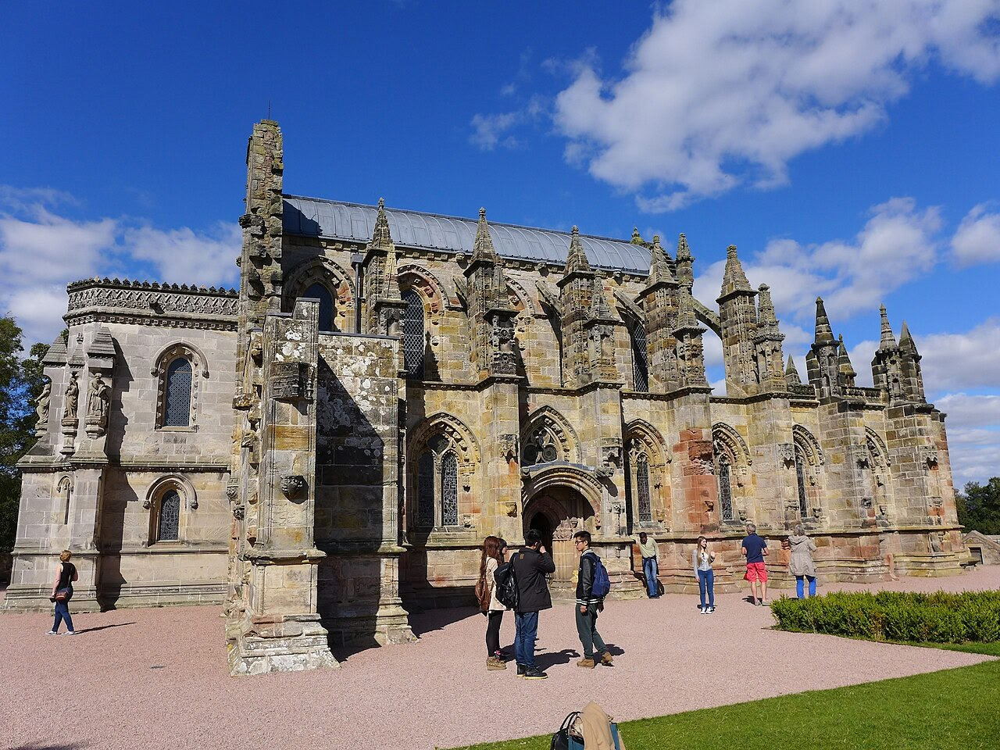

"The design for the Temple of Solomon was a double square, and the same is true for Rosslyn Chapel, the centre being marked by the fourth pillar from the west. Knight and Lomas have overlain the ground plan of the Temple of Solomon with that of Rosslyn Chapel. In their layout, the Apprentice Pillar falls on the location of Boaz and the Master Pillar on that of Jachin. These are the central pillars that play an important role in the Masonic ceremonies. The legend goes that the knowledge of the antediluvian world, imparted to mankind by Shemhazai and his fellow Watchers (that is, the sciences, and more particularly, the arts and astronomy), had been inscribed by Enoch on two pillars. Freemasonic legends state that one of these pillars was later discovered by King Solomon when he built his Temple. This explains why the Temple is so important to the ideology of Freemasons, for they believe that their Temple incorporates this knowledge. The Temple of Solomon faced due East and in front of its Eastern entrance were two pillars. However, there is no entrance in the East of Rosslyn Chapel, unless one counts the entrance “from the underworld”, from the crypt. In mythology, the World Ash Tree connects earth to heaven, but it has also been erected on a square stone, the so-called foundation stone, which holds back the waters from the Abyss, or the Underworld. Intriguingly, the Apprentice Pillar stands immediately next to the “entrance to the underworld” of the chapel, the crypt.

The square, and by extension the cube (see also the “musical cubes” in the Lady Chapel), right next to the “abyss of the chapel” and the Apprentice Pillar, are linked to Saturn. In Greek mythology, according to Orpheus, the god Saturn (who was known to the Greeks as Chronos), was said to have dwelled amongst Mankind. In that respect, he resembles the “Watchers” and their leader, Shemhazai, also depicted in the Lady Chapel. This square, the foundation stone, is often described as “a stone upon which rests a pillar that reaches from earth to heaven”. Again, a reference to the Apprentice Pillar, which together with the other pillars, sustains the ceiling, one part of which is depicted literally as a starry heaven. It is said that when this foundation stone was removed from underneath the World Tree, the Flood or Deluge occurred. In Biblical mythology, the only person to survive this cataclysm was Noah. Mythology also links the foundation stone with Noah’s Ark and, in Egyptian mythology, with the box/coffin of Osiris, which carried his body over the river Nile." - The Stone Puzzle of Rosslyn Chapel, Philip Coppins (2011)

The coffin of Osiris floating over the Nile is possibly linked to the Floating Coffer.

https://en.wikipedia.org/wiki/Rosslyn_Chapel

## Enneagram

The top diagram is from Rosslyn Chapel : The Music of the Cubes by Thomas Mitchell (2006). Excerpts include reference to the importance of the 4th and 5th harmonics in music.

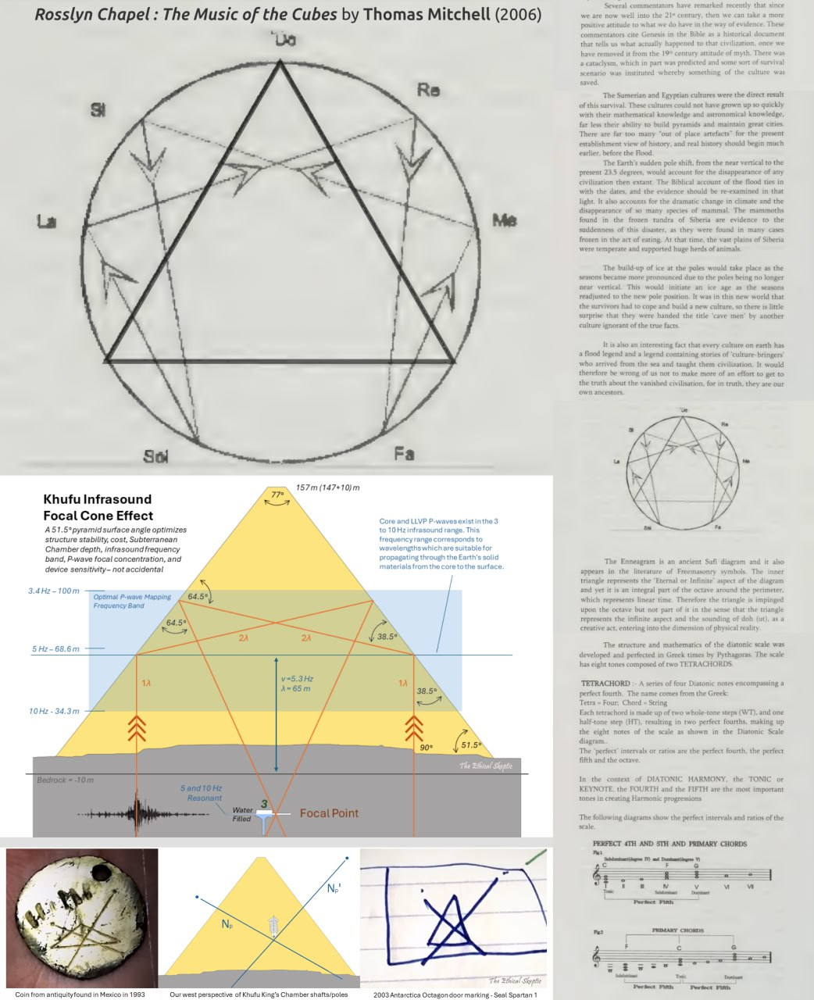

## Snowpiercer [1]

A short chat with GPT about Snowpiercer: https://chatgpt.com/share/070e9343-c809-4d28-ae2e-96925f30acef

## Twitter

Some one posted this on twitter, 104°

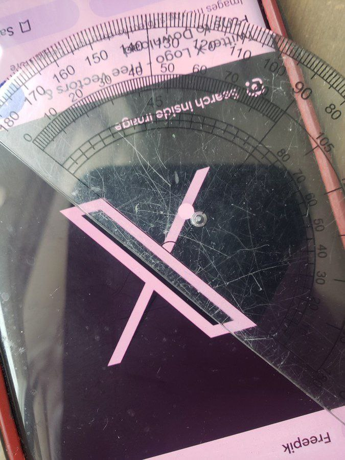

## Wandering Earth Movie

In The Wandering Earth (2019), one of the “torque engines” - used to stop the earths rotation in order to save it from a solar disaster - is singled out near the start of the movie. It’s location is Sulawesi.

## Swastika

I haven't seen this mentioned here, thought I'd share. 

It's long been speculated that the swastika is at least in part an image of the procession of Ursa Major (and Ursa minor, as well, forming a sort of fractal interior) around the North Star.

Over the course of the four seasons, the Little Dipper (whose tail is Polaris, the North Star) and the Big Dipper process around Polaris.

It is one of the earliest and most ubiquitous symbols found among human archeological remains. Some have speculated that the image of the "wheel in the sky" may have inspired the concept of the wheel to the PIE culture that later spread out on horse-drawn chariots from the Pontic steppe and conquered much of Eurasia.

What the ECDO brings to this discussion is clarity about its significance on the scene in which it appeared. After a period of immense chaos and destruction, the apocalypse - or unveiling - of this new axis mundi would have heralded the dawn of a new age of the earth. It would be remembered as such a sign.

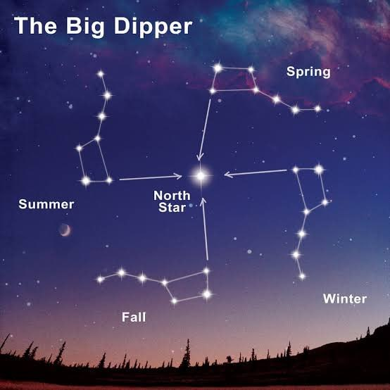
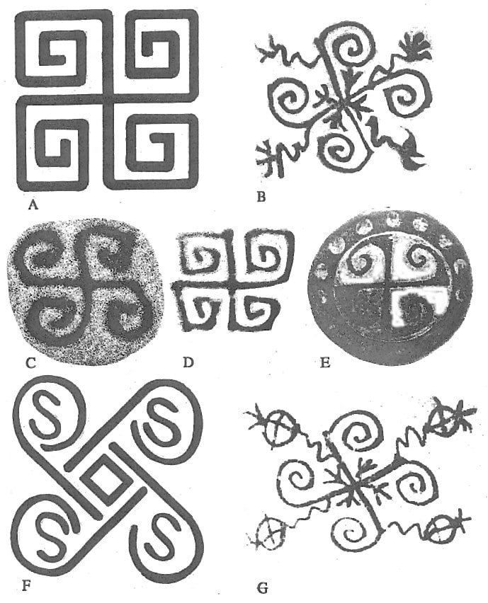

## John Dee

The John Dee and The Elizabethan Court connection is a big nod to the interest of freemasonry in ancient history and it's occult knowledge. Sir Francis Bacon was a lynchpin in these circles, the establishment of modern freemasonry and the settlement of the US at Jamestown.

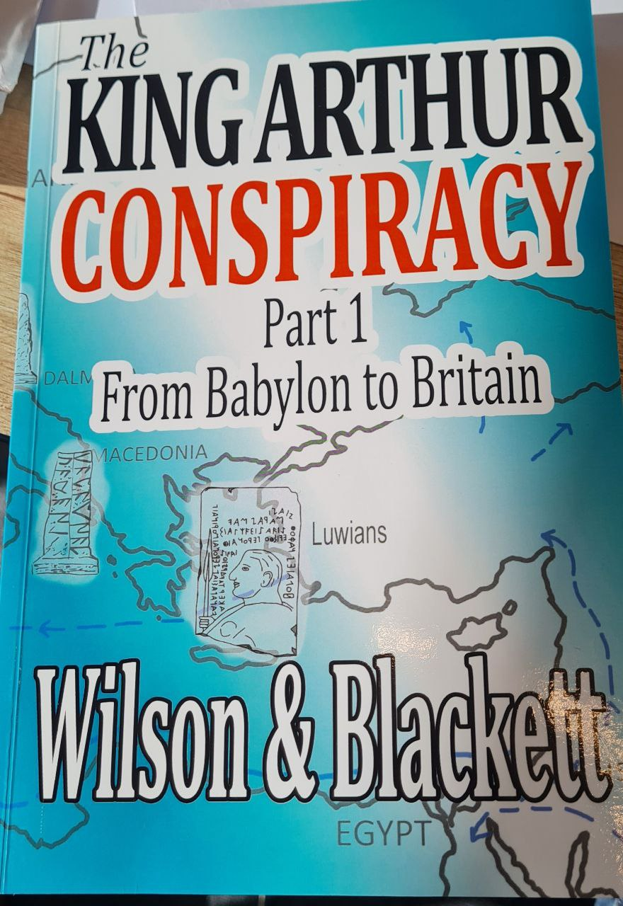
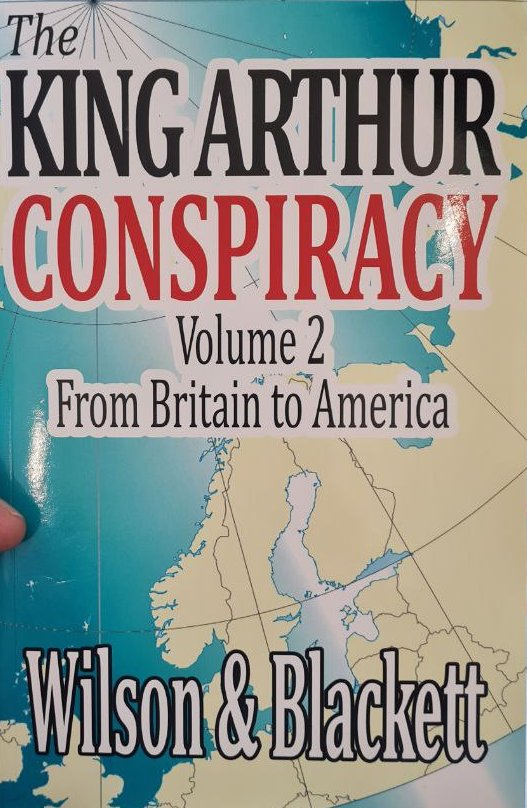
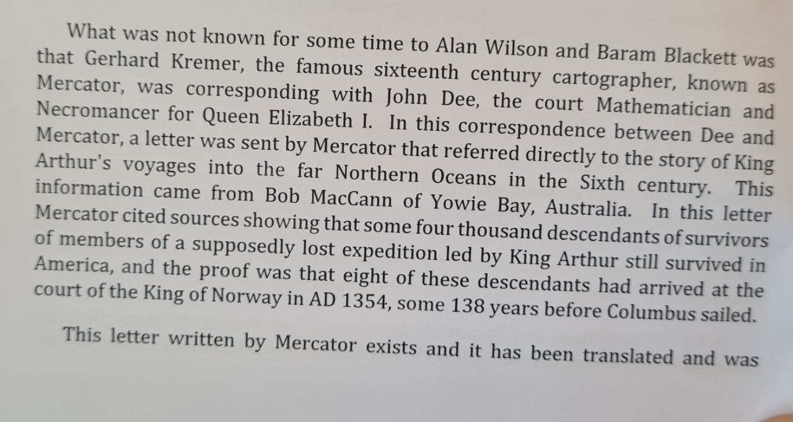
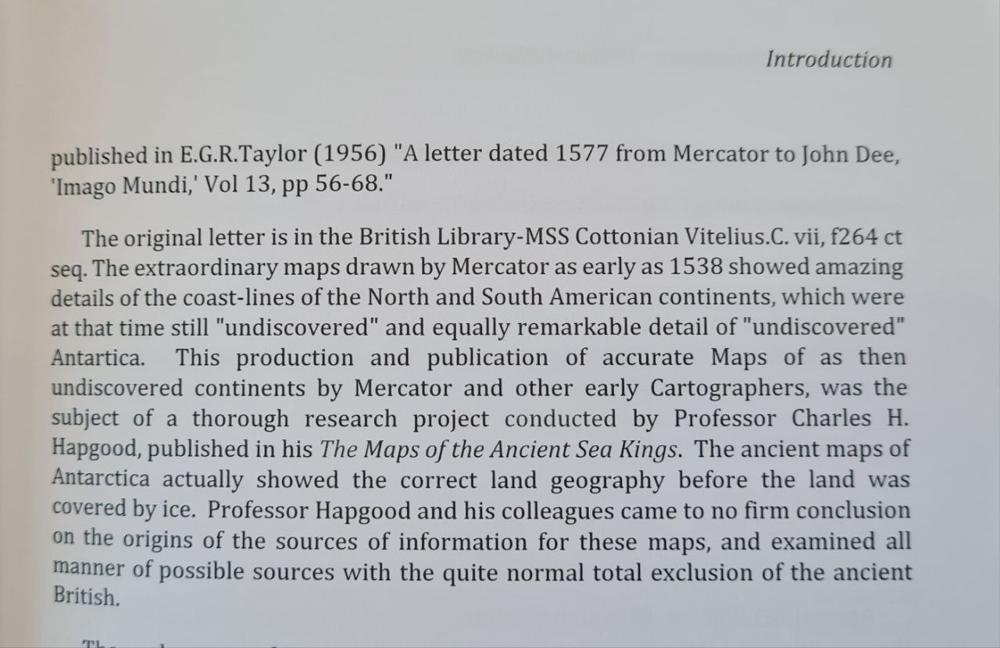

## ZULU story (unrelated)

The ZULU story tells us that ADAM’s CALENDAR is where humanity was created by the gods (ANUNNAKI) to be slaves in the gold mines.

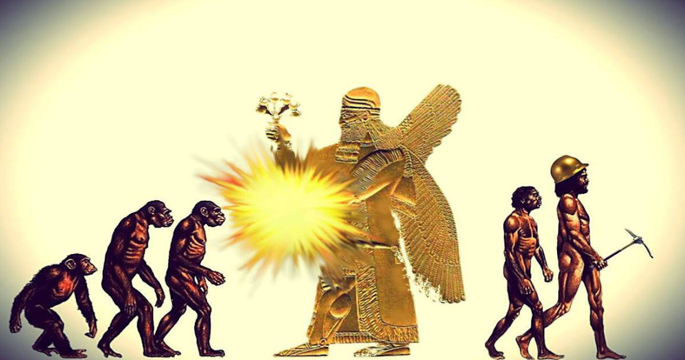

## The Economist 33rd Edition

Stumbled across the cover of the 33rd edition of the economist in my collection again. A quick retrospective review. The script is mirrored, as Da Vinci was fond of doing. We find a reference to the pipeline sabotage, and the four horsemen. Also one to Ultima Thule, which could be the peanut-shaped asteroid by that name (remarkably similar to the one that just passed us), or the ancient island, which it is speculated may have been Orkney, Shetland, Iceland or Greenland. The Pangolin, I suspect, was a reference to the software by that name released in 2020, and appears to be foundational to the virus scam.

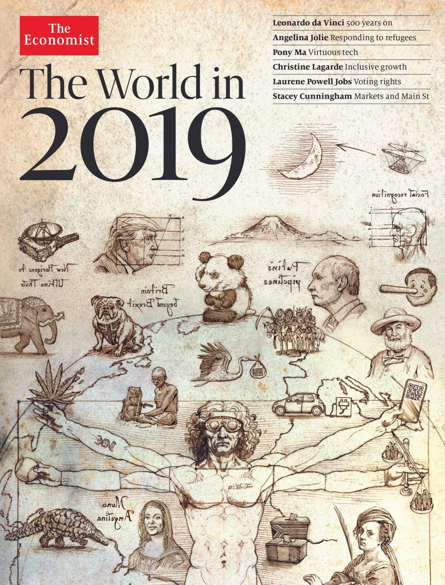
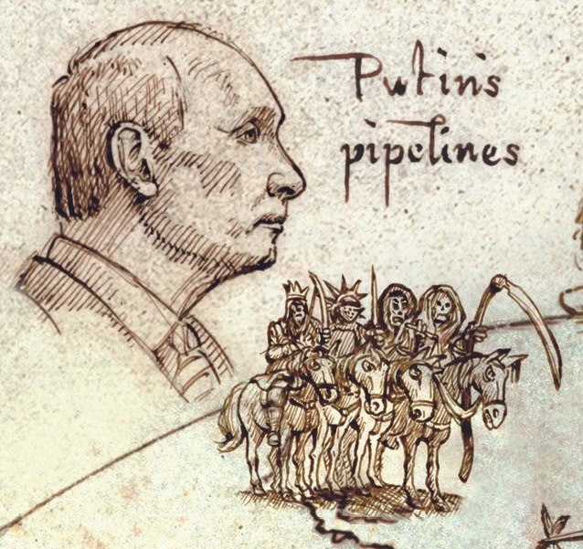
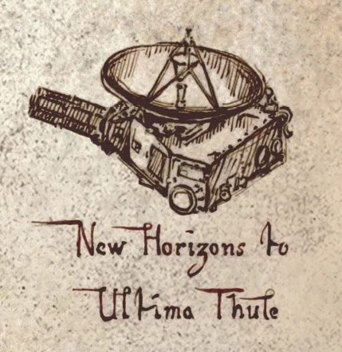
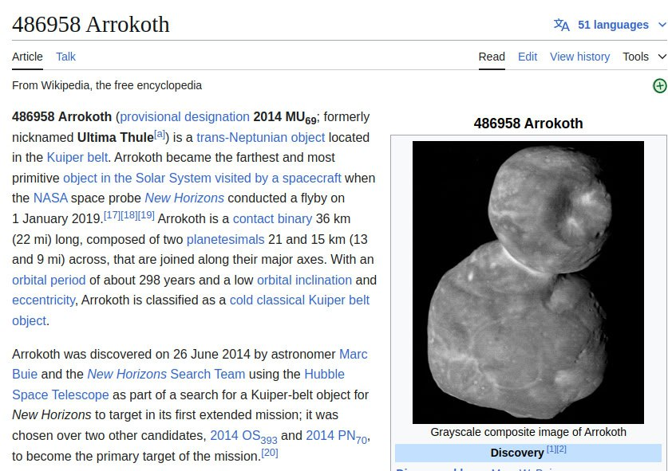
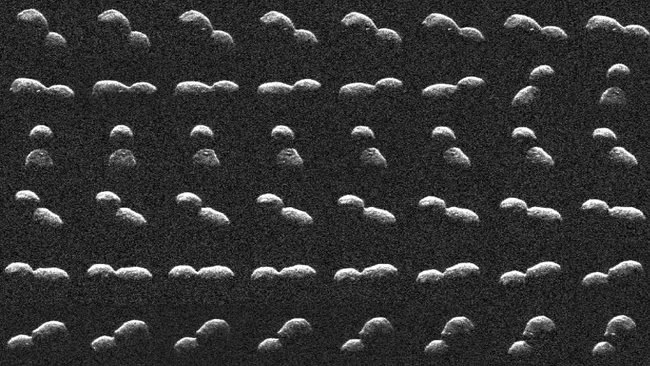
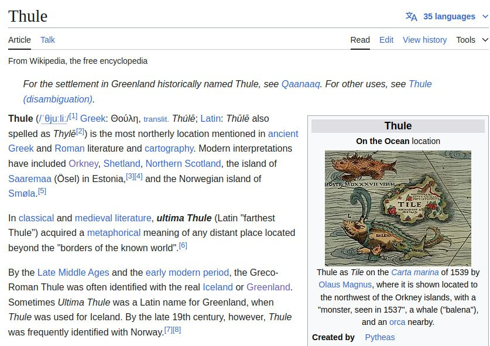
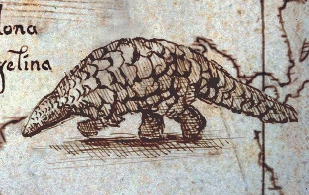

PANGOLIN project funding
https://www.ncbi.nlm.nih.gov/pmc/articles/PMC7610519/

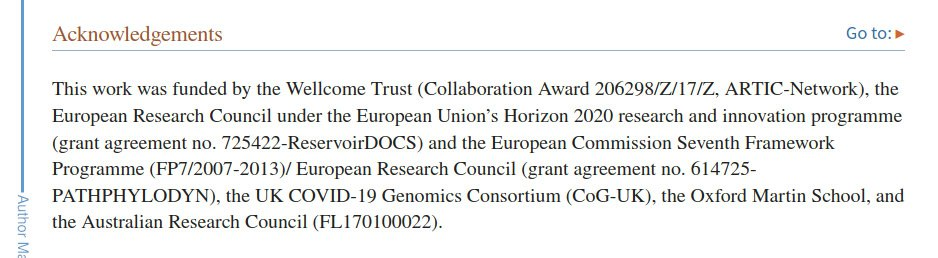

## America

There is a series of an older documentary that speaks to a lot of what is covered here. I think it is well done and worth watching.

https://www.youtube.com/watch?v=tzKqVtu6C5s

https://www.youtube.com/watch?v=oaEKBBsncng

https://www.youtube.com/watch?v=CqutJQ2PPQ4

## Citations

1. [Craig Stone](https://nobulart.com)