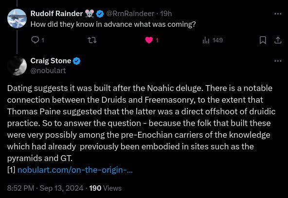
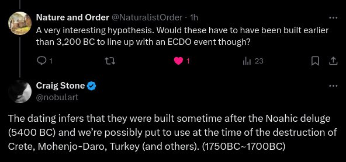
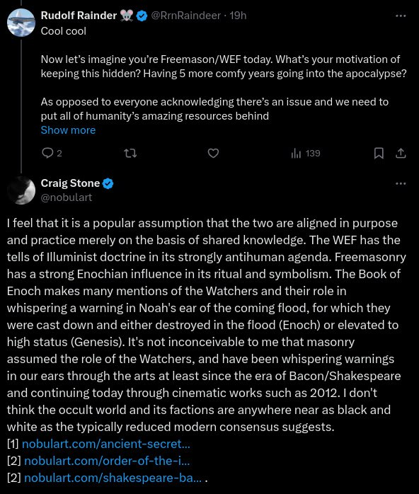

# Elite Cult Symbolism

## Pyramid [1]

"In" the pyramid is hermetic. Very distinct from on it, which is Illuminist art.

Within the context this art's masonic/hermetic origin, "Order From Chaos" could also be a reference to the destructive event that brought order to a previously chaotic planet.

## Elite symbolism [1]

It's one of the things we know pretty much for sure, because they've been writing about it in hermetic texts for centuries. It's illustrated in most masonic art and symbolism.
- Curated examples of the occulted references: https://nobulart.com
- The two trains circling the globe in Snowpiercer could be seen as metaphoric representations of the Arctic and Antarctic following the equator from west to east at 1600km/h.

## Elite Symbolism - Marduk

The book in question is Sitchen's The 12th Planet (Cue groans). I am a aware that he was a member of the illuminati and had an office in the Rockefeller Centre but maybe that should actually prompt us to look at his work more closely. He postulates the existence of terrestrial planet called Marduk (Niburu) which orbits the sun every 3,600 years and allows the nephilim access to Earth around it's perigee. Whether you believe the Marduk planet and Nephilim theory or not this cycle length fits with our 3,700 year catastrophe cycle theory and he bases all his work on an in depth knowledge of ancient Sumerian artifacts, even if his writings may be smoke and mirrors there may contain vital information for the initiated.

## Pillars of Joachim and Boaz [1]

I sometimes wonder whether the two great pyramids are in actual fact the pillars of Joachim and Boaz, and the recorded knowledge was stored in the sarcophagi, possibly along with an operators handbook for the pyramids themselves. This would suggest that pretty much everything we've been told about what came out of there was fabricated to cover the true discovery. Not beyond the realm of possibility at this point.

## Snowpiercer [1]

A short chat with GPT about Snowpiercer: https://chatgpt.com/share/070e9343-c809-4d28-ae2e-96925f30acef

## Twitter

Some one posted this on twitter, 104°

## Freemasonry

1. https://nobulart.com/on-the-origin-of-freemasonry/
2. https://nobulart.com/ancient-secret-societies/
3. https://nobulart.com/order-of-the-illuminati/
4. https://nobulart.com/shakespeare-bacon/

## Citations

1. [Craig Stone](https://nobulart.com)