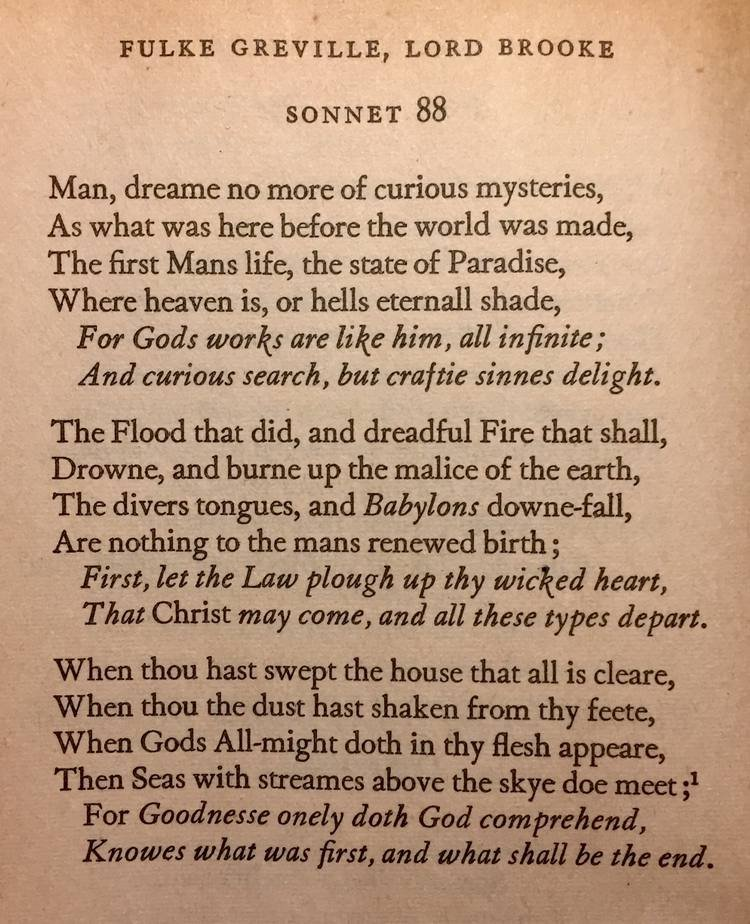
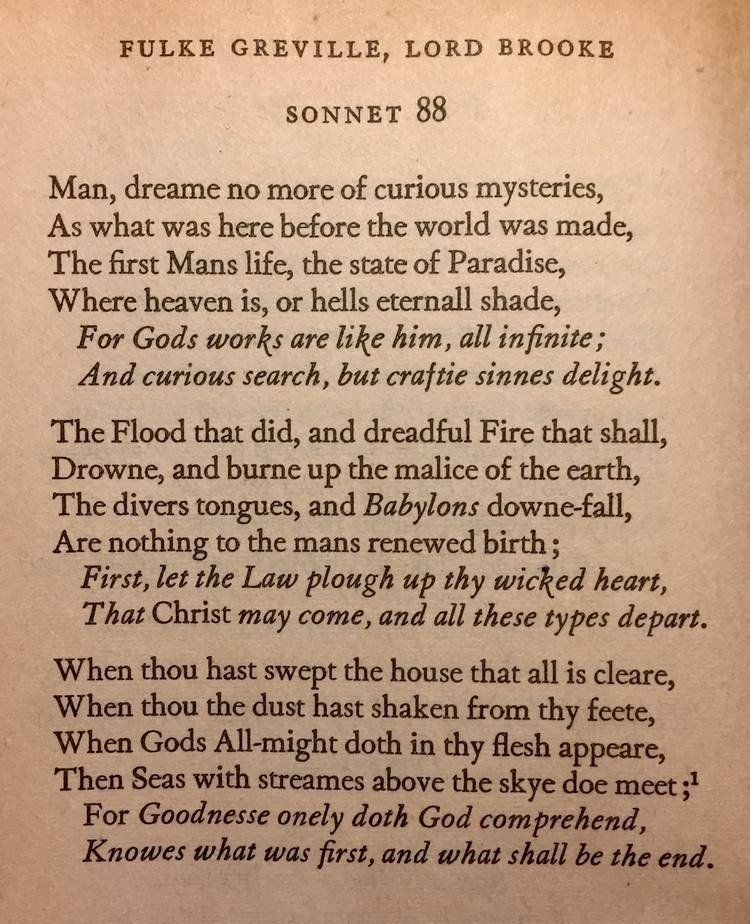
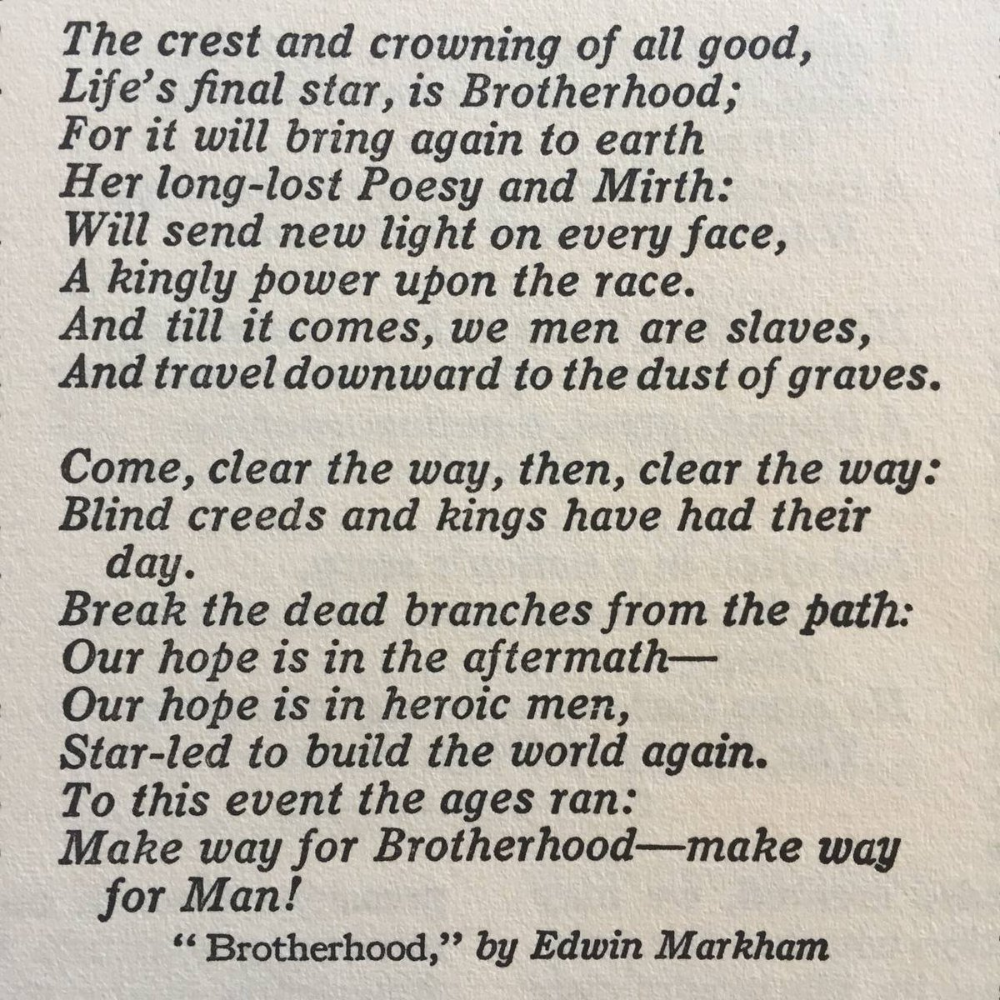

# Rosicrucians

## Rosicrucians

There's that diamond/lozenge shape again. Note the text written around the four edges of it. It symbolizes (among other things) as above, so below.

[1] https://archive.org/details/SecretSymbolsOfTheRosicruciansBook1J.D.A.Eckhardt1788

## Greville

Greville was a founding member of the Rosicrucian order, and was a contemporary of Bacon's.

## Secret Doctrine of the Rosicrucians

"The Rosicrucians teach that these seven planets of our planetary chain are closely linked and connected by subtle etheric forces, and that there is a constant etheric current passing from one to the others and flowing ever through the entire circuit." - Secret Doctrine of the Rosicrucians, W.W Atkinson (1918)

https://nobulart.com/the-souls-progress/

## Warnings once graven in megaliths...

Warnings once graven in megaliths became occulted, but the warnings have always been there for those willing to see through the veils that have been placed over much. Woven into the arts, from the Rosicrucian Masons, Bacon (Shakespeare), Greville, Martin &amp; Markham... https://t.co/3mzcdUuqlm

## Fulke Greville, “the first Grand...

Fulke Greville, “the first Grand Master of the Rosicrucian order“ https://t.co/0RNddOvmr4 https://t.co/hfIpVvgChw https://t.co/MCg6ocwpmM

## Edwin Markham[1] was nominated “poet...

Edwin Markham[1] was nominated “poet laureate of American Freemasonry”. The "event" is the same as that described in Rosicrucian doctrine[2] - the inexorable and cataclysmic turning of the ages[3]. 1. https://t.co/C7nY0Dr3Jw 2. https://t.co/JjzB8AHjRF 3. https://t.co/f17axFJQh6 https://t.co/j3JDpLmviw

