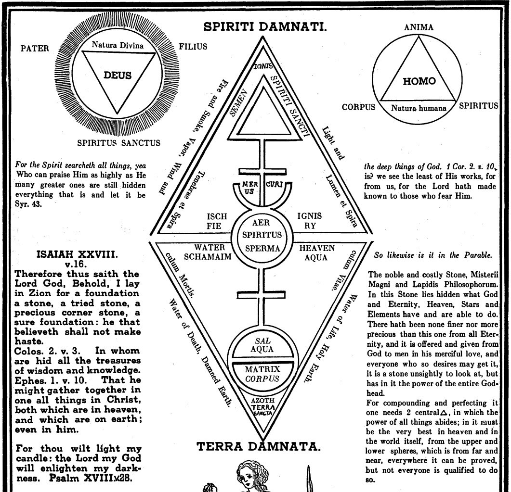
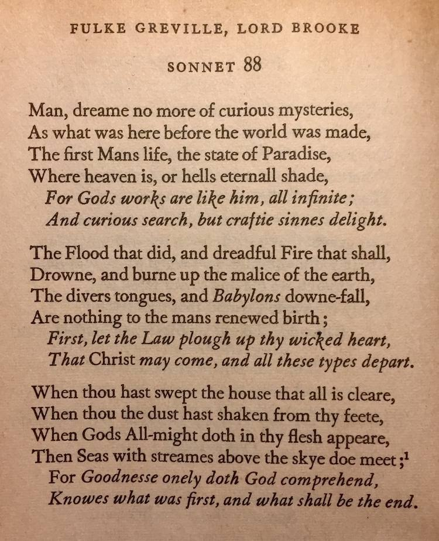

# Rosicrucians

## Rosicrucians

There's that diamond/lozenge shape again. Note the text written around the four edges of it. It symbolizes (among other things) as above, so below.

[1] https://archive.org/details/SecretSymbolsOfTheRosicruciansBook1J.D.A.Eckhardt1788

## Greville

Greville was a founding member of the Rosicrucian order, and was a contemporary of Bacon's.

## Secret Doctrine of the Rosicrucians

"The Rosicrucians teach that these seven planets of our planetary chain are closely linked and connected by subtle etheric forces, and that there is a constant etheric current passing from one to the others and flowing ever through the entire circuit." - Secret Doctrine of the Rosicrucians, W.W Atkinson (1918)

https://nobulart.com/the-souls-progress/