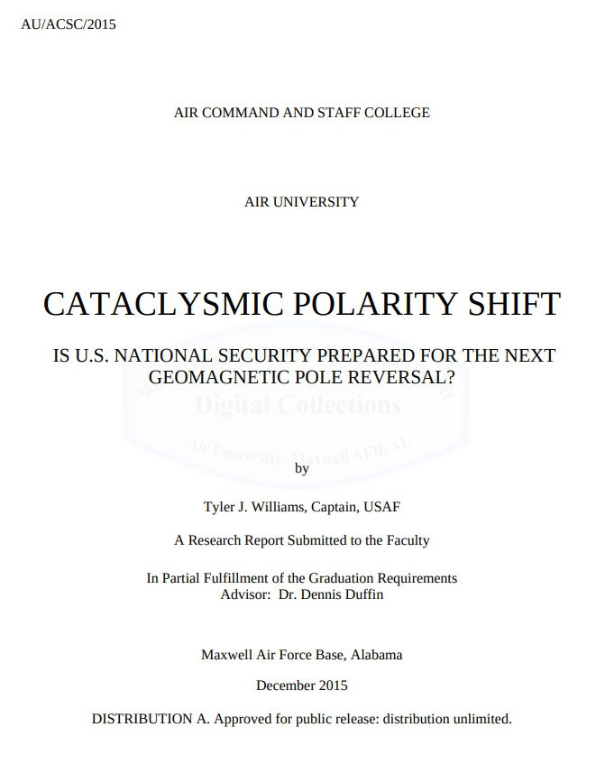
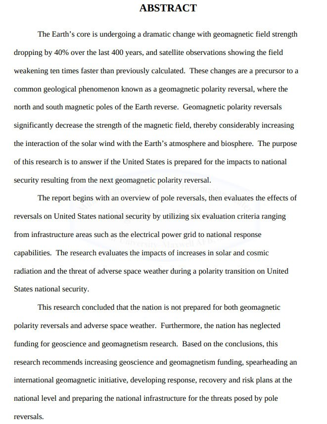
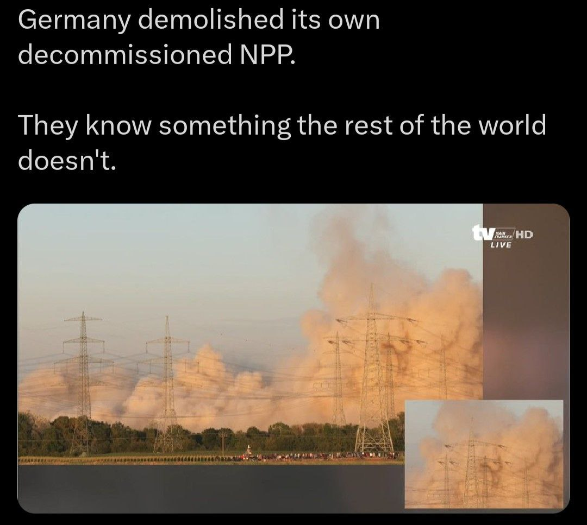
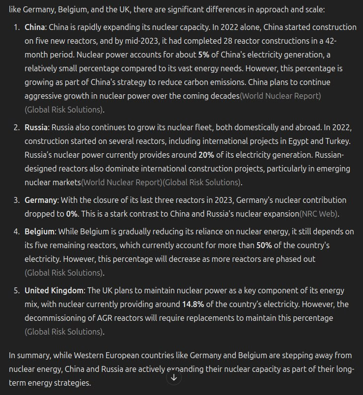
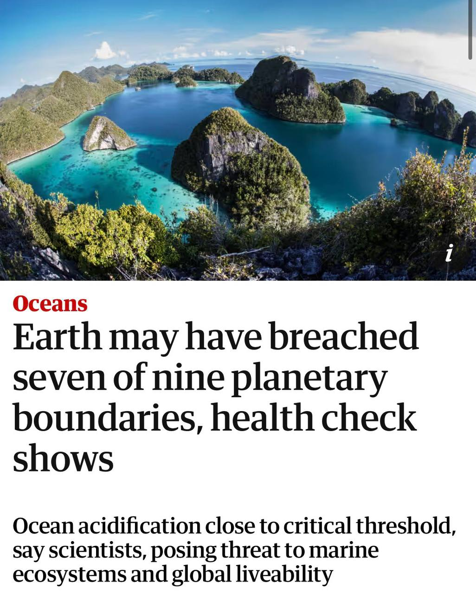
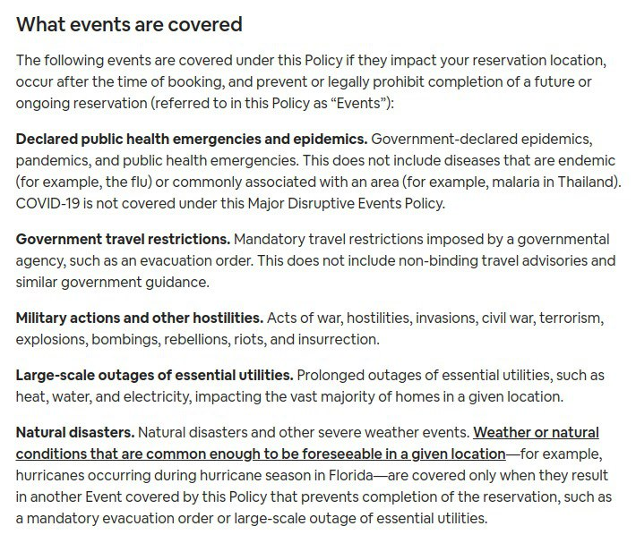
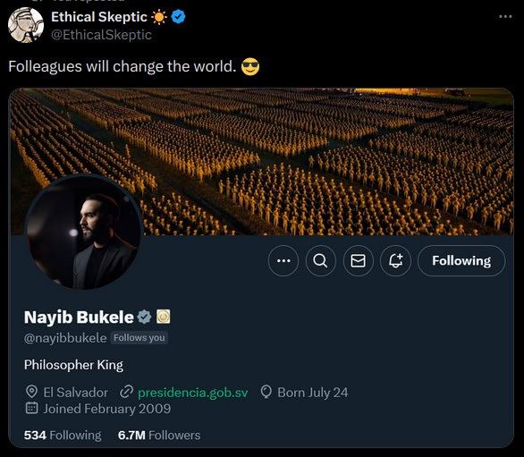

# Elite Intel

## Lue Elizondo

Three quite sobering video clips in this thread. See videos in `img/`.

https://x.com/omapproach/status/1835643206299492774?s=46

## US Government

At one of the scientific meetings that Major White attended in the Pentagon in early 1948, the scientists discussed the advisability of alerting the public to the pending polar-flip phenomenon.

https://nobulart.com/the-flip-of-the-earth/

## US Gov Recent Paper

"The Earth’s core is undergoing a dramatic change with geomagnetic field strength dropping by 40% over the last 400 years, and satellite observations showing the field weakening ten times faster than previously calculated."

Hard copy in this folder.

https://apps.dtic.mil/sti/pdfs/AD1040918.pdf

## Germany prepping?

Interestingly Germany's decision to get rid of its NPPs came after the Fukushima tsunami.

I just tried to back this up by searching the internet for two relatively recent quotes from high profile people about the risk of tsunamis and I cannot find them! One was a speech by the Sir Patrick Vallance in which he warned about the threat of tsunamis and the other was an Irish politician who stated Ireland needed to move its cities inland. I cannot find either quotes anywhere!

I asked about nuclear power generation across Europe, Russia and China. Interesting, confirming what I had heard from a few other sources in recent years. https://chatgpt.com/share/66ed403e-1fe8-8005-a945-4af4996028fa

## 7 of 9

Interesting choice of words for an AGW piece. In Masonic numerology, 7 of 9 may be interpreted as “completion of the divine”.

- https://www.theguardian.com/environment/2024/sep/23/earth-breach-planetary-boundaries-health-check-oceans
- https://medium.com/@julianwilson655/masonic-numbers-meaning-0fd3bcad09a1

## "Major disruptive events" policy

Did you ever see this Sasha Latypova substack highlighting Air BnB's changes to its "Major Disruptive Events" policy? The date the changes are to be implemented is interesting 06/06/24. Bleedingly obvious to an "initiated eye" (6/6/6). Has this been put in place in time for your 1st disruption date of the opposing conjuction around the 16th June?

https://sashalatypova.substack.com/p/message-from-airbnb-expect-governments

## Musk

Reminds me of the curious image Elon posted of what was on his desk

https://www.the-sun.com/tech/6785437/elon-musk-bedside-table-pic-powerful-object/

## Hurari, Shatner

Video clips in `img`.

## Bill Wood - Projecto Looking Glass

Here is another interview I found a few years ago in the same vein. It's worth checking out if you haven't before. 

The guy from the video was later charged with a crime and disappeared, so not sure how credible he is. It's a good tale if nothing else that fits the model.

https://youtu.be/j5kq0zYLgrE?si=udj68pV87r-CdI_O

## Rupert Sheldrake - Banned TED Talk

https://youtu.be/JKHUaNAxsTg

## We have to start re-framing... [1]

We have to start re-framing everything into a context in which the controllers of this world know what is coming.

## Intentionally covering up the event?

I had quite a long interaction with GPT on this topic a few hours ago. 

https://chatgpt.com/share/67188e68-14fc-8005-aa32-d02d61cb71a8

## CIA Website posts

Are the 3 letter agencies just trolling everyone now ? Mars, a million years ago. + Remote viewing.  https://x.com/Andercot/status/1858005501596111320?s=35

If you dare open a CIA file ofc 😂. 

 https://x.com/Andercot/status/1858008776894460051?s=35

## Nayib Bukele reading ECDO?

For those that may have missed this. I think we're much closer to the real disclosure than we were two weeks ago.

## Citations

1. Craig Stone