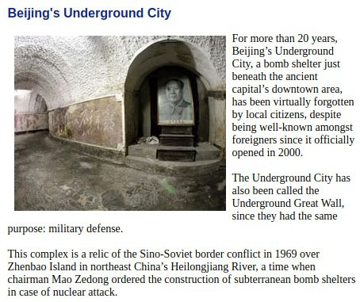
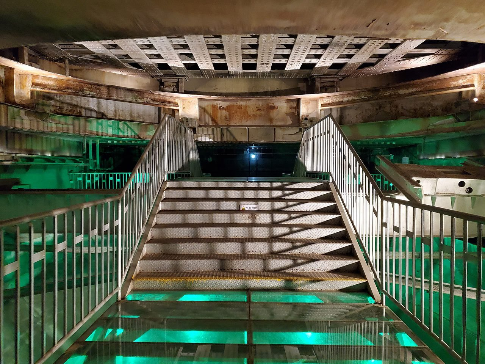
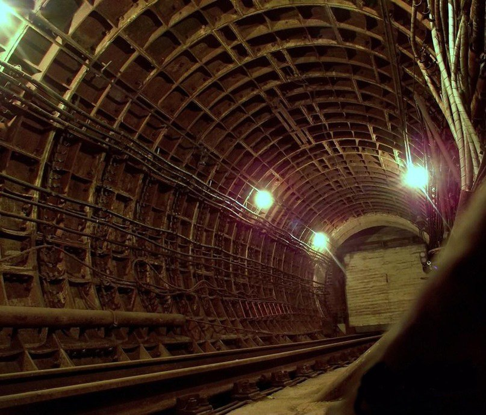
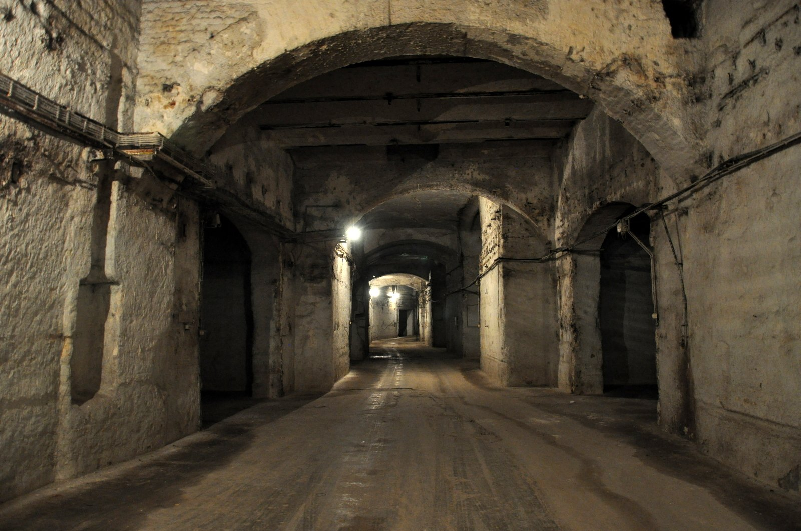
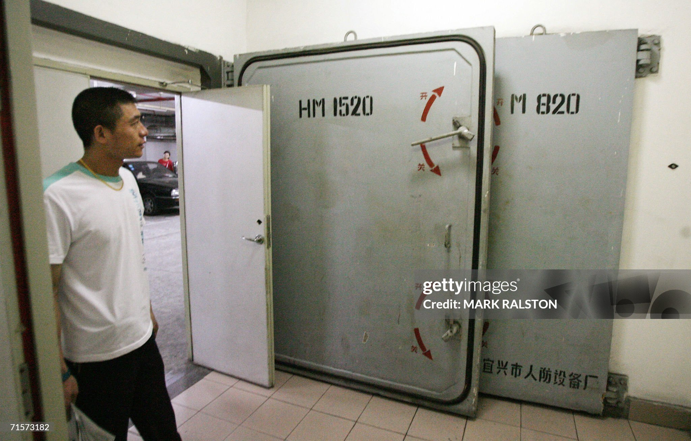

# Elite Preparation

Evidence of elites preparing for... something.

## Billionaires preparing for apocalypse

"A rising number of American billionaires are channeling their inner Bear Grylls — some in preparation for an apocalyptic event, be it a viral epidemic, nuclear war, or cataclysmic pole shift. Reid Hoffman, the cofounder of LinkedIn and a notable investor, told The New Yorker earlier this year he estimated that more than 50% of Silicon Valley billionaires had bought some level of "apocalypse insurance," like an underground bunker." - Business Insider

[1] https://www.businessinsider.com/billionaire-doomsday-preppers-escape-plans-2017-6

Other similar links:
- https://youtu.be/uQin210ZBAQ
- https://www.vice.com/en/article/billionaires-are-building-luxury-bunkers-to-escape-doomsday/

## Denver, Colorado Airport cult conspiracy theories

Colorado happens to be one of the areas in America that will likely be safe during S1 -> S2.

https://www.travelandleisure.com/airlines-airports/denver-airport/denver-international-airport-conspiracy-theories

## Boring Company

Interesting company choice?

## Knowledge Vault

https://www.archmission.org/gkv

"The Billion Year Archive™ is an Arch Mission Foundation initiative that seeks to build a solar-system scale archive of human civilization that will last for at least billions of years. The Billion Year Archive is the largest footprint and longest duration engineering project in human history. It is also the first practical initiative with potential to guarantee that our species and civilization will never be lost. The more locations that Arch Libraries that are sent to, the greater the probability that at least some of them will survive to be discovered in the distant future. Long after the Pyramids have turned to dust, and no matter what transpires on Earth, The Billion Year Archive will remain. The Billion Year Archive is comprised of ultra long-term storage devices called Arch™ Libraries (pronounced ”Arks”)."

"The first installment of data was encoded by Dr. Peter Kazansky and team, at the University of Southampton Optoelectronics Centre, to 5D optical data storage media, in quartz silica glass, with a durability of 14 billion years, inside a specially constructed metallic container and stored inside a vault within a deep underground cave. 

It is important to note that the initial sets of knowledge can be recovered with a microscope - and do not require advanced technology such as computers or lasers. We will include additional microscope-accessible  knowledge that teaches everything necessary to retrieve digital data that will be included in the future as well."

[1] https://archmission.org/

That company is riddled with those who have been selected on a lifeboat (so to speak) and have top security clearances.

Early version of the site: https://web.archive.org/web/20180212155149/https://www.archmission.org/

https://advocate.ng/inside-look-the-vault-of-knowledge-safeguarding-earths-history-in-a-secret-underground-haven/

Arch Mission Chairman Nova Spivack invited The Sun to see the first “Earth disk” being installed at the Hagerbach Test Gallery - a massive research and development facility hidden beneath a mountain... "We are overdue a geological cataclysm, not to mention cosmic energy bursts, and all the risks that humans themselves are causing - nuclear war, bio apocalypse, etc."

https://www.thesun.ie/news/12039928/secret-project-save-world-apocalypse-world-war/

## MSFT Underwater Data Center

https://x.com/IntEngineering/status/1452651172469243904

## IPFS, off-world data centers

https://x.com/NoVaxForMePal/status/1529938570559078415

## China Underground City

"The tunnels, built from 1969 to 1979 by more than 300,000 local citizens and even school children, wind for over 30 kilometers and cover an area of 85 square kilometers eight to eighteen meters under the surface. It includes around a thousand anti-air raid structures. In the event of attack, the plan was to house forty percent of the capital’s population underground and for the remainder to move to neighboring hills.

There is no authoritative information on how far the mostly hand-dug tunnels stretch, but they supposedly link all areas of central Beijing, from Xidan and Xuanwumen to Qianmen and Chongwen districts, to as far as the Western Hills.

They were equipped with facilities such as stores, restaurants, clinics, schools, theaters, reading rooms, factories, a roller skating rink, a grain and oil warehouse as well as barber shops and a mushroom cultivation farm, for growing foods that require little light."

[1] http://www.china.org.cn/english/travel/125961.htm

## China Nuclear Military Plant

"816 Nuclear Military Plant is an unfinished Chinese underground nuclear weapons production facility and the largest man-made tunnel structure in the world.[1] A military megaproject, the nuclear base is located near what is now suburban Fuling, a municipality in Chongqing, China. In 2010, it was opened to Chinese tourists.

The surface area of the cave is more than 104,000 sq.m, and the total length of the tunnels is more than 20 kilometers. The whole complex consists of 13 levels, 18 artificial caves linked to each other, and has more than 80 roads and 130 tunnels. Automobiles are able to pass the roads and tunnels inside. The base has the “World's Largest Artificial Cave”, which has a height of 79.6 meters, roughly equal to that of a 20-floor building."

[1] https://en.wikipedia.org/wiki/816_Nuclear_Military_Plant

## Moscow Metro

"The Moscow Metro. Metro-2 is the informal designation for a clandestine and officially unacknowledged deep underground metro system in the Moscow metropolitan area. // These facilities are interconnected by a network of deep subway lines that provide a quick and secure means of evacuation for the leadership and are intended for the national command authority in wartime. They are estimated to be between 200 m (660 ft) and 300 m (980 ft) deep, and can accommodate an estimated 10,000 people. A special subway line runs from some points in Moscow and possibly to the VIP terminal at Vnukovo Airfield"

[1] https://en.wikipedia.org/wiki/Metro-2

## Kobanya Cellar System

"The Kőbánya cellar system is an extensive network of subterranean, or underground spaces, in the 10th district of Budapest (Kőbánya), in Hungary. It is considered to be the largest cellar complex in the country. The floor area of the complex is variously estimated to be somewhere between 180,000–220,000 m2 (1,900,000–2,400,000 sq ft; 44–54 acres) and the combined length of the tunnels is estimated to be around 32–35 km (20–22 mi). Corridors 3–6 m (9.8–19.7 ft) wide and halls 10 m (33 ft) high are common in it. The deepest part is approximately 30 m (98 ft) under the ground surface."

https://en.wikipedia.org/wiki/K%C5%91b%C3%A1nya_cellar_system

## Shanghai Complex

The Shanghai Complex. China's largest metropolis has completed building a vast bunker in case of explosions, emissions of poisonous gas or nuclear radiation. The complex covers 90,000 square meters and can accomodate 200,000 people, according to the Shanghai Morning Post.

The underground haven has 15 passages nearly 2.5 miles (4km) in length that link to office towers and residential apartments. It is also connected to the subway system, enabling people to flee from one district to another. Water, power and ventilation systems can support the bunker's population for between seven and fifteen days. In times of peace, some parts can be used as garages, warehouses or commercial facilities."

https://www.chinadaily.com.cn/china/2006-07/31/content_653317.htm

## The Oppidium

https://youtu.be/37-4TOMQdjc

## The Elite Shelter

https://youtu.be/2YgYt-uxlmM