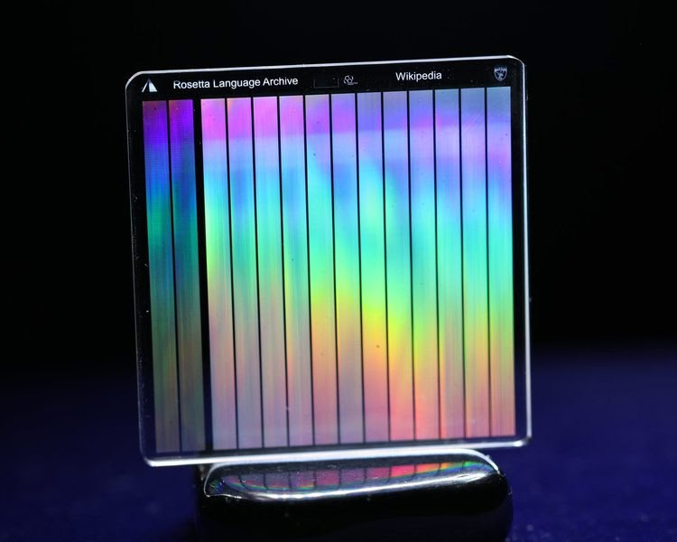

# Elite Preparation

Evidence of elites preparing for... something.

## Denver, Colorado Airport cult conspiracy theories

Colorado happens to be one of the areas in America that will likely be safe during S1 -> S2.

https://www.travelandleisure.com/airlines-airports/denver-airport/denver-international-airport-conspiracy-theories

## Boring Company

Interesting company choice?

Musk's 1-mile-a-week boring machine.
https://www.boringcompany.com/prufrock

## Knowledge Vault

https://www.archmission.org/gkv

"The Billion Year Archive™ is an Arch Mission Foundation initiative that seeks to build a solar-system scale archive of human civilization that will last for at least billions of years. The Billion Year Archive is the largest footprint and longest duration engineering project in human history. It is also the first practical initiative with potential to guarantee that our species and civilization will never be lost. The more locations that Arch Libraries that are sent to, the greater the probability that at least some of them will survive to be discovered in the distant future. Long after the Pyramids have turned to dust, and no matter what transpires on Earth, The Billion Year Archive will remain. The Billion Year Archive is comprised of ultra long-term storage devices called Arch™ Libraries (pronounced ”Arks”)."

"The first installment of data was encoded by Dr. Peter Kazansky and team, at the University of Southampton Optoelectronics Centre, to 5D optical data storage media, in quartz silica glass, with a durability of 14 billion years, inside a specially constructed metallic container and stored inside a vault within a deep underground cave. 

It is important to note that the initial sets of knowledge can be recovered with a microscope - and do not require advanced technology such as computers or lasers. We will include additional microscope-accessible  knowledge that teaches everything necessary to retrieve digital data that will be included in the future as well."

[1] https://archmission.org/

That company is riddled with those who have been selected on a lifeboat (so to speak) and have top security clearances.

Early version of the site: https://web.archive.org/web/20180212155149/https://www.archmission.org/

https://advocate.ng/inside-look-the-vault-of-knowledge-safeguarding-earths-history-in-a-secret-underground-haven/

Arch Mission Chairman Nova Spivack invited The Sun to see the first “Earth disk” being installed at the Hagerbach Test Gallery - a massive research and development facility hidden beneath a mountain... "We are overdue a geological cataclysm, not to mention cosmic energy bursts, and all the risks that humans themselves are causing - nuclear war, bio apocalypse, etc."

https://www.thesun.ie/news/12039928/secret-project-save-world-apocalypse-world-war/

## MSFT Underwater Data Center

https://x.com/IntEngineering/status/1452651172469243904

## IPFS, off-world data centers

https://x.com/NoVaxForMePal/status/1529938570559078415

## Black box recorder

There are some rather interesting projects apparently currently underway or planned. How about a Black Box recorder for planet Earth?

[1] https://earthsblackbox.com

## Beyond the earth

Its 90° not 104° (I checked)

All inner planets within 90 degrees of Saturn and Jupiter. Just an observation.

They included Ceres as well - notice?

Note the liberal use of roman numerology everywhere as well. There is a strong "Music of the Spheres" vibe to many of these projects associated with the Billion Year Archive.

Yes. The asteroid belt could represent an octave.

On the ball, you are as always. Fancy that - she's the size of the British Isles.

Earth, Moon & Ceres to scale.

What is the binary code on the orbital paths? Where does the line go that intesects the 90 degree lines hitting Saturn and Jupiter? It doesn't appear to be on the same plane as it goes under the asteroid belt rather than over it.

Not sure. I don’t see any obvious pattern.  Check out some of the other artwork on the site. Some interesting images.

Check out their star map as well. On one of the other pages.

33 crosses

[1] https://www.beyondtheearth.org

## TASAT

Another one

[1] https://tasat.org

## Video by Ben Davidson about Bezos "10,000 year clock"

Interesting video by Ben Davidson about Bezos' survival plan, in case you missed it (2019)

See /img for c.mp4.

I don't think Bezos' bolt hole hollowed out mountain [see red marker] is in the fabulous position Ben Davidson thinks. I took the screen shot from Ben's video further up the chat.   https://t.me/nobulartchat/27295

Sierra Diablo

Wikipedia
https://en.wikipedia.org › wiki › Sierra_Diablo
sierra diablo texas elevation from en.wikipedia.org
Geography. The Sierra Diablo are a high mountainous plateau in West Texas. The highest peak in the range is 6,610 feet in elevation. The surface of the range ...

## Chinese Communist Party 10 trillion Ark of Doom

CCP's escape plan

https://youtu.be/EDG4GrBL4J8?si=KmjVPQbaUi73njBO

I wouldn’t take the word of this content creator one bit. They’re a Taiwanese intel funded propaganda mouthpiece. Some official Chinese disclosure would be good.
