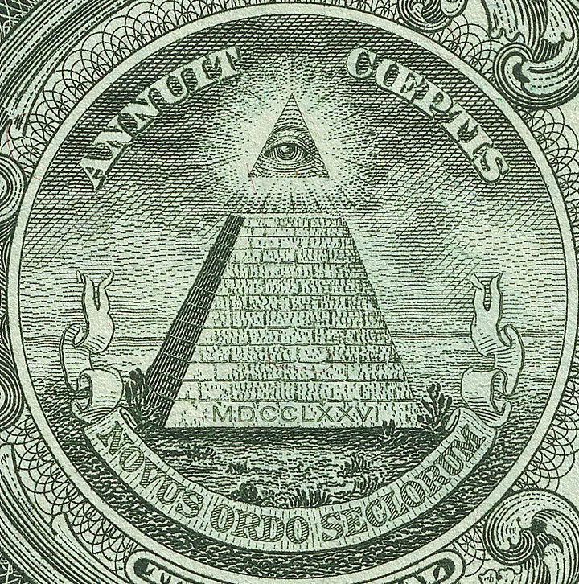
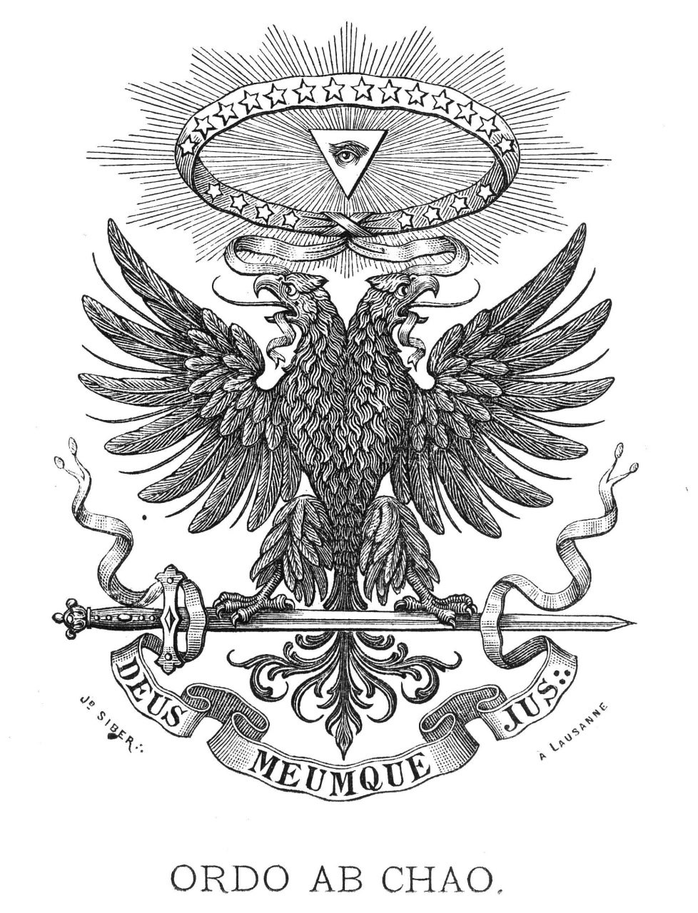
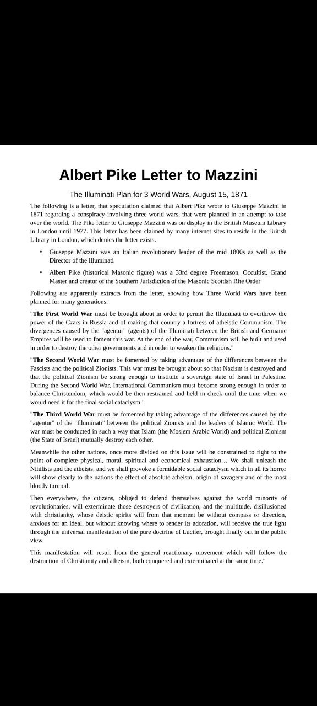
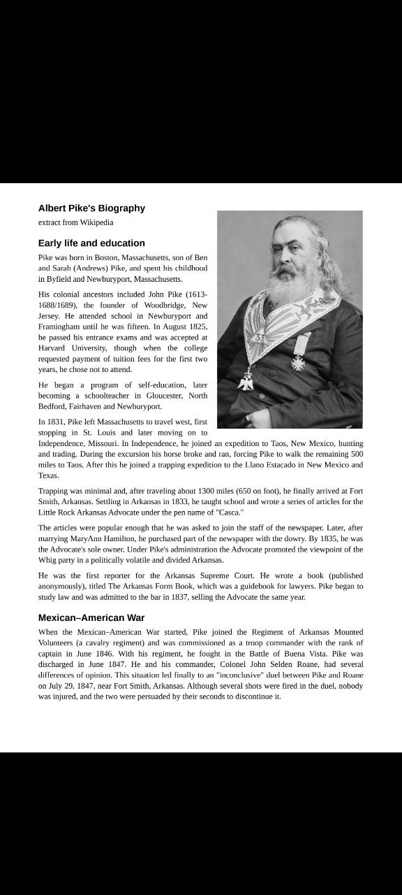
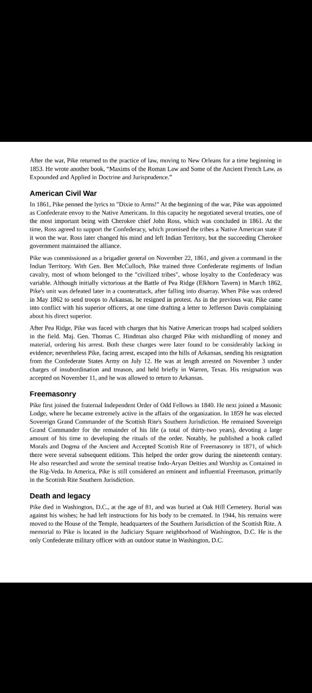

# Illuminati

## Pyramid [1]

"In" the pyramid is hermetic. Very distinct from on it, which is Illuminist art.

Within the context this art's masonic/hermetic origin, "Order From Chaos" could also be a reference to the destructive event that brought order to a previously chaotic planet.

## Albert Pike

## "On May 1, 1776, under...

"On May 1, 1776, under the direction of the newly formed House of Rothschild,.. Weishaupt founded the "Ancient Illuminated Seers of Bavaria" which became known as the "Order of the Illuminati". https://t.co/BM59KKaxR4
