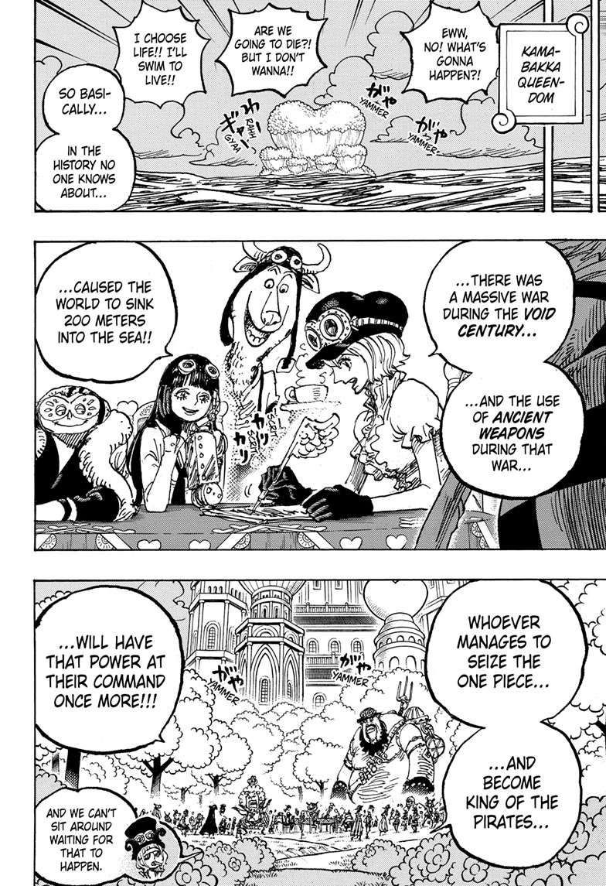
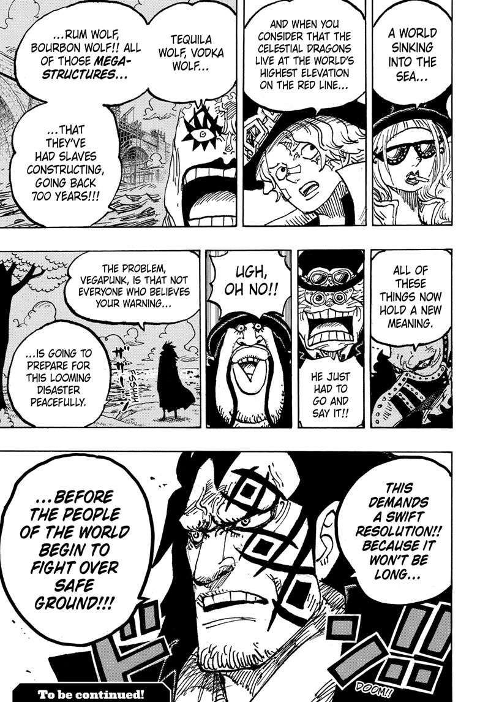
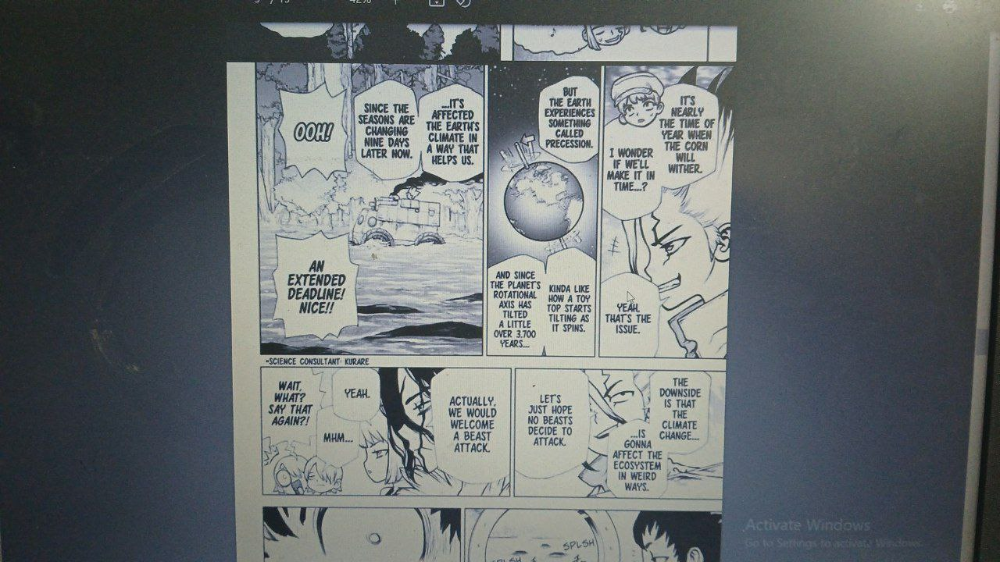

# Japanese Manga

Dr. Stone has a 3700 year reference.

## One Piece 200m Flooding

The most recent few chapters of One Piece unveiled a plotline that several centuries ago, a war caused the ocean level to rise by 200m, and that it is about to happen again, causing people to fight over safe land... Coincidence, or communication?

## Dr Stone Manga

From dr stone manga.
Precession, axis tilt, climate change, 3700 years, etc.
Seems like predictive programming.

https://t.me/nobulartchat/23945