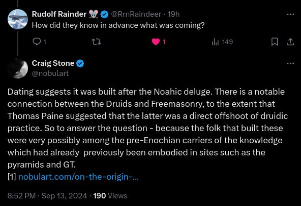
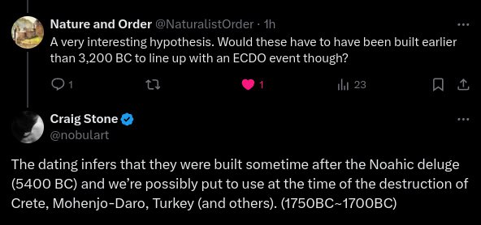
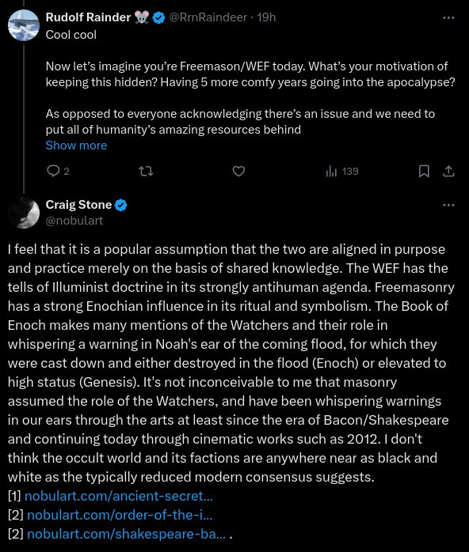
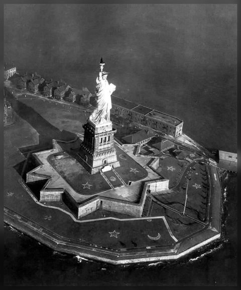
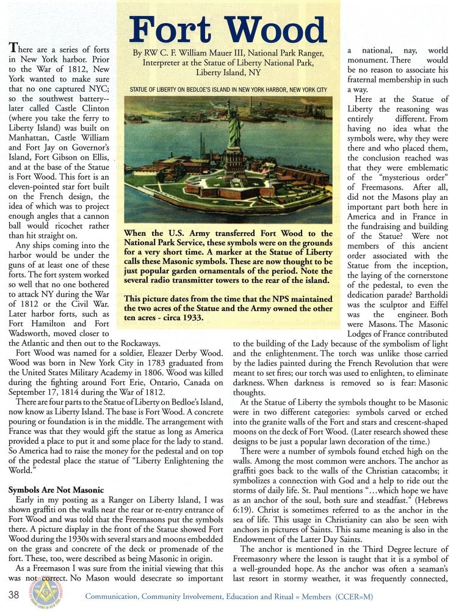
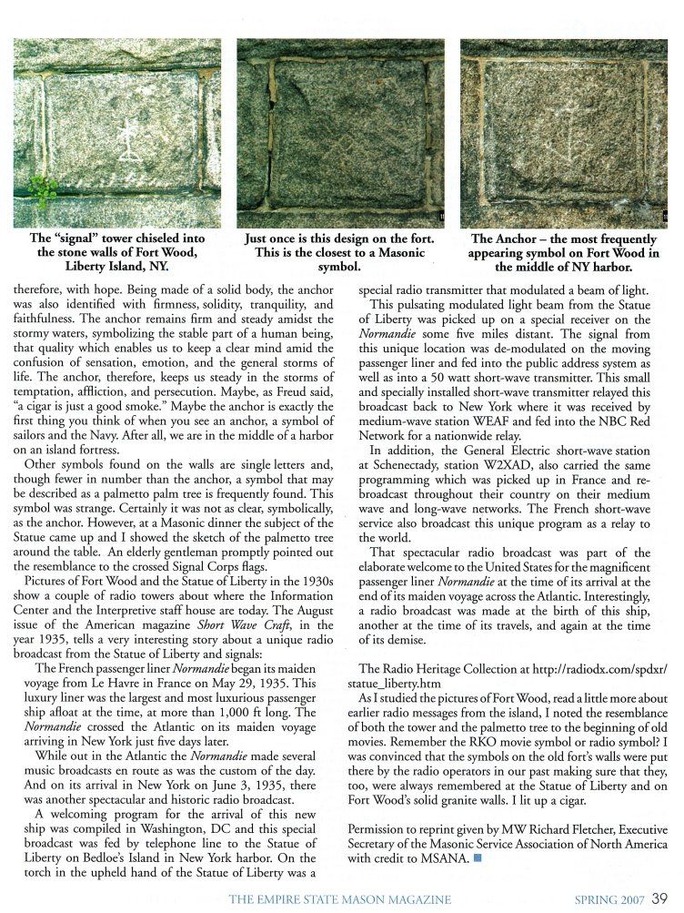
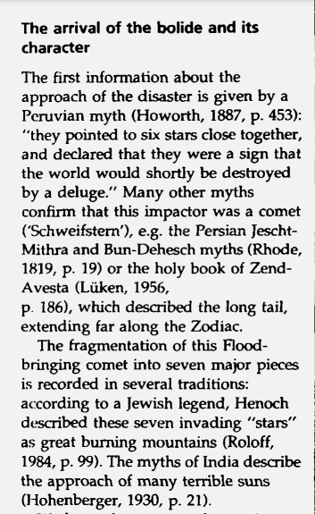
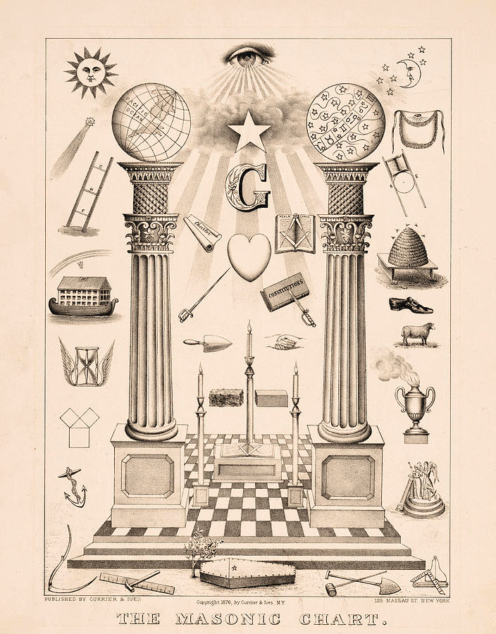

# Masons

## Freemasonry

1. https://nobulart.com/on-the-origin-of-freemasonry/
2. https://nobulart.com/ancient-secret-societies/
3. https://nobulart.com/order-of-the-illuminati/
4. https://nobulart.com/shakespeare-bacon/

## Quote

"Freemasonry (https://en.m.wikipedia.org/wiki/Freemasonry) has a black-and-white checkerboard (https://en.m.wikipedia.org/wiki/Checkerboard) as a central symbol within the lodge and all rituals occur on or around this checkerboard. Also known as a Mosaic Pavement, it represents the floor of King Solomon's Temple and according to Shakespeare (https://en.m.wikipedia.org/wiki/Shakespeare), represents man's natural duality."

https://en.m.wikipedia.org/wiki/Black-and-white_dualism

The secret societies play both sides of the coin. White" hat roles" vs "black hat". Luciferian vs Satanism. Each side creates their own straw man to achieve their own objectives. Hegalian Dialectic. This is how you move and compel the masses.

Its is seen in the two pillars, above and below, male and female, sun and moon, upside down triangle and right-side up triangle, in a single word: baphomet

https://www.reddit.com/r/todayilearned/comments/80urh9/til_that_baphomet_is_often_mistaken_for_satan_but/

This idea goes all the way back to nimrod and his religion and guarded by the secret societies. Martin is just signaling that he is playing his role. He is part of the team... they all are.

## The "Grooved Ware" culture that... [1]

The "Grooved Ware" culture that built the megaliths of Orkney and Ireland (and many other places) were likely the bearers of the ancient Egyptian/Enochian tradition, which later evolved into the druidic culture. From the Druids came Freemasonry, the last remaining living oeal…

## Fort Wood (1930) - the...

Fort Wood (1930) - the lawn symbols have long since been covered or removed. The article is from the Spring 2007 edition of The Empire State Mason magazine. https://t.co/qeC5WXdeSV

## The 7 stars are present...

The 7 stars are present in countless examples of masonic and hermetic art, along with the antediluvian pillars of Joachim and Boaz. Masonry has always presented the deluge as a focal tenet of both its philosophy and art. Text: https://t.co/oAnySAK7xC https://t.co/LTvB3H4XJG

## ¨Though few know it, the...

¨Though few know it, the god of Masonry is Lucifer. What’s the difference between Lucifer and Satan? Luciferians think they are doing good. Satanists know they are evil. Lucifer is further subdivided into Isis and #Osiris¨ https://t.co/HkEkoEfNKd

## #Freemason #Freemasons 
https://t.co/V5T0PxE7Z8

#Freemason #Freemasons https://t.co/V5T0PxE7Z8

## Georgia Guidestones

"The Georgia Guidestones are 108 miles from not one, but three Masonic Temples in Atlanta, one of which burned down in 1950. This is where the numerical symbolism becomes almost fun and the only rational conclusion is that the Georgia Guidestones were built by the Georgia Freemasons." - this is taken from a now defunct website which died shortly after its maintainer did a couple of years ago. His entire focus was the coming event, and he went into enormous detail about many aspects, including this page devoted to the guidestones. I think he was correct.
[1] https://t.co/RhypV7guHg

## Shortly before his death he...

Shortly before his death he made a video, putting his face out there for the first time (I think he knew his time was short). This is an excerpt from that, recorded during a visit to Pike's Peak. https://t.co/139aFjrG6i

See img/1816000237141393578-UeJtYvfNF1xCGebd.mp4.

## Citations

1. Craig Stone