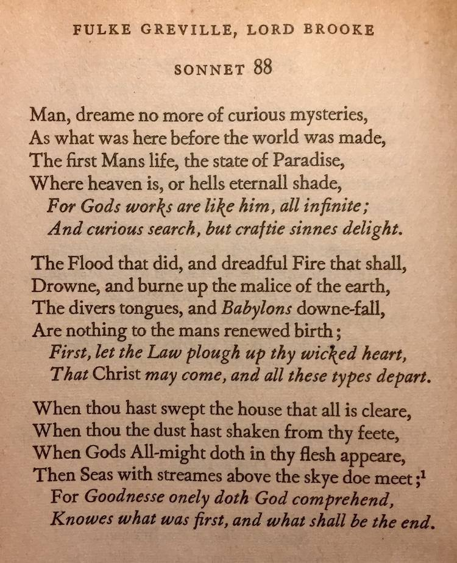
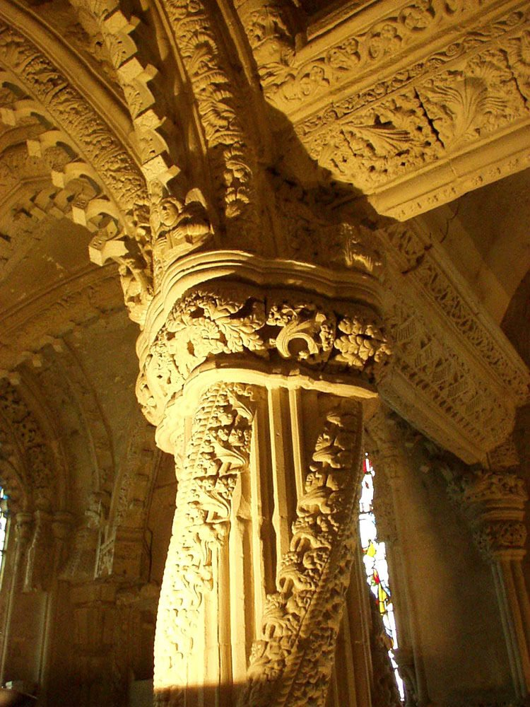

# Rosicrucians

## Rosicrucians

There's that diamond/lozenge shape again. Note the text written around the four edges of it. It symbolizes (among other things) as above, so below.

[1] https://archive.org/details/SecretSymbolsOfTheRosicruciansBook1J.D.A.Eckhardt1788

## Greville

Greville was a founding member of the Rosicrucian order, and was a contemporary of Bacon's.

## Secret Doctrine of the Rosicrucians

"The Rosicrucians teach that these seven planets of our planetary chain are closely linked and connected by subtle etheric forces, and that there is a constant etheric current passing from one to the others and flowing ever through the entire circuit." - Secret Doctrine of the Rosicrucians, W.W Atkinson (1918)

https://nobulart.com/the-souls-progress/

## Warnings once graven in megaliths...

Warnings once graven in megaliths became occulted, but the warnings have always been there for those willing to see through the veils that have been placed over much. Woven into the arts, from the Rosicrucian Masons, Bacon (Shakespeare), Greville, Martin &amp; Markham... https://t.co/3mzcdUuqlm

## Fulke Greville, “the first Grand...

Fulke Greville, “the first Grand Master of the Rosicrucian order“ https://t.co/0RNddOvmr4 https://t.co/hfIpVvgChw https://t.co/MCg6ocwpmM

## Edwin Markham[1] was nominated “poet...

Edwin Markham[1] was nominated “poet laureate of American Freemasonry”. The "event" is the same as that described in Rosicrucian doctrine[2] - the inexorable and cataclysmic turning of the ages[3]. 1. https://t.co/C7nY0Dr3Jw 2. https://t.co/JjzB8AHjRF 3. https://t.co/f17axFJQh6 https://t.co/j3JDpLmviw

## "Seven great continental cataclysms occur...

"Seven great continental cataclysms occur during the occupation of the earth by the human life-wave for one round period." [1] "Nature has furnished her students with the means of reaching her mysteries, in the dual form of intuition and intellect, and of measuring her mighty… https://t.co/qU4GY1TZ1y https://t.co/FHpV7l63tS

## "The Rosicrucians teach that these...

"The Rosicrucians teach that these seven planets of our planetary chain are closely linked and connected by subtle etheric forces, and that there is a constant etheric current passing from one to the others and flowing ever through the entire circuit." - Secret Doctrine of the… https://t.co/4bmGpQWK8x

## Rosslyn Chapel

[1/3] Rosslyn Chapel : An ode to the deluge. This 15th century Templar chapel, located in Scotland, is a scale recreation of Solomon's Temple. The stone used in its construction is speculated to have been sourced from Jerusalem [1]. The intricately decorated structure is a remarkable work, with the antediluvian pillars of Boaz and Jachin as centrepiece. [2]

"The design for the Temple of Solomon was a double square, and the same is true for Rosslyn Chapel, the centre being marked by the fourth pillar from the west. Knight and Lomas have overlain the ground plan of the Temple of Solomon with that of Rosslyn Chapel. In their layout, the Apprentice Pillar falls on the location of Boaz and the Master Pillar on that of Jachin. These are the central pillars that play an important role in the Masonic ceremonies.

The legend goes that the knowledge of the antediluvian world, imparted to mankind by Shemhazai and his fellow Watchers (that is, the sciences, and more particularly, the arts and astronomy), had been inscribed by Enoch on two pillars. Freemasonic legends state that one of these pillars was later discovered by King Solomon when he built his Temple. This explains why the Temple is so important to the ideology of Freemasons, for they believe that their Temple incorporates this knowledge.

The Temple of Solomon faced due East and in front of its Eastern entrance were two pillars. However, there is no entrance in the East of Rosslyn Chapel, unless one counts the entrance “from the underworld”, from the crypt. In mythology, the World Ash Tree connects earth to heaven, but it has also been erected on a square stone, the so-called foundation stone, which holds back the waters from the Abyss, or the Underworld. Intriguingly, the Apprentice Pillar stands immediately next to the “entrance to the underworld” of the chapel, the crypt.

The square, and by extension the cube (see also the “musical cubes” in the Lady Chapel), right next to the “abyss of the chapel” and the Apprentice Pillar, are linked to Saturn. In Greek mythology, according to Orpheus, the god Saturn (who was known to the Greeks as Chronos), was said to have dwelled amongst Mankind. In that respect, he resembles the “Watchers” and their leader, Shemhazai, also depicted in the Lady Chapel. This square, the foundation stone, is often described as “a stone upon which rests a pillar that reaches from earth to heaven”. Again, a reference to the Apprentice Pillar, which together with the other pillars, sustains the ceiling, one part of which is depicted literally as a starry heaven. It is said that when this foundation stone was removed from underneath the World Tree, the Flood or Deluge occurred.

In Biblical mythology, the only person to survive this cataclysm was Noah. Mythology also links the foundation stone with Noah’s Ark and, in Egyptian mythology, with the box/coffin of Osiris, which carried his body over the river Nile."

- The Stone Puzzle of Rosslyn Chapel, Philip Coppins (2011)[2]

1. https://archive.org/details/urielsmachinepre0000knig
2. https://archive.org/details/stonepuzzleofros0000copp
3. https://rosslynchapel.com

[2/3] Rosslyn's intricate design, and densely decorated stone has been interpreted by a number of researchers as encoding musical and cosmic harmonics, in the Templar-Masonic tradition - the music of the spheres: "Music has been at the heart of the human race since day one and the earliest written records of music can be traced back to the early Egyptians. The fact that the mathematics of the diatonic scale are to be found in the ratios which are common to sacred geometry and the symbol phi, tells us that it has much greater significance than may have been realised. The ancients used the diatonic scale in their religious and astronomical studies, and it appears in esoteric teachings as the symbol of a ladder to higher spiritual states. The Gurdjieff teaching “The Work’ calls it “the side octave to the sun” and assigns to each note a planet, representing a step in spiritual progress."
- Rosslyn Chapel : The Music of the Cubes, Thomas Mitchell (1999)

[3/3] "The TONIC or KEYNOTE, the FOURTH and the FIFTH are the most important tones in creating Harmonic progressions. In chord structure :

I is always major.
II is always minor.
III is always minor.
IV is always major.
V is always major.
VI is always minor.
VII is always diminished.

The Enneagram is an ancient Sufi diagram and it also appears in the literature of Freemasonry symbols. The inner diagram around the triangle is the inner aspect of linear time and physical reality and is the moving part of the diagram, represented by Re, Me, Fa, Sol, La, recurring.

The diatonic scale is at the centre of the Enneagram and it presents another spiritual tool to understanding the hidden influences to which we are exposed every day but which by study and application we could become aware. This was the entire purpose of the early pilgrims who walked the way to spiritual awakening by way of the places of power.

That the places of power, and the pilgrimage route to Rosslyn Chapel has survived the ravages of time is proof positive that the ancients knew much more than we give them credit for and a great science perished at the time of the flood."
- Excerpts from Rosslyn Chapel : The Music of the Cubes

The planetary harmonic periods of our solar system are comprised of the 4627-year outer planet cycle (IV) and the 3701-year inner planet cycle (V) and their combined 18.5ka cycle (I).  In Rosslyn (at considerable expense and effort) astronomy, arithmetic, geometry and music converged  more than 500 years ago to bring the deluge and planetary harmonics together in a stone edifice which is, in many respects, quite unique in the world.

[1] https://x.com/nobulart/statu

