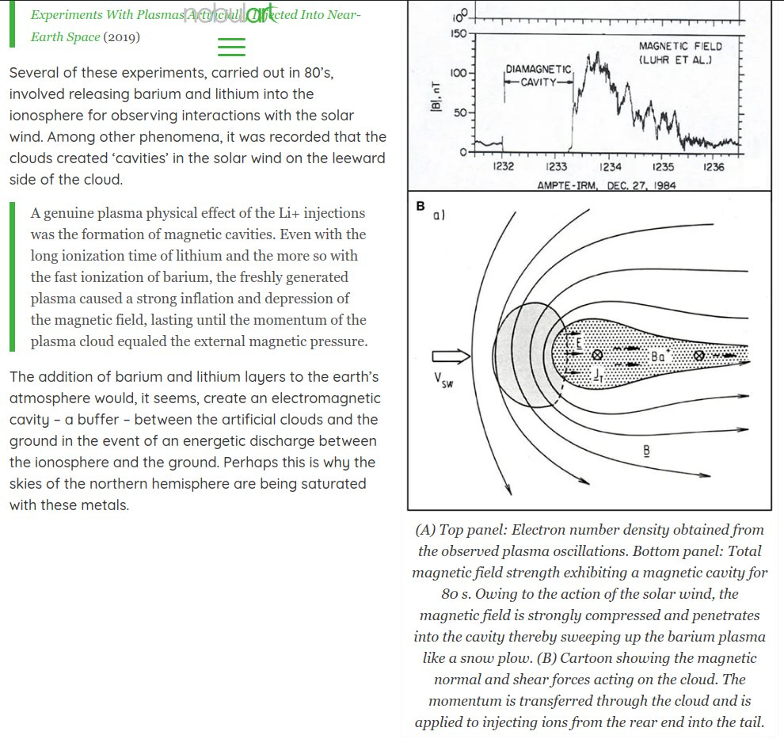
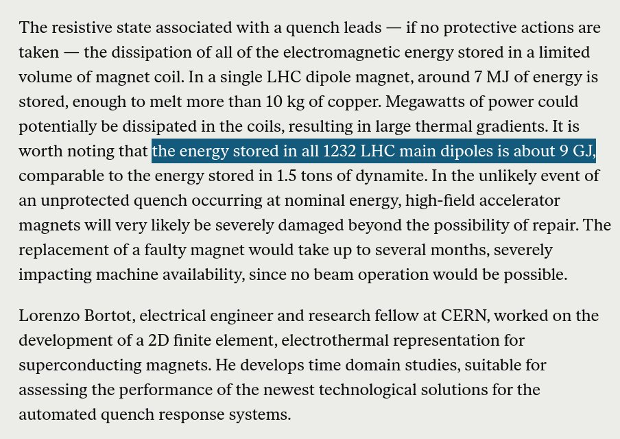

# Government Intervention

This folder is for government intervention related to the ECDO.

## Possibilities

- Chemtrails
- HAARP
- CERN
- Underground shelters
- Seedbanks
- NWO deadline 2030

## Intervention [1]

Its a progressive, electromagnetically interfaced heating event [1]. What if we could somehow retard the process by intervening in the earth-solar coupling [2], and perhaps even the core-mantle coupling through the application of magnetohydrodynamics with the objective of influencing magma viscosity? [3][4][5]

1. https://theethicalskeptic.com/2024/05/12/exothermic-core-mantle-decoupling-dzhanibekov-oscillation-ecdo-theory/
2. https://x.com/nobulart/status/1802017097909760423
3. https://x.com/nobulart/status/1802044626263498824
4. https://home.cern/science/accelerators/future-circular-collider
5. https://en.wikipedia.org/wiki/Future_Circular_Collider

Well, well, well... With the exception of the four colliders in India, the remainder of the 30+ colliders worldwide are all clustered near to the meridians of the ECDO pivots and the rotational meridian. Coincidence, or a tripolar phased array?
- https://mit.edu/~wqm/Papers/Malik_TripolarAntenna.pdf

¨Global view Distribution of superconducting particle accelerators using SRF structures for electrons (orange), protons (purple) and heavy ions (pink). More than 30 SRF accelerators are in operation (circles), approximately 15 are presently under construction (triangles) and more than 10 future projects are under consideration (squares). Credit: CERN¨
- https://cerncourier.com/a/teslas-high-gradient-march/

## Neutrino Detectors. [1]

[1] University of Wisconsin-Madison seal. Numen Lumen = Divine Light. Nice eye. [2] The Antarctic IceCube Neutron Observatory, commissioned in 2010. A joint UWM/CERN experiment. [3] Clustering of existing and planned neutrino detectors is near the ECDO pivot and 31E meridians. Neither IceCube nor it's predecessor (AMANDA) are mentioned anywhere in the 2023 paper Neutrino Geoscience: Review, Survey, Future Prospects by McDonough and Watanabe, from which the map is drawn, nor anywhere in the 275 page parent publication, Core-Mantle Co-Evolution An Interdisciplinary Approach (2023), which occurred to me as a little odd.
1. https://en.wikipedia.org/wiki/University_of_Wisconsin%E2%80%93Madison
2. https://en.wikipedia.org/wiki/IceCube_Neutrino_Observatory
3. https://researchgate.net/publication/370773514_Core-Mantle_Co-Evolution_An_Interdisciplinary_Approach

The detectors are, I believe, what they're claimed to be, but could possibly fulfill other unknown functions. Within the context of an ECDO event, they are part of the early warning system, and could possibly be working in tandem with the similarly clustered colliders, as a core-mantle control (Colliders) and feedback monitoring system (Detectors). The entire system together is a modern day technological equivalent of the Great Pyramid.

## Ice Drilling

If the inertia of the ice causes the ECDO, maybe that's why they're drilling so many holes at the south pole using a "neutrino detector" as the cover. Some strange stuff about this place. Right down to the bedrock. Could enough bang split the ice sheet?

https://icecube.wisc.edu

## HAARP

https://x.com/RealDutchsinse/status/1818805390974263741

## Faraday Cage

Links to the source documents are here:
https://nobulart.com/the-perfect-storm/#chemtrails

### I have a suspicion that...

I have a suspicion that this may be an attempt to place a Faraday cage around the planet, with the intention of mitigating or preventing the trigger for the ECDO event. The other claimed harms exist, but I do not think that they are the intended application of this technology. https://t.co/oQ7nPz2m1o

## Hurricane and Tornado Control

Hurricane and Tornado Control Device US Patent: 20030085296 A1 (https://patents.justia.com/patent/20030085296)

"Mega generators are employed to produce high decibel sound waves, which sound waves are projected toward the clouds and rotating winds which form the low atmosphere systems.

In one scenario, the high frequency sound waves will function to disrupt and slow the rotating winds, thereby preventing a hurricane or tornado from forming. 

In another scenario, the high frequency sound waves will function to enhance the rotation of the winds, thereby causing a hurricane or tornado to form."

## Large Hadron Collider

The estimated magnetic field strength near to the Earth's core is 25-40 teslas. The LHC contains 1,232 superconducting dipole electromagnets, each capable of 8.3 teslas (20-33% of that near the core), for a combined total 10,225 teslas. Approximately 0.63 gigajoules (GJ) of energy would be required to establish a 10,000 tesla magnetic field. The Large Hadron Collider (LHC) can store up to 9 gigajoules (GJ) of energy in its dipole magnets during operation. This stored energy is primarily due to the magnetic field energy stored in the superconducting coils of the magnets.

### Approx. 0.63 gigajoules (GJ) of... [1]

Approx. 0.63 gigajoules (GJ) of energy would be required to establish a 10,000 tesla magnetic field. The LHC can store up to 9GJ of energy in its dipole magnets during operation. This stored energy is primarily due to the magnetic field energy stored in the superconducting coils. https://t.co/4PQqXGZnwG

## CERN is a supercooled ring-magnet...

CERN is a supercooled ring-magnet mounted tangential to the Earth's core. Is this too, an attempt to alter the core-mantle coupling environment under cover of "science"? God particles, and all. https://t.co/Bq4OG9ukPH

## The estimated magnetic field near...

The estimated magnetic field near the Earth's core is 25-40 teslas. The CERN|LHC contains 1,232 superconducting dipole electromagnets, each capable of 8.3 teslas (20-33% of that near the core), for a theoretical combined total of 10,225 teslas (if energized simultaneously). https://t.co/M4lhEvYReL

## CERN is located on a...

CERN is located on a high ridge in the Earth's crust, almost central to a large zone where the magnetic anomaly is relatively undisturbed. Perhaps this area has an LLSVP extension beneath it? https://t.co/3jKNbiL0VM

## It would seem that this...

It would seem that this situation might be averted by applying just the right touch of countering torsion during the early onset of destabilization. Perhaps nuclear-powered torsion engines aren’t so sci-Fi after all.

## Well, well, well... ¨Global view...

Well, well, well... ¨Global view Distribution of superconducting particle accelerators using SRF structures for electrons (orange), protons (purple) and heavy ions (pink). More than 30 SRF accelerators are in operation (circles), approximately 15 are presently under construction… https://t.co/ANyXG3oTPv

## Citations

1. [Craig Stone](https://nobulart.com)

# TODO

Project Nanook