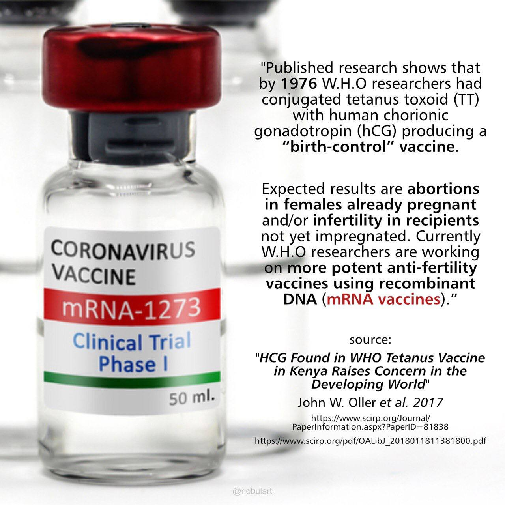
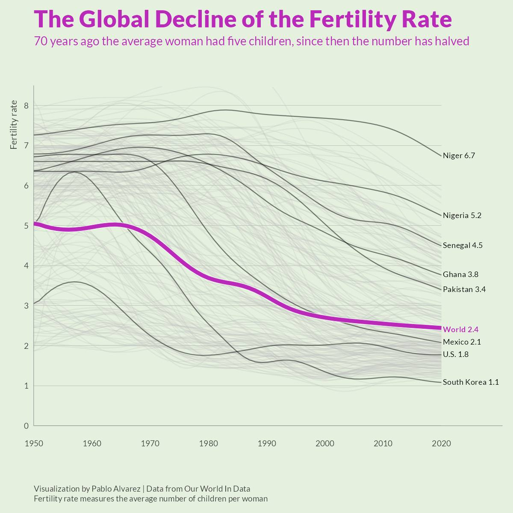

# Vaccines

## Vaccine Speculation [1]

DEPOP 101: Safely [sic] & Effectively Sterilizing Humanity Since the 1970's

"In 1994, the Pro Life Committee of Mexico was suspicious of the protocols for the tetanus toxoid campaign . . . The Committee had the vaccine analyzed for hCG. Similarly laced tetanus vaccines were uncovered in the Philippines and Nicaragua. In addition to the WHO, other organizations involved in the development of an anti-fertility vaccines using hCG include the UN Population Fund, the UN Development Programme, the World Bank, the Population Council, the Rockefeller Foundation, the US National Institute of Child Health and Human Development, the All India Institute of Medical Sciences, and Uppsala, Helsinki, and Ohio State universities." - Vaccine Weekly (https://pubmed.ncbi.nlm.nih.gov/12346214/) (1995)

1. Charted: The Global Decline of Fertility Rates (https://www.visualcapitalist.com/cp/charted-the-global-decline-of-fertility-rates/)
2. HCG Found in WHO Tetanus Vaccine in Kenya Raises Concern in the Developing World (https://www.scirp.org/journal/paperinformation.aspx?paperid=81838)
3. Addendum to “HCG Found in Tetanus Vaccine” (https://www.ijvtpr.com/index.php/IJVTPR/article/view/3)
4. Baby-Killing Vaccine: Is It Being Stealth Tested? (https://www.ewtn.com/catholicism/library/babykilling-vaccine-is-it-being-stealth-tested-11055)

## Bechamp or Pasteur

Ignore the patients that died after treatment, and claim that the 'therapy' works. Sound familiar? Only thing is, this scam started more than a hundred years ago.

https://ia801802.us.archive.org/34/items/bechamp-or-pasteur/Bechamp-or-Pasteur.pdf

## "Catastrophic Contagion"

They sure practice a great deal. https://t.co/0nAw0uKCkM

"The Johns Hopkins Center for Health Security, in partnership with WHO and the Bill & Melinda Gates Foundation, conducted Catastrophic Contagion, a pandemic tabletop exercise at the Grand Challenges Annual Meeting in Brussels, Belgium, on October 23, 2022.

The extraordinary group of participants consisted of 10 current and former Health Ministers and senior public health officials from Senegal, Rwanda, Nigeria, Angola, Liberia, Singapore, India, Germany, as well as Bill Gates, co-chair of the Bill & Melinda Gates Foundation.

The exercise simulated a series of WHO emergency health advisory board meetings addressing a fictional pandemic set in the near future. Participants grappled with how to respond to an epidemic located in one part of the world that then spread rapidly, becoming a pandemic with a higher fatality rate than COVID-19 and disproportionately affecting children and young people.

Participants were challenged to make urgent policy decisions with limited information in the face of uncertainty. Each problem and choice had serious health, economic, and social ramifications. "

https://catastrophiccontagion.centerforhealthsecurity.org/

## In 2016 Antonietta Gatti of...

In 2016 Antonietta Gatti of the National Council of Research of Italy analysed 44 different vaccines using an ESE microscope equipped with an X-ray microprobe. They cataloged undeclared contaminants &amp; nano-particulates in 43 out of the 44 products tested. https://t.co/xxajj5edTo https://t.co/IWfFLF9w3d

## Washington Post tuning the narrative...

Washington Post tuning the narrative (23-24 November 2022). https://t.co/5oVcxXl6Gl https://t.co/gkP6nJzWQu

