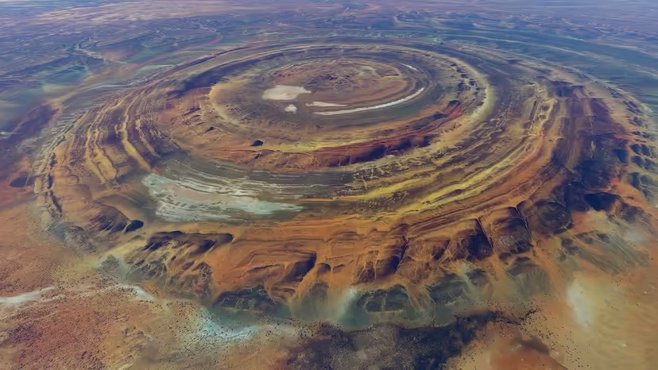

# Earth Geological State

Evidence pertaining to ECDO from the geological state of the Earth, such as weather.

## Recent climate change (Ethical Skeptic)

The [first part](https://theethicalskeptic.com/2020/02/16/the-climate-change-alternative-we-ignore-to-our-peril/) of Ethical Skeptic's three-part ECDO thesis is one of the best sources that the climate has been changing recently. I will take some quotes that summarize his points:
- *"Atmospheric CO2 levels follow temperature rises and are accelerating – Man’s carbon-producing activity is linear and of insufficient slope to drive this"*
- *"48% of global ocean sea surface temperature heat content rise from 1995 to 2023 arrived in a mere 3 to 4 weeks of 2023, far too fast for the atmosphere or man to serve as the cause. A record level Antarctic ice melt-off occurred simultaneously to this and during a record cold winter"*
- *"Abyssal and deep oceans at sea bottom are absorbing excessive novel heat content per cubic kilometer of ocean"*

The first four citations from his work may also be good leads:
- Penny Starr; Breitbart News: Politics: Study: Oceans Heating up Like ‘3.6 Billion Hiroshima Atom-Bomb Explosions’; 15 Jan 2020; https://www.breitbart.com/politics/2020/01/15/study-oceans-heating-up-like-3-6-billion-hiroshima-atom-bomb-explosions/
- Cheng, Abraham, et. al.; Record-Setting Ocean Warmth Continued in 2019; Advances In Atmospheric Sciences, Vol. 37, Feb 2020, 137–142 https://link.springer.com/content/pdf/10.1007%2Fs00376-020-9283-7.pdf
- Durack, Gleckler, et.al.; Ocean Warming: From the Surface to the Deep in Observations and Models; Oceanography; 9 Dec 2018; https://tos.org/oceanography/article/ocean-warming-from-the-surface-to-the-deep-in-observations-and-models
- Desbruyeres, D.G., S.G. Purkey, E.L. McDonagh, G.C. Johnson, and B.A. King. 2016. Deep and abyssal ocean warming from 35 years of repeat hydrography. Geophysical Research Letters 43(19):10,356–10,365, https://doi.org/​10.1002/2016GL070413.

## Hurricane Irma: 3700 year history

https://nhess.copernicus.org/articles/23/3761/2023/nhess-23-3761-2023.pdf

## El Nino 3700 year history

"The seasonal variation 3700 years ago was slightly lower than that suggested by modern instrumental data, and the transition between warm and cold seasons was rapid. Higher amplitudes of reconstructed r-monthly and r-annual SST anomalies imply an enhanced climate variability during this warm period. Investigation of the El Ninõ–Southern Oscillation (ENSO) variation (based on the reconstructed SST series) indicates reduced ENSO frequency but increased ENSO-related variability and extreme El Ninõ winter events 3700 years ago."

https://annas-archive.org/scidb/10.5194/cp-16-597-2020

## Peltier Effect

What could cause the the dramatic shift from bolling allerod to younger dryas where the warm and cooler hemispheres swapped places so rapidly, perhaps a poleshift?

Could this also be an instance of the Peltier Effect?: https://en.wikipedia.org/wiki/Thermoelectric_effect

## Bolling-Allerod

Younger Dryas coincides with the start of this period?

https://en.wikipedia.org/wiki/B%C3%B8lling-Aller%C3%B8d_Interstadial

## Temperature

Any theories as to why the temperature fluctuations were much more severe prior to 8000BC?

Because the first event was the result of a collision or encounter with a comet or other body/bodies.

## 18.5k year climate cycles?

An 18.5ky precessional supercycle which modulates long term climate.

Links:
- https://agu.confex.com/agu/fm23/meetingapp.cgi/Paper/1382125
- https://doi.org/10.1130/G52182.1

## Evidence of a warming core?

Published 19 July, 2023. The chart serves as reference to the observation that the propagation velocity of shear waves traversing the Earth's inner core has an inverse relationship with core temperature. The higher the temperature, the lower the wave velocity.

The authors of this paper observed a 3.4% reduction in shear wave velocity relative to the 1981 Preliminary Reference Earth Model (PREM). Whilst they make mention of increased temperatures as playing a possible role, they favour measurement errors, interpretative calibration discrepancies, and previously incorrect assumptions about the composition of the core in prior art in order to reconcile the observed reduction in wave velocity.

1. https://doi.org/10.1038/s41467-023-40307-9
2. https://annas-archive.org/md5/17ca9353c3b84e99c28d13c255e1cd4c

## 2400 BCE Climate anomaly

*"The mid-24th century BCE climate anomaly is the period, between 2354 and 2345 BCE, of consistently reduced annual temperatures that are reconstructed from consecutive abnormally narrow, Irish oak tree rings."*

https://en.wikipedia.org/wiki/Mid-24th_century_BCE_climate_anomaly#:~:text=In%201997%2C%20Marie-Agn%C3%A8s%20Courty,hundred%20kilometres%20from%20each%20other

## Speculative core-mantle decoupling instigator

The phase state change of hexagonal close packed iron in the core into the mantle may be driven by solar proton storms (From CMEs) into the core via the poles by slamming positively charged protons into a solid mass of Fe+ causing mantle heating and density changes. As we see the magnetic field deteriorate are we seeing this process accelerate exponentially taking us to the TAU point TES describes? Are they trying to slow this down by seeding the atmosphere with negatively ions?

A neutrino storm could significantly raise the number of interactions which occur internally. Each neutrino interaction is potentially a nuclear fission or fusion heating event.

https://www.britannica.com/science/neutrino

### Telluric Currents and Earthquake Lights

See `img/japan-telluric.mp4`.

Video: Sendai, Fukushima (2022)
"Different theories have been proposed to explain the electrification of the Earth’s surface by earthquakes, but the actual process in the crust of the Earth remained unknown until Akihiro Takeuchi, at an underground mine in Japan, observed electrification on the floor of a gallery at the arrival of seismic waves. He discovered, that the arrival of S waves is synchronized with an electric pulse, that flows across the internal resistance of a voltmeter.

The electromagnetic emission in the atmosphere is produced if at any point of the Earth’s surface a limit of the electrical potential is reached at which a sudden electrical discharge through the atmosphere occurs."
- Electric Displacement by Earthquakes, Lira & Heraud (2012)

1. https://en.wikipedia.org/wiki/Telluric_current
2. https://cdn.intechopen.com/pdfs/26246/InTech-Electric_displacement_by_earthquakes.pdf

## Piezoelectric Effect

The piezoelectric effect is a source of significant electric current generation in igneous and high-grade metamorphic rock masses during earthquakes. The current flows generated by granite monoliths such as found in the Rocky Mountains could easily run into billions of amps during major seismic activity. These current flows are a fitting explanation for "earthquake lights", and possibly other geological phenomena, such as Richat (which has a gabbro interior): "How much current can be delivered per unit rock volume? In the case of gabbro .. the steady-state outflow currents were found to increase to 50,000 A/km^3, plus an initial spike that can rise to 100,000 A/km^3."

1. https://nhess.copernicus.org/articles/7/535/2007/nhess-7-535-2007.pdf
2. https://en.wikipedia.org/wiki/Richat_Structure

## Citations

Authors: [Craig Stone](https://nobulart.com)
