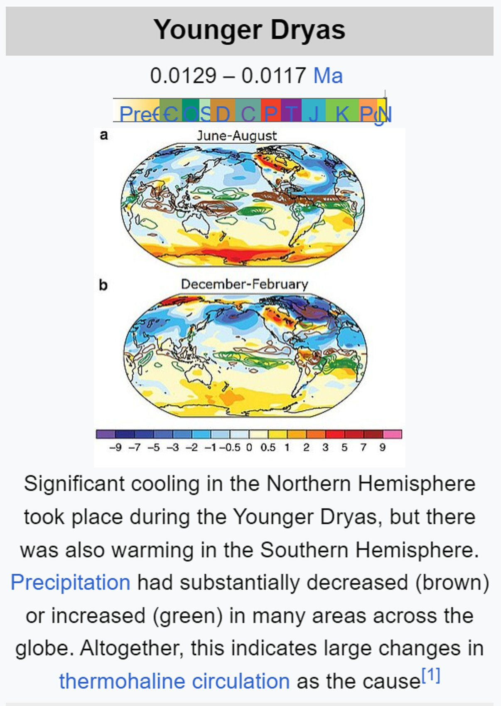

# Earth Geological State

Evidence pertaining to ECDO from the geological state of the Earth, such as weather or ocean patterns.

Holocene major events:
- 11.7ka to present
- period of warming
- Black Sea deluge [5]
- Tollmann Bolide Hypothesis [4]
- global sea level rise

## 3 drought events (6200, 3200, 2200 BC): Staubwasser, Weiss

"The paper by Staubwasser and Weiss concerns itself only with past abrupt changes in climate and the impact these changes may have had on civilizations in the past. It identifies and discusses three abrupt climate change events at roughly 2200 B.C., 3200 B.C., and 6200 B.C. In all three cases, it finds that populations were reduced to a greater or lesser extent over large geographical areas."

"Staubwasser and Weiss postulate widespread drought as the cause of these depopulation events in all three instances. However, the middle event, the one they date to 3200 B.C., uniquely exhibits the three signa- tures of Noah’s Flood discussed in the previous chapter. They call this event “the late Uruk collapse.” (Refer back to the Figure 5.2 chronology to understand this terminology.) They find it to be (1) a “hemispheric and possibly global”10 event, (2) accompanied by widespread depopula- tion and (3) with very clear evidence, specifically in the archaeology of South Mesopotamia, of the inception of the institution of human govern- ment in an easily recognized, capital punishment-wielding form—that of monarchy."

"The last temples of the late Uruk IV Eanna precinct were abandoned, replaced by terraces and light post and reed constructions."

## 2200 BC aridification event (cold and dry)

The 4.2-kiloyear (thousand years) BP aridification event (long-term drought), also known as the 4.2 ka event,[2] was one of the most severe climatic events of the Holocene epoch.

Starting around 2200 BC, it most likely lasted the entire 22nd century BC. It has been hypothesised to have caused the collapse of the Old Kingdom in Egypt, the Akkadian Empire in Mesopotamia, and the Liangzhu culture in the lower Yangtze River area.[4][5] The drought may also have initiated the collapse of the Indus Valley Civilisation, with some of its population moving southeastward to follow the movement of their desired habitat,[6] as well as the migration of Indo-European-speaking people into India.

*"The south-central Levant experienced two phases of dry climate punctuated by a wet interval in between and thus the 4.2 ka event in the region has been termed a W-shaped event."*

A study of fossil corals in Oman provides evidence that prolonged winter shamal seasons, around 4200 years ago, led to the salinization of the irrigated field, which made a dramatic decrease in crop production trigger a widespread famine and eventually the collapse of the ancient Akkadian Empire.

*"δ18O values from Yonglu Cave in Hubei confirm that the region became characterised by increased aridity and show that the onset of the event was gradual but that its end was sudden."* - Aridification, leading up to an inundation?

"The 4.2 ka event resulted in an enormous reduction in the strength of the East Asian Summer Monsoon (EASM)."

"In the Korean Peninsula, the 4.2 ka event was associated with significant aridification, measured by the large decline in arboreal pollen percentage (AP)."

*"Stalagmites from northeastern Namibia demonstrate the region became wetter thanks to the southward shift of the ITCZ.[84] The Namibian humidification event had two pulses."* - Indeed, Namibia would move further away from the equator during a flip, although this might me a misattribution, as it wouldn't happen the way the authors imagined.

https://en.wikipedia.org/wiki/4.2-kiloyear_event

## 6200 BC cooling event

"In climatology, the 8.2-kiloyear event was a sudden decrease in global temperatures that occurred approximately 8,200 years before the present, or c. 6,200 BC, and which lasted for the next two to four centuries."

"The event may have been caused by a large meltwater pulse,[12] which probably resulted from the final collapse of the Laurentide Ice Sheet of northeastern North America,[13][14][15] most likely when the glacial lakes Ojibway and Agassiz suddenly drained into the North Atlantic Ocean.[16] The same type of action produced the Missoula floods that formed the Channeled Scablands of the Columbia River basin. The meltwater pulse may have affected the North Atlantic thermohaline circulation,[17][18][19] reducing northward heat transport in the Atlantic and causing significant North Atlantic cooling.[20] The Atlantic meridional overturning circulation (AMOC) weakened by 55%[14] or 62%.[20] Estimates of the cooling vary and depend somewhat on the interpretation of the proxy data, but decreases of around 1 to 5 °C (1.8 to 9.0 °F) have been reported. In Greenland, the event started at 8175 BP, and the cooling was 3.3 °C (decadal average) in less than 20 years. The coldest period lasted for about 60 years, and its total duration was about 150 years."

"The sea-level data from the Rhine–Meuse Delta indicate a 2–4 m (6 ft 7 in – 13 ft 1 in) of near-instantaneous rise at 8.54 to 8.2 ka, in addition to 'normal' post-glacial sea-level rise."

"In northwestern Madagascar, the 8.2 ka event is associated with a negative δ18O excursion and calcite deposition, indicating wet, humid conditions caused by the southward migration of the ITCZ.... Humidification was two-phased, with an 8.3 kiloyear sub-event preceding the 8.2 kiloyear sub-event by about 20 years."

"The sediment core records of the Fram Strait show a short-lived cooling during the 8.2 ka event superimposed on a broader interval of warm climate.[38] In western Scotland, the 8.2 ka event coincided with a dramatic reduction in the Mesolithic population.[39] In the Iberian Peninsula, the 8.2 ka event is linked to greater summer aridity that caused an increase in the frequency of fires and a consequent expansion of fire-resistant evergreen oak trees."

"Lacustrine sediment records show that Western Siberia underwent humidification during the 8.2 ka event."

"The South American Summer Monsoon (SASM) drastically intensified during the 8.2 ka event as revealed by sediment records from Juréia Paleolagoon."

https://en.wikipedia.org/wiki/8.2-kiloyear_event

## Holocene Sea Level Rise, Meltwater pulses [9,10,11]

"The early Holocene sea level rise (EHSLR) was a significant jump in sea level by about 60 m (197 ft) during the early Holocene, between about 12,000 and 7,000 years ago, spanning the Eurasian Mesolithic."

Understanding what exactly caused this undeniable massive sea level rise should surely be very relevant for the ECDO. The justification for these seems to be massive ice sheet melting. But that should raise the question, how was it that there were such massive ice sheets before the Younger Dryas, which then melted during the Holocene, and don't exist to such an extent now?

"During deglaciation since the Last Glacial Maximum, between about 20,000 to 7,000 years ago (20–7 ka), the sea level rose by a total of about 100 m (328 ft), at times at extremely high rates, due to the rapid melting of the British-Irish Sea, Fennoscandian, Laurentide, Barents-Kara, Patagonian, Innuitian and parts of the Antarctic ice sheets."

- "Meltwater pulse 1B between c. 11.4–11.1 ka, a 7.5 m (25 ft) rise over about 160 years centered at 11.1 ka, which includes the end of Younger Dryas interval of reduced sea level rise at about 6.0–9.9 mm (0.2–0.4 in)/yr;
- Meltwater pulse 1C between c. 8.2–7.6 ka, centered at 8.0 ka, a rise of 6.5 m (21 ft) in less than 140 years." 

## 1200 BC Event?

"This event is becoming known as the 3.2k yr BP event. Some of these studies indicate that the drought happened in two stages, a drought between 1250 and 1150 BC, followed by a return to normal precipitation for 50 years and then another drought between 1100 and 950 (possibly continuing to 850) BC."

https://nuttersworld.com/climactic-events/3.2k-yr-bp-event/

## Cold and dry outbreaks in the eastern Mediterranean 3200 years ago (hard copy here)

"The eastern Mediterranean’s cold and dry period between 1200 and 850 cal. yr BCE can be qualified as a “W”-shaped cooling event occur- ring ∼2750 yr before the pre-industrial Little Ice Age (e.g., Jones et al., 2001) and ∼1850yr before the Late Antiquity Little Ice Age (Büntgen et al., 2016). This colder period is clearly differenti- ated from the 4.2 kyr B.P. event (Weiss et al., 1993; Weiss, 2016), and does not correspond to a progressive deterioration of the climate be- tween these two episodes."

## Holocene Syrian Coastal Change

"Holocene [Syrian] coastal change comprised three main aggradation phases resulting from increased fluvial sediment input (estimated to be at 5000 BC, 2000 BC, and 1200 AD) and separated by erosive and/or retreat phases and two episodes of coastal uplift in about 1400 BC and 1000 AD. The precise causes of aggradation remain unclear, but could either result from climate changes or human actions.

This general pattern masks a degree of local complexity caused by tectonic movements and sediment supply. These local changes are exemplified by coastal progradation which either created or removed natural harbours. For example, at Amrit the Hellenistic quay and harbour basin are now 800 m inland"

[1] https://link.springer.com/article/10.1007/s11457-022-09339-y

## Western Mediterranean hydro-climatic consequences of Holocene ice-rafted debris (Bond) events (hard copy here)

## Volcanic Winter of 536

"The volcanic winter of 536 was the most severe and protracted episode of climatic cooling in the Northern Hemisphere in the last 2,000 years.[1] The volcanic winter was caused by at least three simultaneous eruptions of uncertain origin, with several possible locations proposed in various continents. Most contemporary accounts of the volcanic winter are from authors in Constantinople[citation needed], the capital of the Eastern Roman Empire, although the impact of the cooler temperatures extended beyond Europe. Modern scholarship has determined that in early AD 536 (or possibly late 535), an eruption ejected massive amounts of sulfate aerosols into the atmosphere, which reduced the solar radiation reaching the Earth's surface and cooled the atmosphere for several years. In March 536, Constantinople began experiencing darkened skies and lower temperatures."

https://en.wikipedia.org/wiki/Volcanic_winter_of_536

## Peltier Effect

What could cause the the dramatic shift from bolling allerod to younger dryas where the warm and cooler hemispheres swapped places so rapidly, perhaps a poleshift?

Could this also be an instance of the Peltier Effect?: https://en.wikipedia.org/wiki/Thermoelectric_effect

## Temperature

Any theories as to why the temperature fluctuations were much more severe prior to 8000BC?

Because the first event was the result of a collision or encounter with a comet or other body/bodies.

## Richat Structure

Was the ancient volcano underlying the Richat Structure the contact point for a discharge between the Earth and Encke’s progenitor 12,500 YBP, shattering the comet, strewing destruction across the northern hemisphere from Turkey to Alaska?

## Impact structures

https://en.m.wikipedia.org/wiki/List_of_impact_structures_on_Earth

## Citations

1. [Craig Stone](https://nobulart.com)
