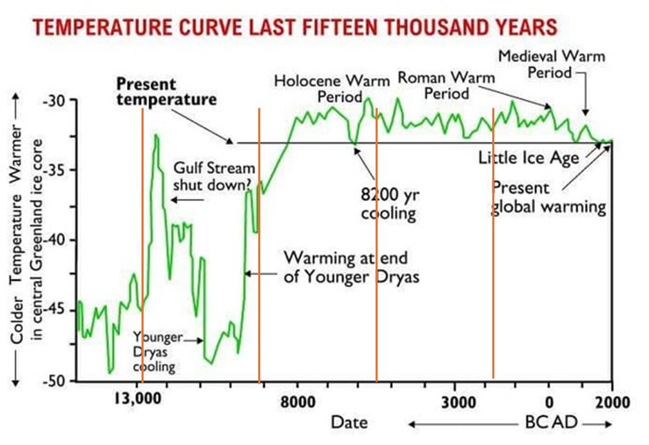

# Earth Geological State

Evidence pertaining to ECDO from the geological state of the Earth, such as weather.

## Recent climate change (Ethical Skeptic)

The [first part](https://theethicalskeptic.com/2020/02/16/the-climate-change-alternative-we-ignore-to-our-peril/) of Ethical Skeptic's three-part ECDO thesis is one of the best sources that the climate has been changing recently. I will take some quotes that summarize his points:
- *"Atmospheric CO2 levels follow temperature rises and are accelerating – Man’s carbon-producing activity is linear and of insufficient slope to drive this"*
- *"48% of global ocean sea surface temperature heat content rise from 1995 to 2023 arrived in a mere 3 to 4 weeks of 2023, far too fast for the atmosphere or man to serve as the cause. A record level Antarctic ice melt-off occurred simultaneously to this and during a record cold winter"*
- *"Abyssal and deep oceans at sea bottom are absorbing excessive novel heat content per cubic kilometer of ocean"*

The first four citations from his work may also be good leads:
- Penny Starr; Breitbart News: Politics: Study: Oceans Heating up Like ‘3.6 Billion Hiroshima Atom-Bomb Explosions’; 15 Jan 2020; https://www.breitbart.com/politics/2020/01/15/study-oceans-heating-up-like-3-6-billion-hiroshima-atom-bomb-explosions/
- Cheng, Abraham, et. al.; Record-Setting Ocean Warmth Continued in 2019; Advances In Atmospheric Sciences, Vol. 37, Feb 2020, 137–142 https://link.springer.com/content/pdf/10.1007%2Fs00376-020-9283-7.pdf
- Durack, Gleckler, et.al.; Ocean Warming: From the Surface to the Deep in Observations and Models; Oceanography; 9 Dec 2018; https://tos.org/oceanography/article/ocean-warming-from-the-surface-to-the-deep-in-observations-and-models
- Desbruyeres, D.G., S.G. Purkey, E.L. McDonagh, G.C. Johnson, and B.A. King. 2016. Deep and abyssal ocean warming from 35 years of repeat hydrography. Geophysical Research Letters 43(19):10,356–10,365, https://doi.org/​10.1002/2016GL070413.

## 3 drought events (6200, 3200, 2200 BC): Staubwasser, Weiss

"The paper by Staubwasser and Weiss concerns itself only with past abrupt changes in climate and the impact these changes may have had on civilizations in the past. It identifies and discusses three abrupt climate change events at roughly 2200 B.C., 3200 B.C., and 6200 B.C. In all three cases, it finds that populations were reduced to a greater or lesser extent over large geographical areas."

"Staubwasser and Weiss postulate widespread drought as the cause of these depopulation events in all three instances. However, the middle event, the one they date to 3200 B.C., uniquely exhibits the three signa- tures of Noah’s Flood discussed in the previous chapter. They call this event “the late Uruk collapse.” (Refer back to the Figure 5.2 chronology to understand this terminology.) They find it to be (1) a “hemispheric and possibly global”10 event, (2) accompanied by widespread depopula- tion and (3) with very clear evidence, specifically in the archaeology of South Mesopotamia, of the inception of the institution of human govern- ment in an easily recognized, capital punishment-wielding form—that of monarchy."

"The last temples of the late Uruk IV Eanna precinct were abandoned, replaced by terraces and light post and reed constructions."

## 2200 BC aridification event (cold and dry)

The 4.2-kiloyear (thousand years) BP aridification event (long-term drought), also known as the 4.2 ka event,[2] was one of the most severe climatic events of the Holocene epoch.

Starting around 2200 BC, it most likely lasted the entire 22nd century BC. It has been hypothesised to have caused the collapse of the Old Kingdom in Egypt, the Akkadian Empire in Mesopotamia, and the Liangzhu culture in the lower Yangtze River area.[4][5] The drought may also have initiated the collapse of the Indus Valley Civilisation, with some of its population moving southeastward to follow the movement of their desired habitat,[6] as well as the migration of Indo-European-speaking people into India.

*"The south-central Levant experienced two phases of dry climate punctuated by a wet interval in between and thus the 4.2 ka event in the region has been termed a W-shaped event."*

A study of fossil corals in Oman provides evidence that prolonged winter shamal seasons, around 4200 years ago, led to the salinization of the irrigated field, which made a dramatic decrease in crop production trigger a widespread famine and eventually the collapse of the ancient Akkadian Empire.

*"δ18O values from Yonglu Cave in Hubei confirm that the region became characterised by increased aridity and show that the onset of the event was gradual but that its end was sudden."* - Aridification, leading up to an inundation?

"The 4.2 ka event resulted in an enormous reduction in the strength of the East Asian Summer Monsoon (EASM)."

"In the Korean Peninsula, the 4.2 ka event was associated with significant aridification, measured by the large decline in arboreal pollen percentage (AP)."

"Stalagmites from northeastern Namibia demonstrate the region became wetter thanks to the southward shift of the ITCZ.[84] The Namibian humidification event had two pulses."

https://en.wikipedia.org/wiki/4.2-kiloyear_event

## 6200 BC cooling event

In climatology, the 8.2-kiloyear event was a sudden decrease in global temperatures that occurred approximately 8,200 years before the present, or c. 6,200 BC, and which lasted for the next two to four centuries.

The initial meltwater pulse caused between 0.5 and 4 m (1 ft 8 in and 13 ft 1 in) of sea-level rise. Based on estimates of lake volume and decaying ice cap size, values of 0.4–1.2 m (1 ft 4 in – 3 ft 11 in) circulate. Based on sea-level data from the Mississippi Delta, the end of the Lake Agassiz–Ojibway (LAO) drainage occurred at 8.31 to 8.18 ka and ranges from 0.8 to 2.2 m.[25] The sea-level data from the Rhine–Meuse Delta indicate a 2–4 m (6 ft 7 in – 13 ft 1 in) of near-instantaneous rise at 8.54 to 8.2 ka, in addition to 'normal' post-glacial sea-level rise.

https://en.wikipedia.org/wiki/8.2-kiloyear_event

## Peltier Effect

What could cause the the dramatic shift from bolling allerod to younger dryas where the warm and cooler hemispheres swapped places so rapidly, perhaps a poleshift?

Could this also be an instance of the Peltier Effect?: https://en.wikipedia.org/wiki/Thermoelectric_effect

## Bolling-Allerod

Younger Dryas coincides with the start of this period?

https://en.wikipedia.org/wiki/B%C3%B8lling-Aller%C3%B8d_Interstadial

## Temperature

Any theories as to why the temperature fluctuations were much more severe prior to 8000BC?

Because the first event was the result of a collision or encounter with a comet or other body/bodies.

## Rainfall data fudging [1]

Where did all the water go? Further examples of altered rainfall data from 16 different cities around the world. Unusually high rainfall records for the past three years have been erased from the record.

High resolution images available here:
- https://nobulart.com/media/anti-diluvian-1.jpg
- https://nobulart.com/media/anti-diluvian-2.jpg

## Meteor strike fudging

Did you know there was a meteorite strike on march 28, 2020 that struck Nigeria and left an uncomfortable crater? Did you also know we had another extremely near miss of an asteroid on November 12 of the same year? No one reported them.

The 2 ships that were moored on ny harbor supposedy for Covid were actually floating hospitals designed for trauma patients (as in those who would be victims of a traumatic event-asteroid strike) and not for infectious disease treatment. Not a single Covid patient was treated onboard either of them. Uncanny don’t you think?

UK built a load of temporary hospitals too. Called Nightingale hospitals. Never had a patient.

### Telluric Currents and Earthquake Lights

See `img/japan-telluric.mp4`.

Video: Sendai, Fukushima (2022)
"Different theories have been proposed to explain the electrification of the Earth’s surface by earthquakes, but the actual process in the crust of the Earth remained unknown until Akihiro Takeuchi, at an underground mine in Japan, observed electrification on the floor of a gallery at the arrival of seismic waves. He discovered, that the arrival of S waves is synchronized with an electric pulse, that flows across the internal resistance of a voltmeter.

The electromagnetic emission in the atmosphere is produced if at any point of the Earth’s surface a limit of the electrical potential is reached at which a sudden electrical discharge through the atmosphere occurs."
- Electric Displacement by Earthquakes, Lira & Heraud (2012)

1. https://en.wikipedia.org/wiki/Telluric_current
2. https://cdn.intechopen.com/pdfs/26246/InTech-Electric_displacement_by_earthquakes.pdf

## Piezoelectric Effect

The piezoelectric effect is a source of significant electric current generation in igneous and high-grade metamorphic rock masses during earthquakes. The current flows generated by granite monoliths such as found in the Rocky Mountains could easily run into billions of amps during major seismic activity. These current flows are a fitting explanation for "earthquake lights", and possibly other geological phenomena, such as Richat (which has a gabbro interior): "How much current can be delivered per unit rock volume? In the case of gabbro .. the steady-state outflow currents were found to increase to 50,000 A/km^3, plus an initial spike that can rise to 100,000 A/km^3."

1. https://nhess.copernicus.org/articles/7/535/2007/nhess-7-535-2007.pdf
2. https://en.wikipedia.org/wiki/Richat_Structure

## 1930 Meteor

"In August 1930 Father d’Alviano went to the Curuc-a River, near the Brazilian–Peruvian border, to carry out his annual apostolic mission. There, he discovered that the local people were terrified by fireballs and explosions that had occurred a few days before his arrival and that had let them believe that the world was at an end. Hundreds of eyewitnesses reported to the catholic missionary that at around 0800 hours on August 13, 1930, a fine red dust began to fall onto the forest and into the river; then people heard several earpiercing whistles that became increasingly loud. Fishermen on the river could see the fall of large fireballs. There were three distinct explosions, each causing earth tremors. The ash continued to fall until midday (Huyghe, 1996). Father d’Alviano concluded that a meteoroid had exploded in the Earth atmosphere, and a note to this effect appeared on March 31, 1931, in the Vatican Newspaper."

[1] https://sci-hub.ru/10.1016/j.pss.2010.10.012

## Citations

1. [Craig Stone](https://nobulart.com)
