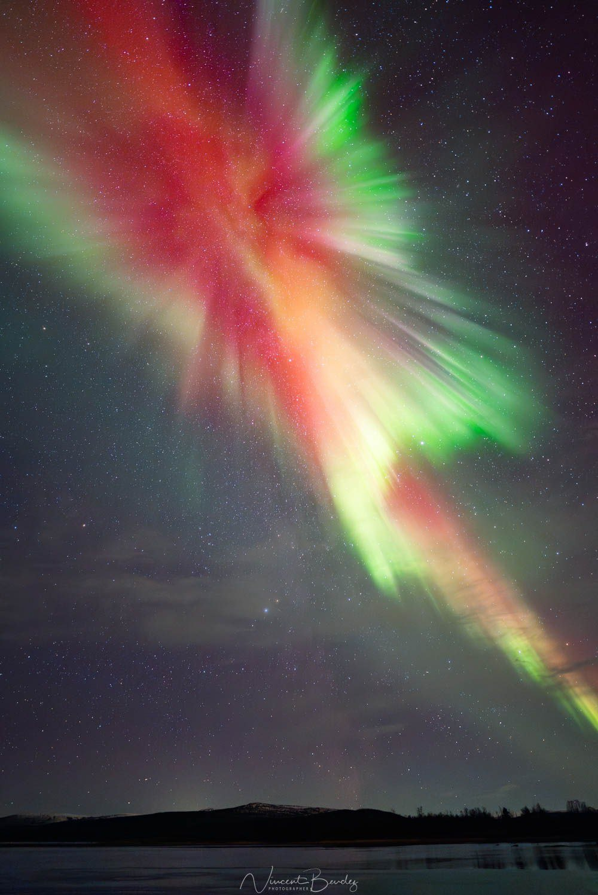
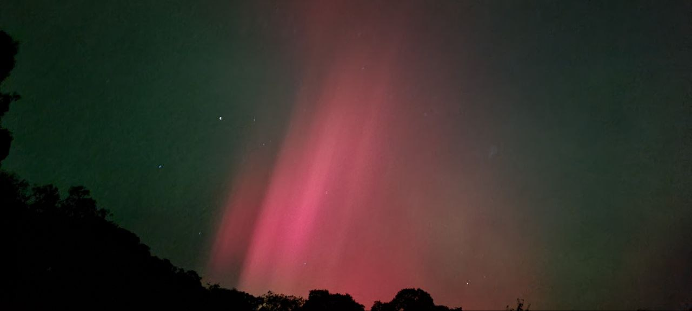
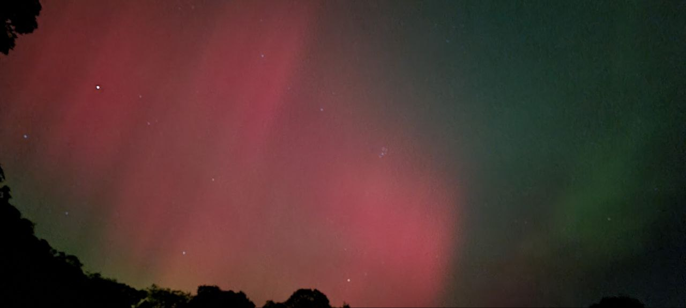
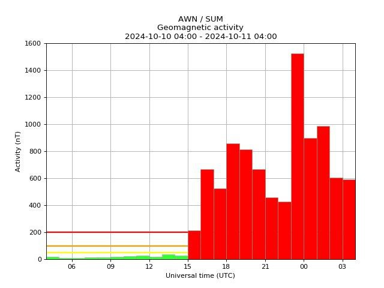
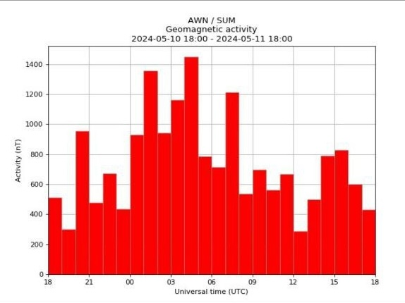
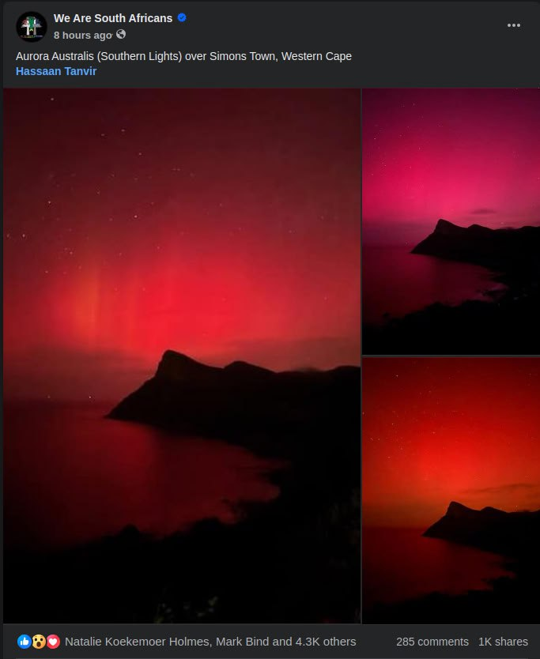

# Auroras

## October 2024 aurora storm

Denmark: https://x.com/HaelVoort/status/1843041553742492052

South Wales: https://x.com/thomas_winstone/status/1843050738391601274

October 7, 2024 auroras:

https://x.com/ggormleyphotos/status/1843198255909478608

https://x.com/NoVaxForMePal/status/1843232904719249511

Finnish Lapland

New ENgland: I've never seen anything like this before. Even in May which is the 1st time I've seen the northern lights where I am.

Last night's storm vs the one in May. We just hit new heights.

https://x.com/Dalpatsing27298/status/1844606383217312148

Aurora Australis possibly observed from Cape Town again over the past few days.
https://www.msn.com/en-za/news/other/southern-lights-could-reappear-over-south-african-skies-this-weekend/ar-AA1rHNgm?ocid=BingNewsVerp

Confirmed
https://www.facebook.com/share/p/VZXk9jPeoZjbYPPq/

it spanned the whole northen hemisphere at the same time pretty much