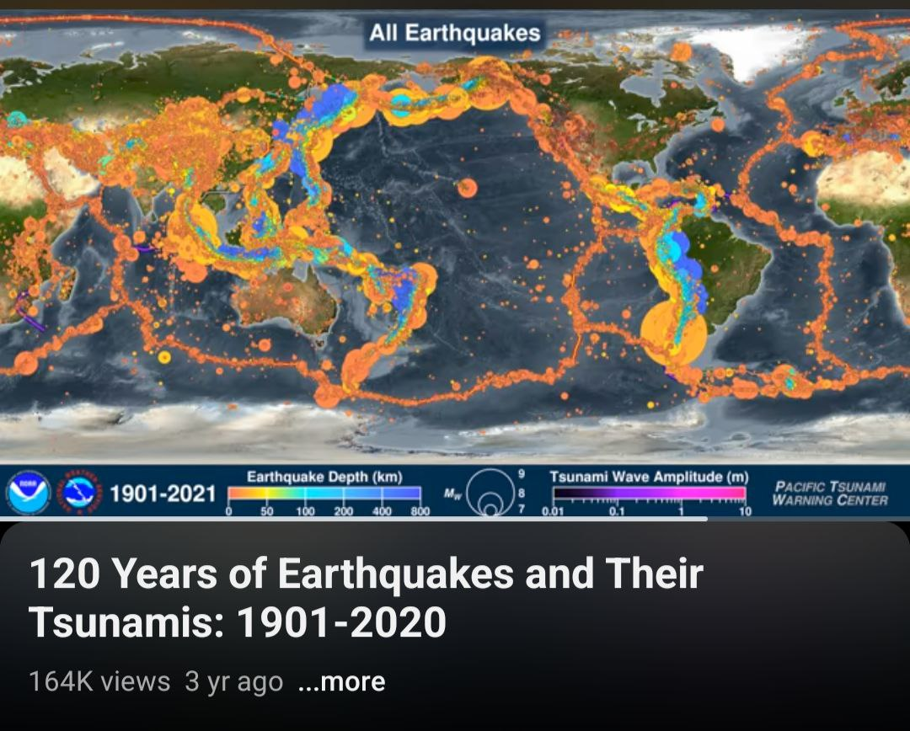

# Earthquakes

## 6.0 earthquake Indonesia

https://watchers.news/2024/09/23/m6-0-earthquake-hits-sulawesi-indonesia-2/

## Earthquake Forecasting - SSGEOS

Uses solar system metrics (planetary geometry, movements and solar activity) to predict quakes through cycle resonances. He has quite a good track record.
- https://youtu.be/O_OB9se30-Q
- https://ssgeos.org

## Seismic uptick

Interesting visualisation of the uptick in seismic activity after 1970. It lights up like a Christmas tree from then onwards. When the NMP acceleration really took off.

https://youtu.be/ilFEKSZQv5o