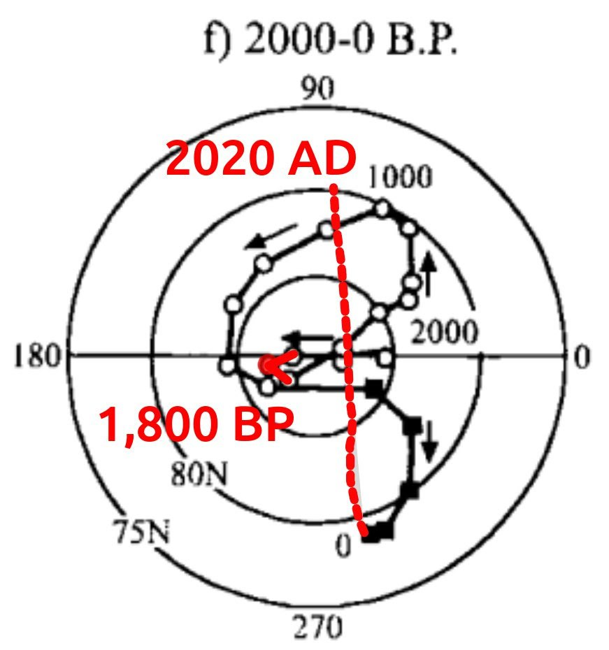

# Geomagnetic ECDO evidence

## 10,000 year magnetic polar wander [1]

Magnetic polar wander over 10,000 years. I have marked observable path deviations >270° in red. These lie very close to the 2nd/9.25ky, 5th/3.7ky and 10th/1.85ky planetary harmonics.

Last century added on. Scale, path and orientation taken from the map here: https://cdn.britannica.com/13/204113-050-65ADC340/Map-Earth's-northern-polar-region-geomagnetic-North-Pole-since-1900.jpg

[1] Paleomagnetism, McElhinny & McFadden (2000) https://archive.org/details/paleomagnetismco0000mcel

## Citations

1. [Craig Stone](https://nobulart.com)