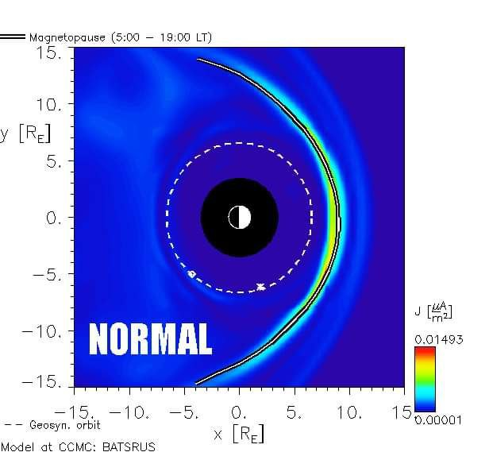

# Geomagnetic ECDO evidence

## Contents

- `north-pole-wander`: Tracking the wandering of the north magnetic pole.

# Analysis

## Recent Schumann Resonance band changes; Weaknening of the Earth's magnetic moment

[Ethical Skeptic's thesis](https://theethicalskeptic.com/2020/02/16/the-climate-change-alternative-we-ignore-to-our-peril/) covers these recent geomagnetic changes in depth.

*"Recent Schumann Resonance banding-power (not the frequencies themselves as has been errantly reported by some sources) has ranged upwards through more of the higher frequencies inside the established eight resonance harmonics (six of which manifest in the Exhibit 5A example to the right); indicating a weakening in the Earth’s magnetic moment generated from its solid core."*

He provides plenty of sources, I encourage you to look at his original work.

## Magnetic field getting weaker

See https://iswa.gsfc.nasa.gov/.

Relevant papers
- https://x.com/NoVaxForMePal/status/1659529838221295622
- https://x.com/NoVaxForMePal/status/1682913085265248256
- https://x.com/NoVaxForMePal/status/1618641550237634561
- https://x.com/NoVaxForMePal/status/1621465149872766976
- https://x.com/NoVaxForMePal/status/1620468069624868864
- https://x.com/NoVaxForMePal/status/1620468069624868864

## South Atlantic Anomaly [3]

The South Atlantic Anomaly (SAA) is an area where Earth's inner Van Allen radiation belt comes closest to Earth's surface, dipping down to an altitude of 200 kilometres (120 mi). This leads to an increased flux of energetic particles in this region and exposes orbiting satellites (including the ISS) to higher-than-usual levels of ionizing radiation.

The effect is caused by the non-concentricity of Earth and its magnetic dipole and has been observed to be increasing in intensity recently.[quantify] The SAA is the near-Earth region where Earth's magnetic field is weakest relative to an idealized Earth-centered dipole field.

In-depth and up-to-date look at it here: https://svs.gsfc.nasa.gov/4840/

There's an excellent paper on this by Laj in `EVIDENCE/cataclysm-remnants/paleomagnetic`.

## Citations

1. [Craig Stone](https://nobulart.com)