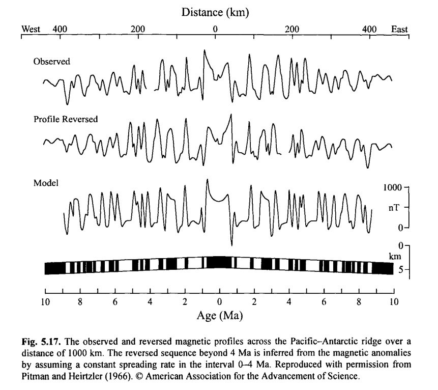
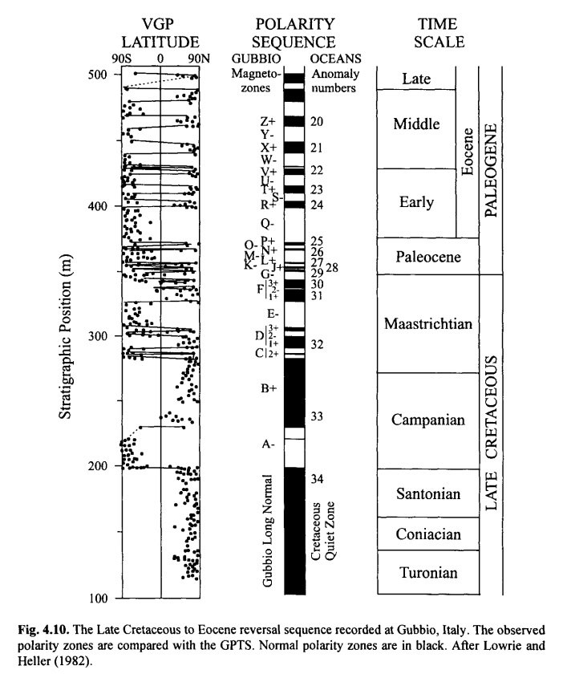
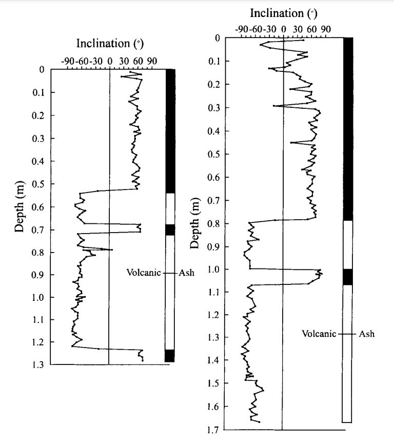

# Geomagnetic ECDO evidence

## Contents

- `north-pole-wander`: Tracking the wandering of the north magnetic pole.

# Analysis

## Recent Schumann Resonance band changes; Weaknening of the Earth's magnetic moment

[Ethical Skeptic's thesis](https://theethicalskeptic.com/2020/02/16/the-climate-change-alternative-we-ignore-to-our-peril/) covers these recent geomagnetic changes in depth.

*"Recent Schumann Resonance banding-power (not the frequencies themselves as has been errantly reported by some sources) has ranged upwards through more of the higher frequencies inside the established eight resonance harmonics (six of which manifest in the Exhibit 5A example to the right); indicating a weakening in the Earth’s magnetic moment generated from its solid core."*

He provides plenty of sources, I encourage you to look at his original work.

## Magnetic profiles [1]

Quick glance at the long term magnetic reversal history. Black/White transitions are 180° flips.

This is recorded all over the earth in thousands of proxies. Uniformitarian geology ascribes them to magnetic field reversals rather than physical ones.

## Magnetic field getting weaker

See https://iswa.gsfc.nasa.gov/.

Relevant papers
- https://x.com/NoVaxForMePal/status/1659529838221295622
- https://x.com/NoVaxForMePal/status/1682913085265248256
- https://x.com/NoVaxForMePal/status/1618641550237634561
- https://x.com/NoVaxForMePal/status/1621465149872766976
- https://x.com/NoVaxForMePal/status/1620468069624868864
- https://x.com/NoVaxForMePal/status/1620468069624868864

## Citations

1. [Craig Stone](https://nobulart.com)