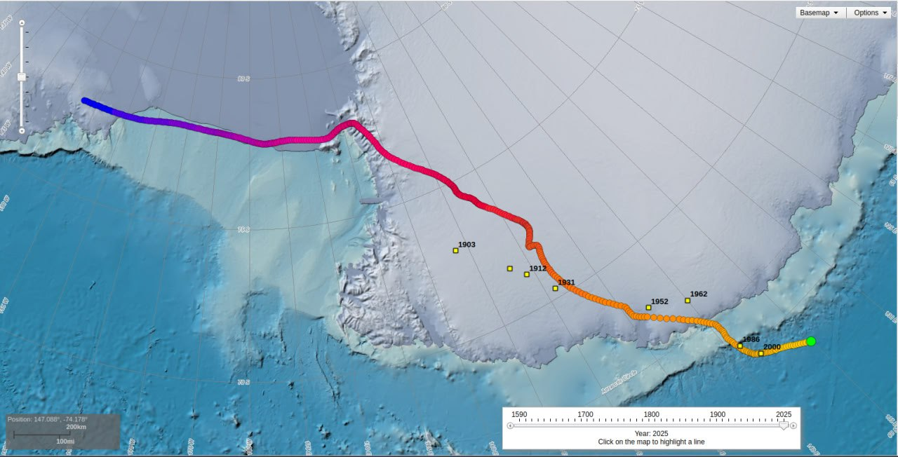

# North Pole Wander

Goal: Use the wandering of the North Pole to predict the progress of the ECDO event.

## NOAA Data

Courtesy of NOAA, showing that that the Np has traversed more in the past 25 years than it did in the 400 years before that. Sp is more consistent, but has similarly covered over 2000km headed in pretty much one direction.

https://www.ncei.noaa.gov/maps/historical_declination/

## North Magnetic Pole and Planetary Harmonics (1600-2024) [1]

https://github.com/user-attachments/assets/9c74c030-b865-4beb-822a-7399062c7fdf

North Magnetic Pole and Planetary Harmonics (1600-2024). Could the planets be influencing Earth's magnetic dipole? Observed NMP path deviations are marked in white. Deviations >270° in pink. Significant velocity changes are in green. I've also marked several key events during the last century on this timeline which may have been catalyzed by observations of the rapidly accelerating magnetic reversal (or excursion). Preparing for pole shifts requires a lot of money. Wars are extremely profitable, both financially and technologically. Having the freedom to print cash out of thin air even more so.

1. https://ngdc.noaa.gov/geomag/data/poles/NP.xy
2. https://ssd.jpl.nasa.gov/horizons/
3. https://nobulart.com/the-flip-of-the-earth/
4. https://nobulart.com/report-from-iron-mountain/
5. Visualization: https://nobulart.com/

## 10,000 year magnetic polar wander [1]

Magnetic polar wander over 10,000 years. I have marked observable path deviations >270° in red. These lie very close to the 2nd/9.25ky, 5th/3.7ky and 10th/1.85ky planetary harmonics.

Last century added on. Scale, path and orientation taken from the map here: https://cdn.britannica.com/13/204113-050-65ADC340/Map-Earth's-northern-polar-region-geomagnetic-North-Pole-since-1900.jpg

[1] Paleomagnetism, McElhinny & McFadden (2000) https://archive.org/details/paleomagnetismco0000mcel

## NOAA December 2023 State of the Geomagnetic Field

The WMM (World Magnetic Model) gets updated once every 5 years, with the last time being in 2020. More up-to-date data is not easily found.

However, NOAA has [published a report in December 2023](https://www.ncei.noaa.gov/sites/g/files/anmtlf171/files/2023-12/WMM_Annual_Report_2023.pdf) called "State of the Geomagnetic Field" with some analysis on the current state of the geomagnetic field. Hard copy in `hard-copies`. Following is a quote from the paper:

*"This suggests that nonlinear changes in the Earth’s magnetic field have remained small over the past three years. Since 2020, the north magnetic dip pole has moved at an average speed of 41 km/yr, and the south magnetic dip pole at 9 km/yr. Neither underwent any noticeable change in direction."*

## 1840 - 2019 Magnetic North Pole Wander Video

Video at `img/npw.mp4`. It is an excellent visualization, compiled from historic observational and SWARM data. Note the apparent >270° deviation that occurred in the mid-1800's.

Source: https://www.esa.int/Applications/Observing_the_Earth/FutureEO/Swarm/Magnetic_north_and_the_elongating_blob

## Citations

1. [Craig Stone](https://nobulart.com)