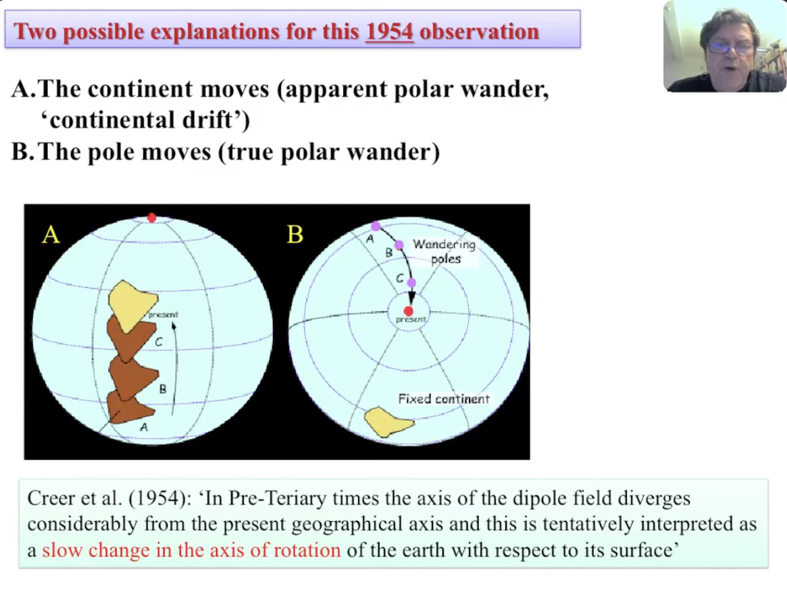
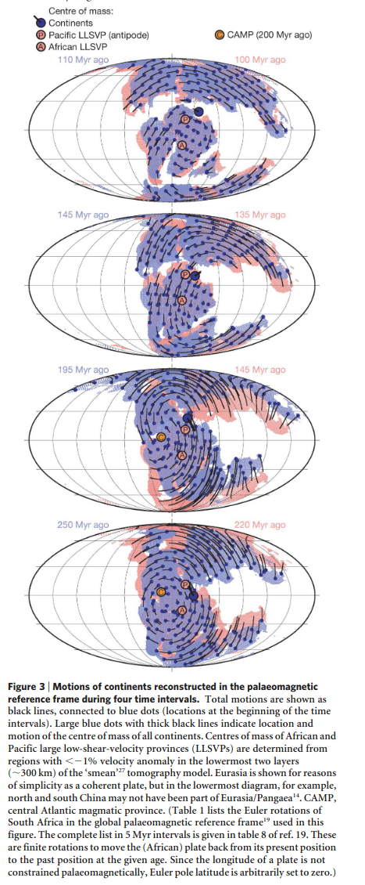
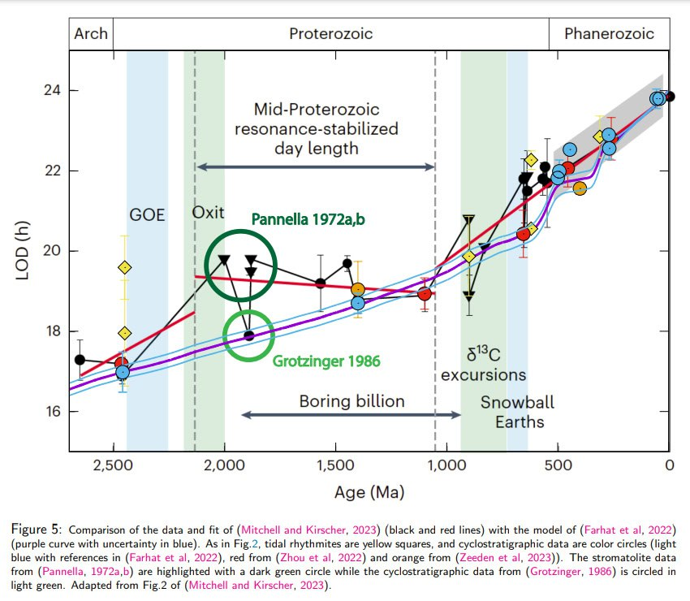
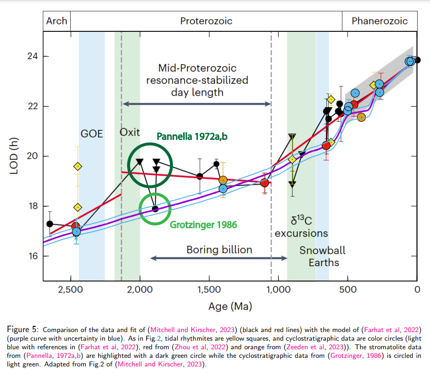

# Orbital ECDO Evidence

This folder is for ECDO evidence related to the orbit of the Earth.

TPW also referred to as "mean rotational pole".

## Interpreting APW visuals

https://www.youtube.com/watch?v=_D_EkDHKH3E

5:52

## True polar wander and supercontinents (hard copy here)

A great paper! Hard copy here.

https://people.earth.yale.edu/sites/default/files/files/Evans/16_03c-TPW.pdf

## TPW of old supercontinent

Lot of literature on this topic it seems. Hard copy here

https://www.researchgate.net/publication/5466242_Absolute_plate_motions_and_true_polar_wander_in_the_absence_of_hotspot_tracks

## True Polar Wander Utah Geology

A length blog post https://utahgeology.com/were-the-ice-ages-really-just-true-polar-wandering-events/

## Length of day increasing over billion years

The geo record indicates that the length of day (axial velocity) has quite steadily progressed from 16 hour days 2.5 billion years ago to 24 hour days now. An approximate 13% reduction in axial velocity per 1 billion years. Axial velocity is regulated by mass distribution. A broadening mass will incur slower rotation.

https://arxiv.org/pdf/2309.11479

## This possible shortening of the...

This possible shortening of the day some 2,700 years ago (as suggested by the ancient calendars) runs contrary to the long-term lengthening trend in the solar day over the past 2.5 billion years. Chart shows the LOD as derived from multiple proxies and studies.… https://t.co/rWChkYBaEP

## 500 mm years ago

https://www.researchgate.net/publication/235243439_Evidence_for_a_Large-Scale_Reorganization_of_Early_Cambrian_Continental_Masses_by_Inertial_Interchange_True_Polar_Wander

See paleomagnetic evidence folder. Hard copy here.
