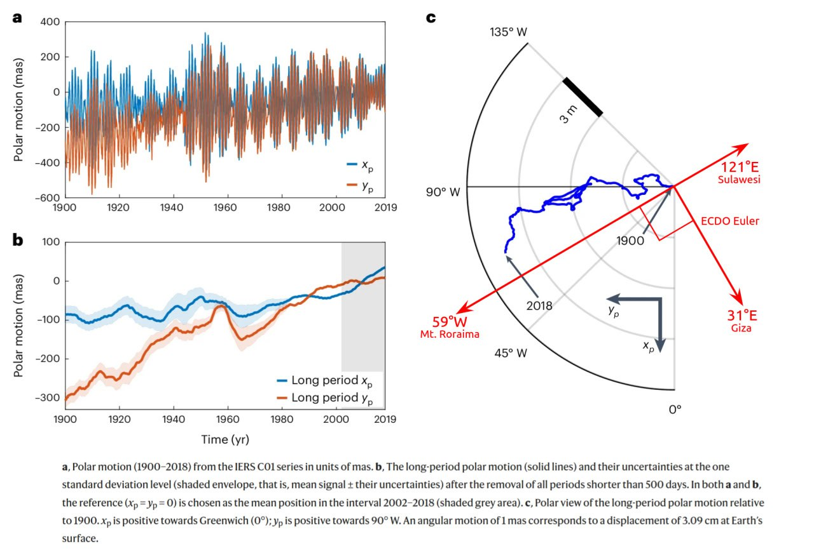
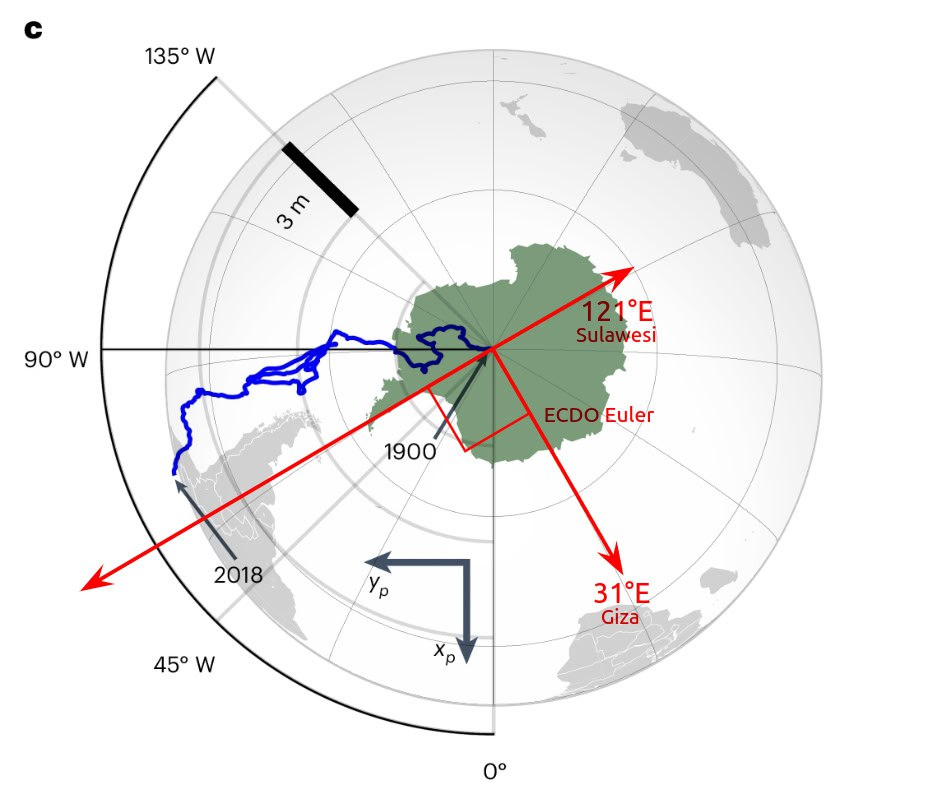

# Orbital ECDO Evidence

This folder is for ECDO evidence related to the movements of the Earth.

## Paper: Contributions of core, mantle and climatological processes to Earth’s polar motion [1]

Potentially relevant paper.

By separately analyzing the various influences and harmonics in the Earth's axial wobble, they were able to construct a fairly good predictive model, which was validated by training it on the first part of the measured data and then checking its predictive power against the later portion of the known data. The visual illustrates how the measured polar motion drift has been progressing perpendicular to the ECDO moment of inertia, which is illustrated on the below chart from the paper:

Note how the observed polar nutation over the past 120 years appears to be following a path congruent with the centrifugal moment of Antarctica's ice mass. The original chart shows a north polar view. This visual is with the Antarctic overlaid and flipped to illustrate the distribution of it's mass at the other pole.

"The ice mass is dragging the crust's rotational axis away from the center as the decoupling progresses further, and more slippage is occurring at the core-mantle boundary." [1]

"The original map in the paper is a north polar view. I added Antarctica as it is positioned at the opposite pole, as though you're looking through the planet to see the ice on the other side. Since its a sphere, if the antarctic wants to pull East (in this view) the north pole is going to tend west. It significant to ECDO because it's showing the effect of Antarctica's mass as the core-mantle coupling continues to degrade." [2]

"If the rotational axis of the core and that of the mantle are diverging, then this could surely lead to induction heating as the core's field traverses that of the outer layers, generating currents just as an electrical generator does - rotating overlapping fields." [2]

A rough view of the axial polar movement overlaid on the magnetic polar movement along the same timeline (1900-2018):

## Length of day increasing over billion years

The geo record indicates that the length of day (axial velocity) has quite steadily progressed from 16 hour days 2.5 billion years ago to 24 hour days now. An approximate 13% reduction in axial velocity per 1 billion years. Axial velocity is regulated by mass distribution. A broadening mass will incur slower rotation.

https://arxiv.org/pdf/2309.11479

## Length of days growing shorter?

https://youtu.be/7Pz7pSLrI_M?si=yTuEdZ-BwSW13Ceu

## Citations

1. https://www.nature.com/articles/s41561-024-01478-2
2. [Craig Stone](https://nobulart.com)