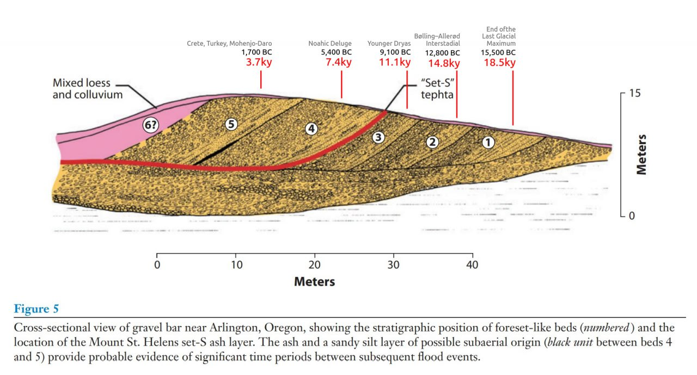

# Flood Remnants

## Contents

- `animal-remains`: Animal remains from previous ECDO events.
- `erratic-rocks`: Large rocks in strange places.
- `erosion`: Evidences of erosion.
- `human-remains`: Human remains.

# Evidence

## Scablands flood deposits

Potential explanation for the Scablands flood deposits based on the ECDO. The "Set S" tephta is an ash layer from Mt. Saint Helens and is a temporal marker for the termination of the Younger Dryas.

https://www.geo.umass.edu/climate/papers2/Baker_retrospective_2009.pdf

# TODO

Goldmine: https://www.iafi.org/was-j-harlan-bretz-near-your-house/