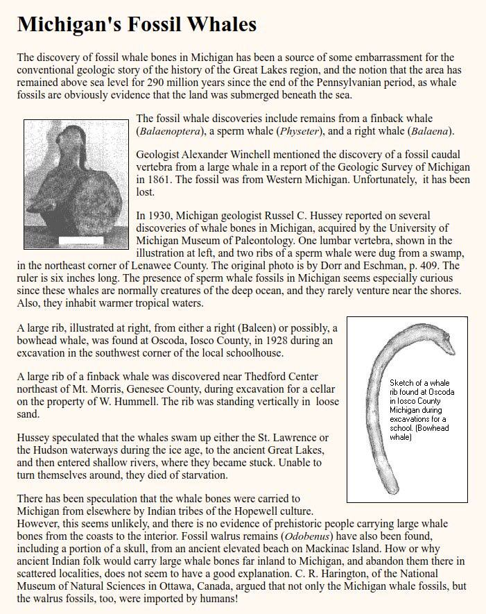
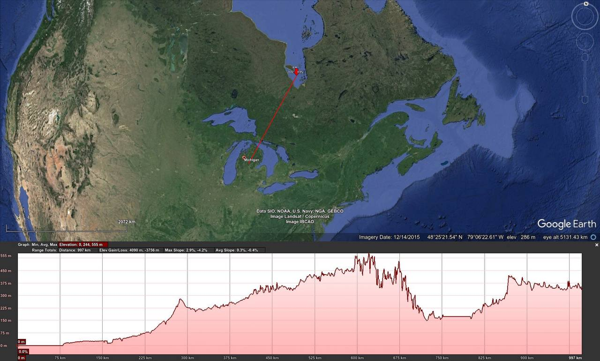
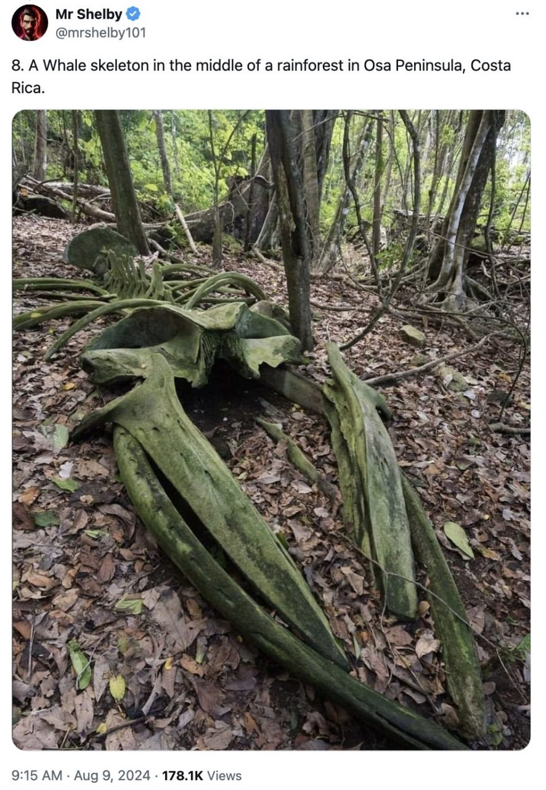

# Whales

## Michigan whales

Mountain Whales (aka "erratic whales").
1. Earth in Upheaval, Velikovsky (1977)
2. https:// (https://t.co/siKpmHPJlG)creationconcept.info/michwls.html (https://t.co/siKpmHPJlG)
3. Elevation profile: Hudson Bay > Michigan Whales

## Whales

Dead whale bones in Egypt.

Whale skeletion in Osa Peninsula, Costa Rica.

