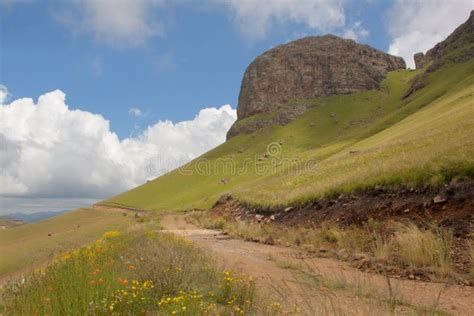
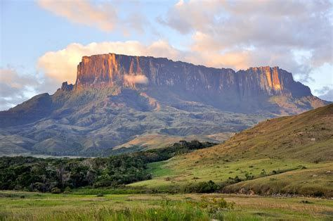

# Erosion

An absolute banger: https://www.istockphoto.com/photos/wind-erosion
- Bolnuevo, Spain
- slot canyons
- wave rock west virginia
- arches national park

I've put a bunch of photos into `img/`. Just to show a few:

Coyote Buttes North, Arizon:

Arches National Park, Utah:

Cappadocia, Turkey:

Kalaat MGouna, Morocco:

## Table top mountains [1]

"One thing they all have in common - they look old and worn. Columns of intrusive magma exposed by the removal of softer material around them. The Alps, Himalayas, etc. all youngsters by comparison." [1]

More images in `img/`.

### Drakensberg

### South America Tepu around Roraima

## Colorado, Trappers Lake Trail

## Citations

1. https://nobulart.com
2. https://www.touropia.com/table-top-mountains/

# TODO

Other tabletop mountains:
- colorado grand mesa
- https://adventuretaco.com/in-search-of-the-blueprint-petroglyph-three-ways-4/