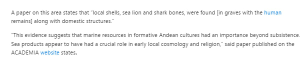
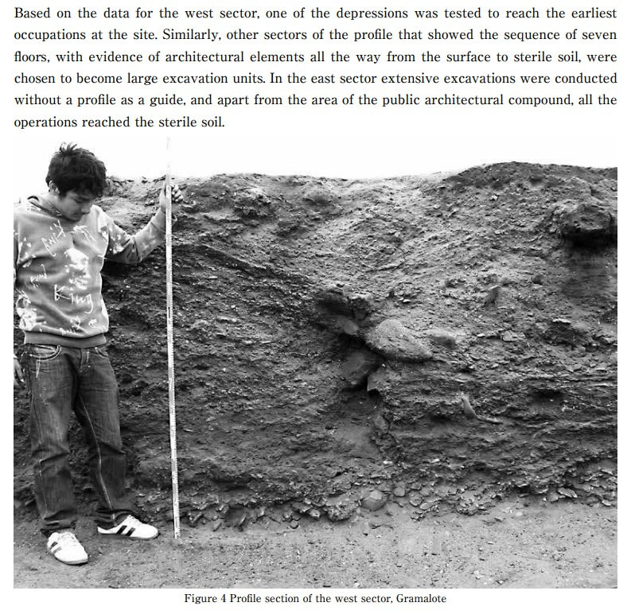

# Human Remains

## Peru

Archaeologists Uncover Remains of Two Children and an Adult Believed to be 3,800 Years Old, Linked to Ancient 'Water Cult'

https://www.msn.com/en-gb/news/world/archaeologists-uncover-remains-of-two-children-and-an-adult-believed-to-be-3-800-years-old-linked-to-ancient-water-cult/ar-AA1pgMk4?ocid=winp2fptaskbarhoverent&cvid=fc15d0494a344b7487d8b92d0ab9bd22&ei=14

“A paper on this area states that “local shells, sea lion and shark bones, were found [in graves with the human (https://knewz.com/tag/human-history/) remains] along with domestic structures.”
- Hard copy of paper in `research-papers/`

Seven sedimentary "floors". That looks a lot like alluvial deposit to me.

Ash-sand-ash-sand... more than once.

Gramalote ECDO context.

## Invasion in Turkey 3700 years ago

"A team of archaeologists has discovered the well-preserved brain and skin remnants of people who lived around 3,700 years ago in Turkey. The remains belong to two Bronze Age individuals who were found at the Tavşanlı Mound (or Tavşanlı Höyük) in Turkey's Kütahya province—located in the west of the Anatolian peninsula. The remnants belong to a young man aged 15-18 at the time of death, and another middle-aged man who was 40-45 years old when he died, the Anadolu Agency (AA) reported. Researchers believe these individuals died when their homes were set on fire and they were unable to flee during an attack around 3,700 years ago. Evidence suggests there was a large-scale attack on the city around 1700 B.C. that resulted in the entire settlement being burned to the ground."

https://www.newsweek.com/archaeologists-discover-brain-remnants-people-lived-3700-years-ago-1825076

## Asian bodies in the Mediterranean?

"Ancient Plaque Reveals Exotic Diets 3,700 Years Ago 

A study of ancient proteins in human plaque has revealed that oriental elements and cooking oils were a part of diets in the Mediterranean around 3,700 years ago, indicating the existence of long-distance trade involving exotic foods such as turmeric or bananas.

“Today’s Mediterranean cooking, including Valencian cooking, is characterized by having been created from cultural exchanges, and we now know it was also this way during the Bronze Age, after this study reveals that globalization affected Mediterranean cooking millennia ago,” said biomolecular archaeologist Domingo C. Salazar Garcia of the University of Valencia.

The study aimed to clarify whether the early globalization of commercial networks during the Bronze Era also affected eating habits. The researchers examined food remains in dental plaque and found evidence that the inhabitants of the Eastern Mediterranean coast already ate turmeric, bananas, and even soy during the Bronze Age and Iron Age."

https://www.dentistrytoday.com/ancient-plaque-reveals-exotic-diets-3-700-years-ago/