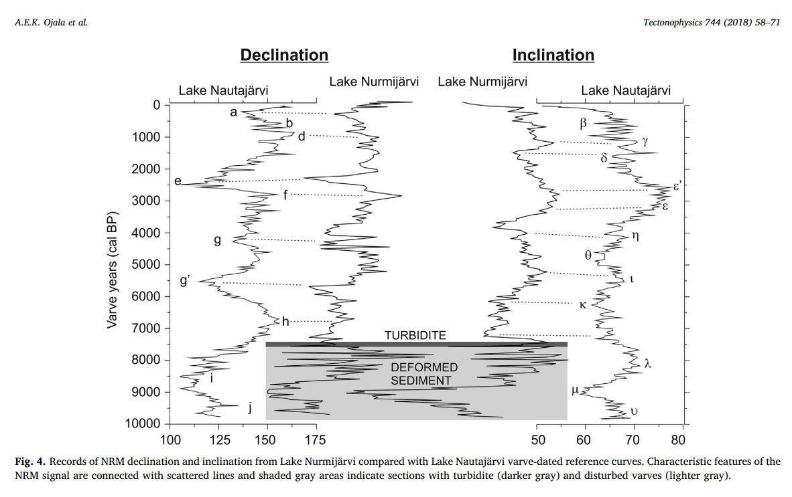
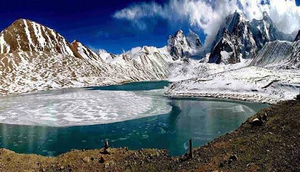

# Cataclysm Remnants

## Comet event 3100-3000 BC?

https://x.com/GemsOfINDOLOGY/status/1594307136905162753

## Sumer flood 3500 - 2600 BC

https://www.cambridge.org/core/journals/iraq/article/abs/physical-evidence-for-noahs-flood/226A2701813C09C5CD25BCA17C8E5074

## Latvian lake 6500 - 5400 BC

An account of the first formation of a lake with fish in it. Latvia c.±7800 BP. https://sci-hub.ru/10.1177/0959683616683255

## 7400 BP Fennoscandia Earthquake

https://sci-hub.ru/10.1016/j.tecto.2018.06.015

## Vredefort Impact Structure

https://en.wikipedia.org/wiki/Vredefort_impact_structure

The unusually mineral rich composition of the crust here probably has something to do with the LLSVP intrusion and the Vredefort crater which exposed some of what was below. Agreed on the alternate concepts - I find valuable knowledge in most areas of inquiry, especially if its something new to me. 

## Opal (Australia)

Like all fine things, gem opal is exceedingly rare. Much of the world's precious opal is mined in the harsh outback of Australia, where a unique combination of geological conditions permitted the formation of opal near the margins of an ancient inland sea.

https://www.opalsdownunder.com.au/learn/australian-opal-mining-fields/

## Himalayas Gurudongmar Salt lake

This lake that is frozen all year has a secret that no one has found a solution for. This lake is on the plateau next to the Kanchengyao mountain range. It is the source of the Teesta river. However, the secret it holds is that there is a spot in it that stays unfrozen. There surely is a religious angle to it from Buddhism. The story circulated is that a Buddhist Padmasambhava gave this place a blessing. He is believed to have had tantric qualities as well. However, it is still unknown how this one place is untouched even by the harshest of colds.

## Citations

1. https://en.wikipedia.org/wiki/Black_Sea_deluge_hypothesis#cite_note-RyanOthers2003a-8

# TODO

Tibet:
- Typical Soft-Sediment Deformation Structures Induced by Freeze/Thaw Cycles: A Case Study of Quaternary Alluvial Deposits in the Northern Qiangtang Basin, Tibetan Plateau: https://ui.adsabs.harvard.edu/search/q=author%3A%22Jiang%2C%20Hanchao%22&sort=date%20desc%2C%20bibcode%20desc&p_=0
- Magnetostratigraphy of Tertiary Sediments From the Wulanwula Lake Basin: Implications for the Cenozoic Tectonic History of the Tibetan Plateau: https://ui.adsabs.harvard.edu/abs/2002AGUFMGP71A0980Z/abstract
- Himalayas: https://himalayacarbongeomorphology.wordpress.com/

William Ryan's more recent work

Goldmine: https://www.iafi.org/was-j-harlan-bretz-near-your-house/