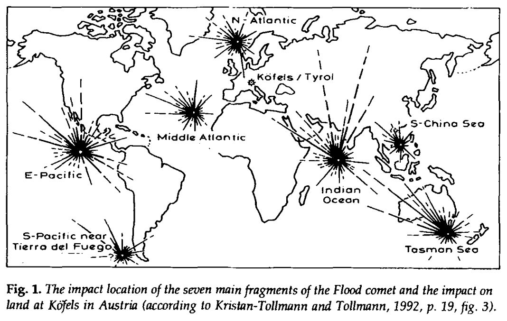
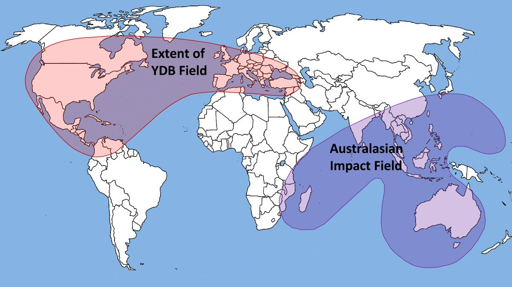
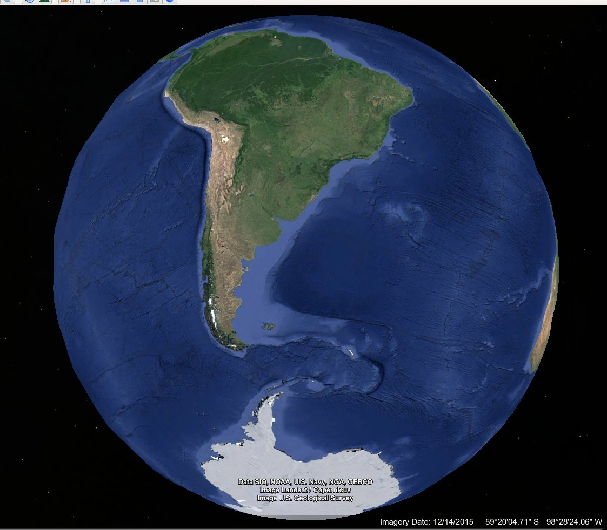
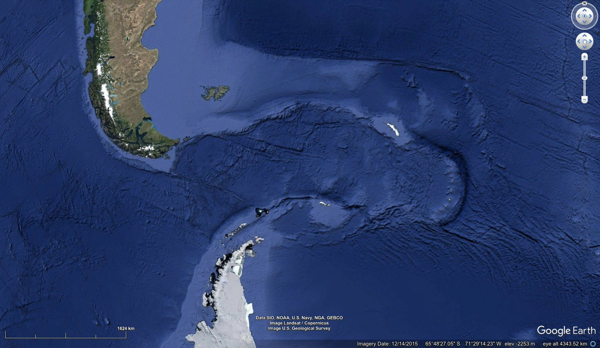
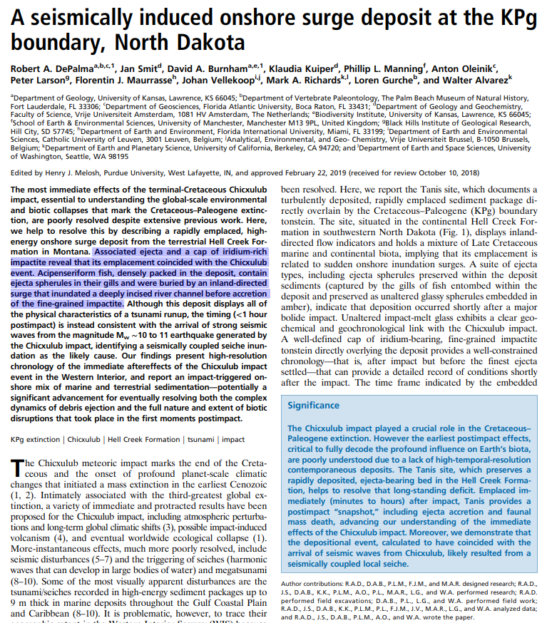
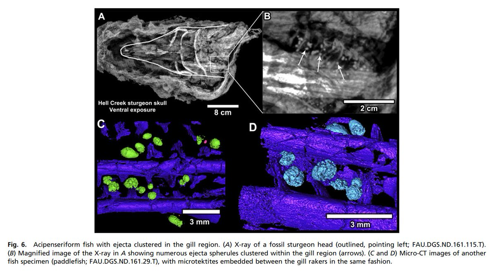
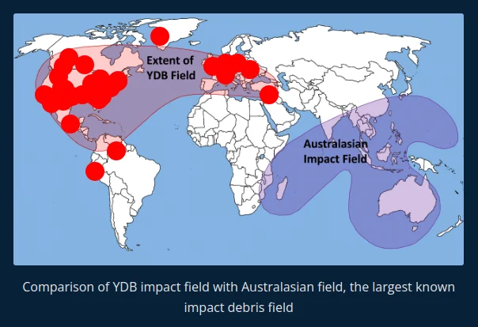
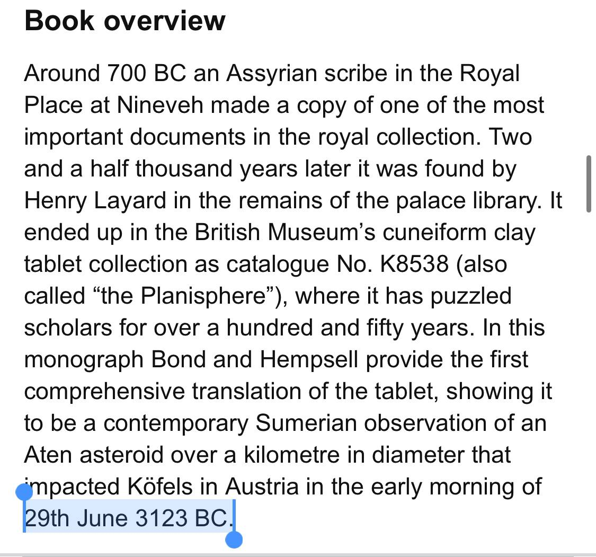

# Comet Impacts

- Bruce Masse
	- Mentions Ioannis Liritzis
- Tollmann Bolide hypothesis

## Tsunami Chronology supporting Late Holocene Impacts

Hard copy in this folder.

## Martin Gray: Cosmic and cometary induced cataclysms - 9500, 7640, 3150 and 1198 BC

https://www.knowth.com/sacred-geography-1.htm

## Illumetsa crater field 5500 BC

The Illumetsa crater field in southeastern Estonia. impact dated to ±7400 YBP, on the V harmonic interval. Loc: 57°57'45.38" N  27°27'38.43" E

## The age of the Kaali meteorite craters and the effect of the impact on the environment and man: evidence from inside the Kaali craters, island of Saaremaa, Estonia 

"AMS dating of terrestrial macrofossils from these sediment layers places the age of the impact at 16901510 B.C."

https://www.academia.edu/16308753/The_age_of_the_Kaali_meteorite_craters_and_the_effect_of_the_impact_on_the_environment_and_man_evidence_from_inside_the_Kaali_craters_island_of_Saaremaa_Estonia

Kaali Craters. "Saarse et al. (1991) radiocarbon dated the near-bottom lake sediments of the Kaali main crater from a bulk sample of calcareous gyttja over-lying the dolomite debris and proposed an age of 1740–1620 BC." Loc: 58°22'22.08" N  22°40'09.78" E

## Comet event 3100 BC?

https://x.com/GemsOfINDOLOGY/status/1594307136905162753

## Vredefort Impact Structure

https://en.wikipedia.org/wiki/Vredefort_impact_structure

The unusually mineral rich composition of the crust here probably has something to do with the LLSVP intrusion and the Vredefort crater which exposed some of what was below. Agreed on the alternate concepts - I find valuable knowledge in most areas of inquiry, especially if its something new to me.

## The Tollman's used best guess...

The Tollman's used best guess derivations for the oceanic impact locations based upon written and oral histories describing the event. Note the South American strike estimation, and what appears to be a 2,500km long E-W impact path in the ocean floor between the two continents. https://t.co/zEtVefnyFe

## Extraterrestrial impact ejecta found in...

Extraterrestrial impact ejecta found in the gills of fish that died in the Chicxulub impact event. This is a fascinating paper. Strong evidence for catastrophic extinction level impacts. https://t.co/8tHPgqgxjX https://t.co/972Q07Q7AH

## This comet and its companions...

This comet and its companions have been convincingly cast as the the actors in the Younger Dryas impact/airburst event. https://t.co/MZ6GvCebpA https://t.co/3cf9EHkRj6

## YDB Field

### Could this mass aerial bombardment...

Could this mass aerial bombardment of the northern hemisphere 12.5ky ago have imparted sufficient energy to destabilize the Earth, thus commencing the oscillation which has continued to this day? This would sensibly align with a pyramid construction date of around 9-10ky ago.

### Origin and provenance of spherules and magnetic grains at the Younger Dryas boundary (hard copy here)

https://cometresearchgroup.org/wp-content/uploads/2016/09/PNAS-2013-Wu-E3557-66.pdf

## 2193 BC K8538 (hard copy here)

"The original document, regarded of maximum
importance, was copied over more than 1,500 years,
because it was the astronomical witness for the exact seat
of the Gods in the celestial realm. The Gods sent their
envoy messengers as comets out of the constellation
Triangulum. The observed comet passed the Pleiades,
Aldebaran, moved further towards Orion and finally
crashed into the highly advanced, irrigation based
J. Seifert, F. Lemke: The Sumerian K8538 tablet. The great meteor impact devastating Mesopotamia
agricultural civilisation of Akkad and Sumer, in 2193 BC,
destroying the entire Akkadian empire and its capital city
of Agade."

https://www.knowledgeminer.eu/climate/pdf/Sumerian_K8538_Paper.pdf

## 3123 BC Kofels impact (Alternative dating)

Sumerian Observation of the Kofels Impact Event:

https://books.google.co.za/books/about/A_Sumerian_Observation_of_the_K%C3%B6fels_Im.html?id=1v7oLAAACAAJ&source=kp_book_description&redir_esc=y

"The Köfels landslide was a huge mountain rockslide (a SturzstromWikipedia) that occurred in the Austrian Alps about 9800 years ago near the present day village of Köfels. Some of its features mystified geologists for quite some time. One hypothesis was that it had been caused by an asteroid impact — a Köfels impact event — but more recent research has rejected the idea. This didn't stop a pair of British engineers from publishing a book that claims that a) it was an asteroid impact, b) it inspired a lot of myths, and c) it was recorded on an ancient Sumerian clay tablet." [12]