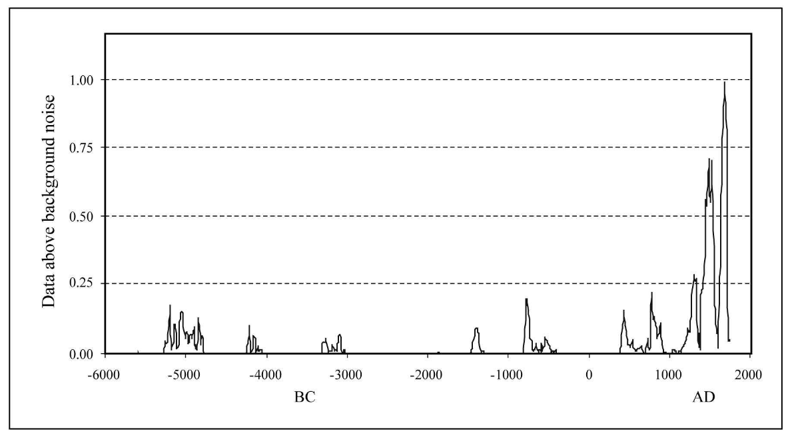
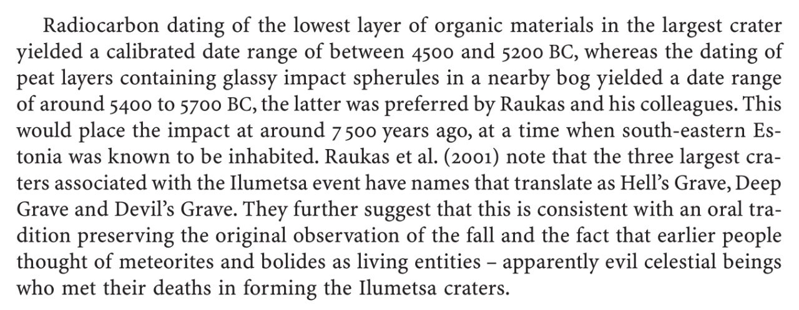
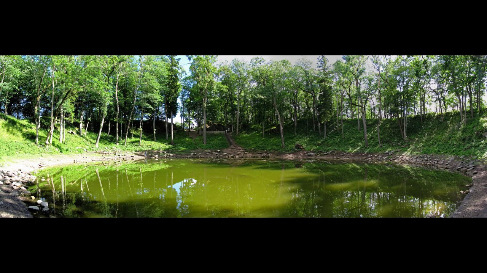
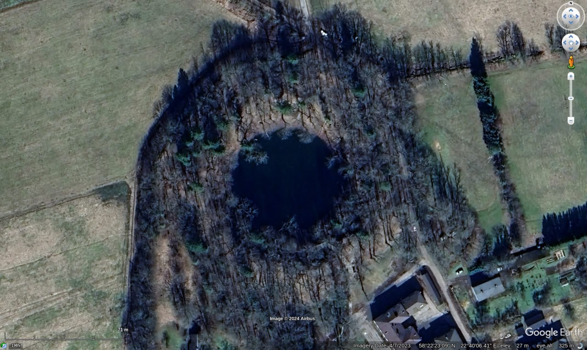

# Comet Impacts

- Bruce Masse
	- Mentions Ioannis Liritzis
- Tollmann Bolide hypothesis

## Tsunami Chronology supporting Late Holocene Impacts

Hard copy in this folder.

## Martin Gray: Cosmic and cometary induced cataclysms - 9500, 7640, 3150 and 1198 BC

https://www.knowth.com/sacred-geography-1.htm

## Illumetsa crater field

The Illumetsa crater field in southeastern Estonia. impact dated to ±7400 YBP, on the V harmonic interval. Loc: 57°57'45.38" N  27°27'38.43" E

## Kaali Craters

Kaali Craters. "Saarse et al. (1991) radiocarbon dated the near-bottom lake sediments of the Kaali main crater from a bulk sample of calcareous gyttja over-lying the dolomite debris and proposed an age of 1740–1620 BC." Loc: 58°22'22.08" N  22°40'09.78" E

