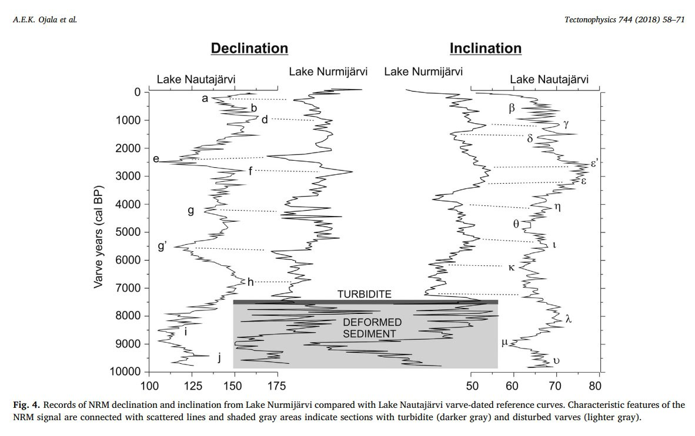

# Earthquakes

## 7400 BP Fennoscandia Earthquake

https://sci-hub.ru/10.1016/j.tecto.2018.06.015

## Great earthquake at 7.3 ka inferred from tsunami deposits in the Sukumo Bay area, southwestern Japan (hard copy here)

"Tsunami deposits in Kyushu Island, southwestern Japan, have been attributed to the 7.3 ka Kikai caldera eruption, but their origin has not been confirmed. We analyzed a 83-cm-thick Holocene event deposit in the SKM core, obtained from incised valley fill in the coastal lowlands near Sukumo Bay, southwestern Shikoku Island. We confirmed that the event deposit contains K-Ah volcanic ash from the 7.3 ka eruption. The base of the event deposit erodes the underlying inner-bay mud, and the deposit contains material from outside the local terrestrial and marine environment, including angular quartz porphyry from a small inland exposure, oyster shell debris, and a coral fragment. Benthic foraminifers and ostracods in the deposit indicate various habitats, some of which are outside Sukumo Bay. The sand matrix contains low-silica volcanic glass from the late stage of the Kikai caldera eruption. We also documented the same glass in an event deposit in the MIK1 core, from the incised Oyodo River valley in the Miyazaki Plain on southeastern Kyushu. These two 7.3 ka tsunami deposits join other documented examples that are widely distributed in southwestern Japan including the Bungo Channel and Beppu Bay in eastern Kyushu, Tachibana Bay in western Kyushu, and Zasa Pond on the Kii Peninsula as well as around the caldera itself. The tsunami deposits near the caldera have been divided into older and younger 7.3 ka tsunami deposits, the younger ones matching the set of widespread deposits. We attribute the younger 7.3 ka tsunami deposits to a large tsunami generated by a great interplate earthquake in the northern part of the Ryukyu Trench and (or) the western Nankai Trough just after the late stage of the Kikai caldera eruption and the older 7.3 ka tsunami deposits to a small tsunami generated by an interplate earthquake or Kikai caldera eruption."

This paper describes a record of two consecutive tsunami's  affecting Japan circa 7300 years before present. The examined cores also reveal many other notable event correlations. Great earthquake at 7.3ka inferred from tsunami deposits in the Sukumo Bay area, southwestern Japan, Nanayama et al. (2021)

[1] https://sci-hub.ru/10.1111/iar.12422

## Cape Kidnappers, New Zealand

