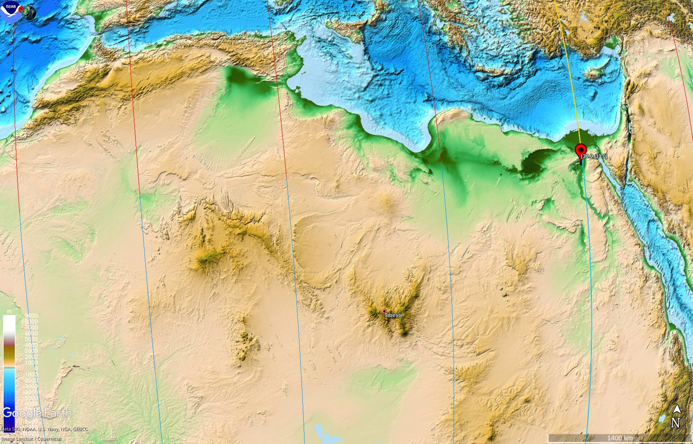

# Erosion

## Youtube channels

The POV Channel:
https://www.youtube.com/@the_pov_channel/videos

Desert drifter https://www.youtube.com/@Desert.Drifter/videos

## Stock photo Website

An absolute banger: https://www.istockphoto.com/photos/wind-erosion
- Bolnuevo, Spain
- slot canyons
- wave rock west virginia
- arches national park
- and more

I've put a bunch of photos into `img/`. Just to show a few:

Coyote Buttes North, Arizon:

Arches National Park, Utah:

Cappadocia, Turkey:

Kalaat MGouna, Morocco:

## Table top mountains [1]

"One thing they all have in common - they look old and worn. Columns of intrusive magma exposed by the removal of softer material around them. The Alps, Himalayas, etc. all youngsters by comparison."

"I think many "flat tops" were magma pools - not necessarily eruptive, but solidifying as hard flat topped pipes in the crust. This often leading to their flat-topped appearance when erosion clears around them." [1]

More images in `img/`.

### Drakensberg

### South America Tepu around Roraima

## Colorado, Trappers Lake Trail

## Serra da Capivara, Brazil

## Göreme Valley, Türkiye https://t.co/ZoXkvmaTCi

Göreme Valley, Türkiye https://t.co/ZoXkvmaTCi

## Tibesti

Images  of water worn rocks  In Tibesti  FABULOUS PICTURES    https://www.naturalarches.org/gallery-Chad-Tibesti.htm

More images from  the Chad area    https://www.naturalarches.org/gallery-ChadPortfolio.htm

## Bighorn Mountains, Devils Canyon (Wyoming)

https://www.youtube.com/watch?v=0FPo8gdHnqU

## Yosemite Half Dome

This looks towards the northeast. Approximately in the line of the S1 to S2 flip. The flat part of the dome faces northwest, perpendicular to the line of movement.

## How Erosion Builds Mountains

Hard copy here.

## Devil's Arrows, North Yorkshire Monoliths

What the hell are these?? 

https://youtu.be/e7MBWcTn-0w?feature=shared

## Erosion?

What are such structures called? I remember some mountain very similiar to this in another country
Those were probably created from huge water erosion right?

## Great Canyon of the Pacific in Hawaii

Like the Grand Canyon

## Citations

1. https://nobulart.com
2. https://www.touropia.com/table-top-mountains/

# TODO

Other tabletop mountains:
- colorado grand mesa
- https://adventuretaco.com/in-search-of-the-blueprint-petroglyph-three-ways-4/

## GPT: 1. Matterhorn (Swiss-Italian Border)

### Overview
The Matterhorn is one of the most iconic mountains in the Alps, straddling the border between Switzerland and Italy. It has a distinctive pyramid shape, with four steep faces pointing in the cardinal directions.

### Erosion and Asymmetry
- **North Face**: The north face of the Matterhorn is particularly steep and heavily eroded by glacial activity. It has a rugged appearance due to the intense carving from ancient glaciers.
- **South Face**: In contrast, the south face is less affected by glaciation and features more weathered, rounded surfaces. It receives more sunlight, leading to differences in weathering rates.
- **Prevailing Winds and Climate**: The asymmetric erosion is also influenced by prevailing winds, which carry snow and ice that accumulate differently on each side, affecting erosion patterns.

### Formation
The Matterhorn was formed through a combination of tectonic uplift and subsequent glacial erosion. The intense sculpting by glaciers during the Ice Ages gave it its iconic sharp, jagged profile.

## 2. Kirkjufell (Iceland)

### Overview
Kirkjufell, meaning "Church Mountain," is a prominent standalone mountain located on the Snæfellsnes Peninsula in western Iceland. It is one of the most photographed mountains in the country due to its distinctive shape.

### Erosion and Asymmetry
- **Wind and Rain Erosion**: Kirkjufell has one side that is steep and pointed, shaped heavily by glaciation, while the other sides are more rounded and weathered by wind and rain.
- **Glacial Carving**: The mountain’s sharp, isolated peak was formed by glaciers that carved away the surrounding softer rock, leaving the harder, more resistant layers intact.
- **Prevailing Weather**: The steep side of Kirkjufell faces the prevailing wind direction, leading to more intense erosion, while the leeward side is more sheltered and experiences less weathering.

### Formation
Kirkjufell’s unique shape is the result of volcanic activity, glaciation, and differential erosion. It was originally part of a larger volcanic landscape, but glaciers carved away the surrounding rock, leaving behind the isolated peak.

