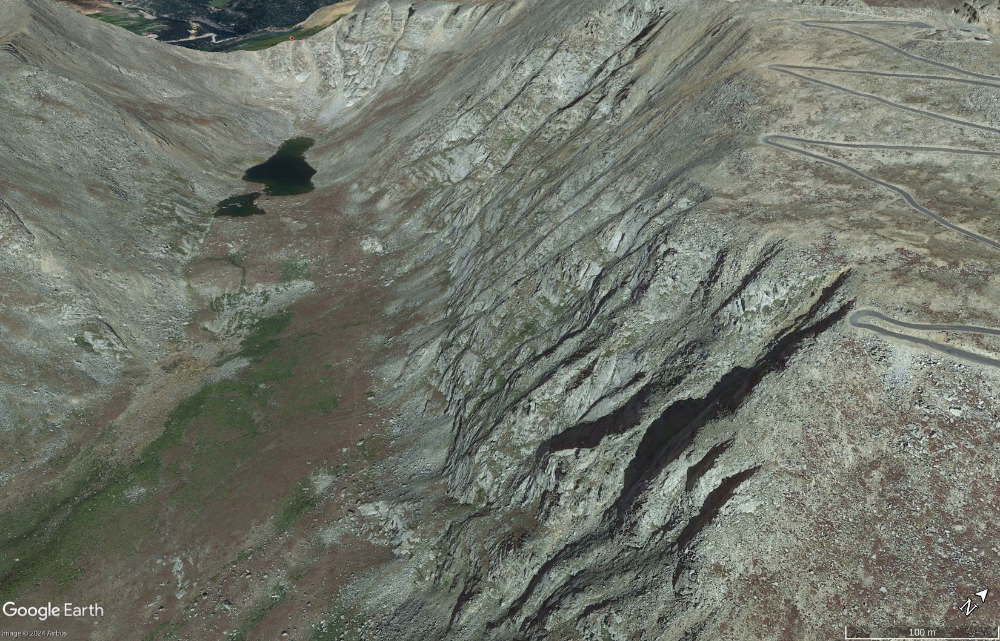

# Arete

Aligned:
- Half Dome, Yosemite
- Binn Chaorach, Ireland
- Garden Wall, Montana
- Sawtooth, Colorado

Not really aligned:
- Matterhorn
- Clouds Rest
- Knife Edge, Maine

## Binn Chaorach

## Clouds Rest

## Garden Wall

## Milford Sound

## New Zealand

## Sawtooth

## Norway

## South America Tip

# GPT: Famous U-Shaped Glacial Valleys

U-shaped valleys, also known as glacial troughs, are formed by the erosive action of glaciers and are characterized by steep sides and a flat or rounded bottom. Here are some of the most famous examples:

## 1. Yosemite Valley, California, USA
- **Description**: Iconic U-shaped valley carved by glaciers in the Sierra Nevada. Features steep granite cliffs such as El Capitan and Half Dome.
- **Notable Features**: El Capitan, Bridalveil Fall, Yosemite Falls.

## 2. Milford Sound, New Zealand
- **Description**: A dramatic U-shaped fjord in Fiordland National Park, carved by glaciers and filled by the sea.
- **Notable Features**: Mitre Peak, Stirling Falls, sheer cliffs rising from the water.

## 3. Geirangerfjord, Norway
- **Description**: A UNESCO World Heritage Site featuring steep U-shaped valley walls formed by glacial erosion.
- **Notable Features**: Seven Sisters Waterfall, Bridal Veil Falls.

## 4. Great Langdale, Lake District, England
- **Description**: A classic U-shaped valley in the Lake District, known for picturesque landscapes and hiking trails.
- **Notable Features**: Langdale Pikes, Blea Tarn.

## 5. Glencoe, Scotland
- **Description**: Known for its dramatic scenery and historical significance, this U-shaped valley was formed by glaciers.
- **Notable Features**: The Three Sisters (three steep ridges), Loch Leven.

## 6. Chamonix Valley, French Alps
- **Description**: Near Mont Blanc, shaped by the Mer de Glace glacier, popular for skiing and hiking.
- **Notable Features**: Mer de Glace Glacier, Mont Blanc massif.

## 7. Verdon Gorge, France
- **Description**: A U-shaped valley in the French Alps, shaped by both glacial and river erosion. Known as the "Grand Canyon of Europe."
- **Notable Features**: Turquoise waters of the Verdon River, steep limestone cliffs.

## 8. Torres del Paine National Park, Chile
- **Description**: Features several U-shaped valleys in Patagonia, including the famous French Valley.
- **Notable Features**: Cuernos del Paine, French Valley.

These valleys are stunning examples of glacial geomorphology and attract visitors for their breathtaking natural beauty.
