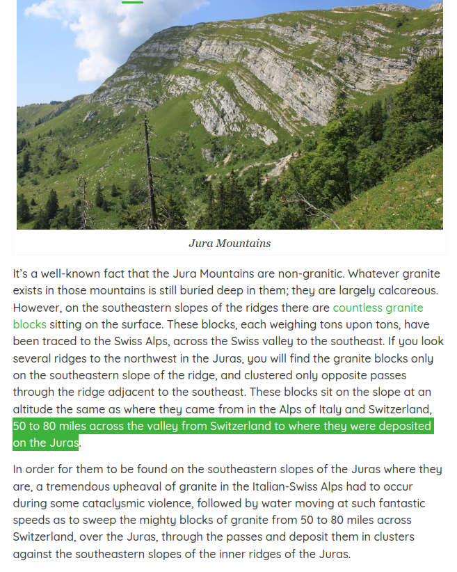
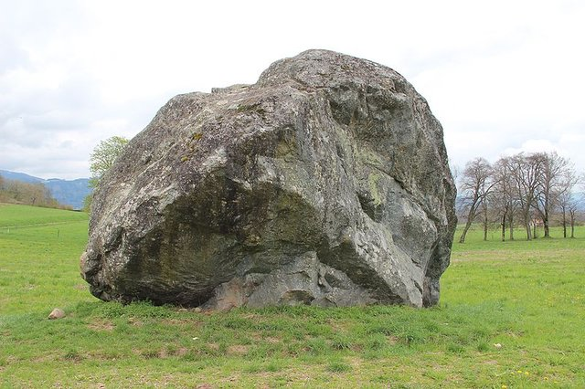

# Erratic Rocks

Often attributed to glaciers.

## Jura Erratic Boulders

Only water could have carried some of these behemoths over the Alps and deposited them 50-80 miles away.

1. https://nobulart.com/cataclysms-revisited/
2. Motte Stone, County Wicklow
3. Pierre à Martin, Lake Geneva
4. Haute Savoie, Switzerland

### ECDO delivers again. The return...

ECDO delivers again. The return from State 2 to State 1 over Europe provides an explanation for the Jura erratic boulders. The Adriatic Sea has nowhere to go but directly over the Alps. https://t.co/Jxzx1VvSch https://t.co/erqK19vDuL

See img/1804988052651086004-vyF54VRYtRKqUHSl.mp4.

## Stonehenge

"Mineralogical tests on the massive six-tonne stone at the heart of the monument show that this central rock, known as the altar stone, was brought to Stonehenge from the far north of Scotland."

"The altar stone is arguably the most ritually important stone in Stonehenge, because it is the rock that marks the intersection of the prehistoric temple’s two most important celestial alignments – the winter solstice sunrise to summer solstice sunset alignment, and the summer solstice sunrise to winter solstice sunset alignment."

"It’s already known that some of the monument’s smaller stones were brought to the site from southwest Wales, around 120 miles away. But moving a rock from northern mainland Scotland or Orkney would have involved a journey of well over 500 miles."

Source: https://www.independent.co.uk/news/science/archaeology/stonehenge-origin-stones-scotland-orkney-b2596259.html

## Gushaini Village erratic

This was taken near Gushaini village in a valley at 1600m on the southern foothills of the himalayas. Wonder how that big rock got there...

If on a southern slope, then probably carried there from one of the peaks to the SW during S2>S1

## Erratic Boulders. Only water could...

Erratic Boulders. Only water could have carried these behemoths OVER the Alps and deposited them 50-80 miles away (glacial action does not explain these). [1] https://t.co/ge0COKhyiS [2] Motte Stone, County Wicklow [3] Pierre à Martin, Lake Geneva [4] Haute Savoie, Switzerland https://t.co/ygA52bpL1N

# TODO Potential Leads

- Rudston Monolith
	- https://en.wikipedia.org/wiki/Rudston_Monolith

Megalithic Ancient Menhirs In Corsica
- Corsica is in fact one of the European regions with the biggest density of ancient menhirs, counting over 500 of them and dating back to 3.300 BCE circa.
Some of them are as tall as 4 meters (13 feet), and weigh more than 2.5 tons.

Foreign stone found on Orkney.
https://youtu.be/OwTs-QVvB7U