# Sediment Deposits

## Scablands flood deposits

Potential explanation for the Scablands flood deposits based on the ECDO. The "Set S" tephta is an ash layer from Mt. Saint Helens and is a temporal marker for the termination of the Younger Dryas.

https://www.geo.umass.edu/climate/papers2/Baker_retrospective_2009.pdf

## Shetland

The Tsunami Sands of Scotland. "Recent evidence has suggested one such major event which took place some 7000 years ago. As a result of a massive under-sea landslide close to Norway a huge tidal wave, a tsunami, seems to have advanced southwards from Shetland along the east coast of Scotland. The height of the wave has been estimated at 8m (25ft), and this would clearly devastate the coastal areas that it hit."
- Scotland's First Settlers, Wickham-Jones (1994)

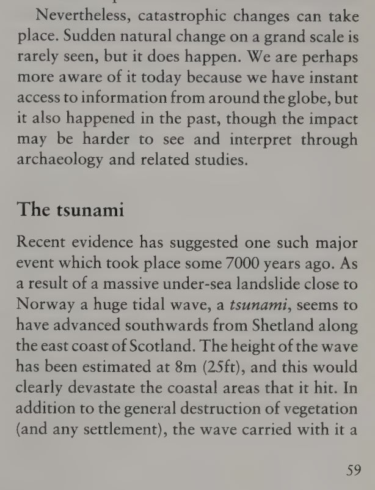
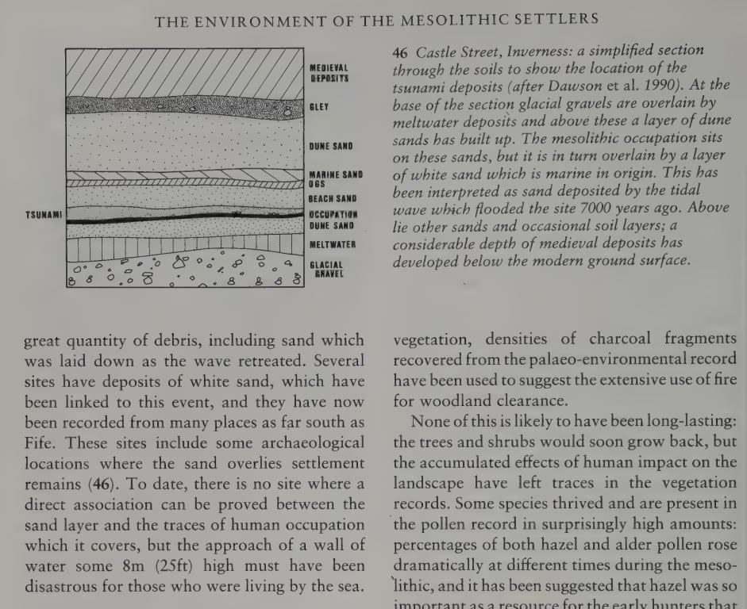

[1] https://archive.org/details/scotlandsfirstse0000wick

Found the precise unadjusted dating obtained from the Scottish tsunami sands - 5325 BC, or 7400 BP.  An exact match to the Noahic deluge on the harmonic timeline. The calibration they applied was to compensate for the presumed changes which the comet (or comets) would have caused to the ozone and C14 levels. If there was no comet, their adjustment would be unnecessary. [1,2]

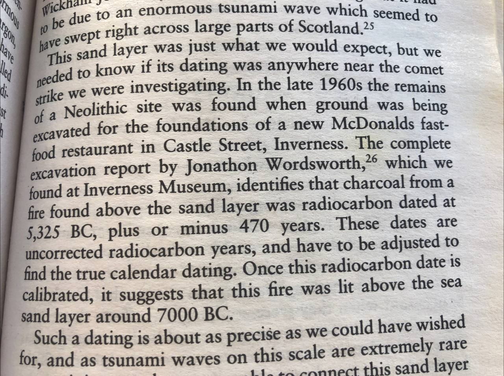

Regarding the book's mention of flood elevation: "Says Castle Street, Inverness. Inverness lies between sea level and about 130m. Castle street must be about half that - around 50-60m asl at least." [2]

See `LOCATION-MAPPING/europe/great-britain` for flood analysis.

## A Minoan and a Neolithic tsunami recorded in coastal sediments of Ios Island, Aegean Sea, Greece

"In this work, we document two distinct tsunami deposits on the coasts of Ios Island, Aegean Sea, Greece. The younger tsunami deposit, dated 1831–1368 cal. BCE, includes both marine sediments and pumices from the ∼1600 BCE Minoan eruption of Santorini volcano. This is the first evidence of the Minoan tsunami in the Cycladic Islands North of Santorini. Tsunami waves inundated the Manganari coastal plain, southern coast of Ios, over a distance >200 m (>2 m a.s.l.). The second tsunami deposit reworks pumice from the 22 ka Cape Riva eruption mixed with marine sediment. We assume a Neolithic age for this major tsunami, with a wave runup >13 m a.s.l. on the southern and eastern coasts of Ios. The source of this tsunami - volcanic eruption, landslide, or earthquake - remains unknown. Additionally, we provide the first on-land evidence of Cape Riva deposits outside Santorini, thus questioning previous estimates on the magnitude of this eruption."

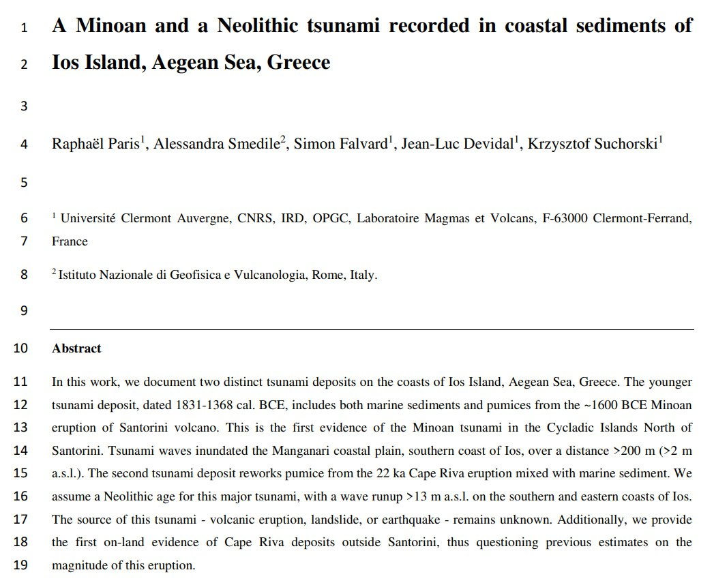

https://www.sciencedirect.com/science/article/abs/pii/S0025322722001797

## 1700 BCish Crete Tsunami

Crete Tsunami. Proximal to 1700BC.

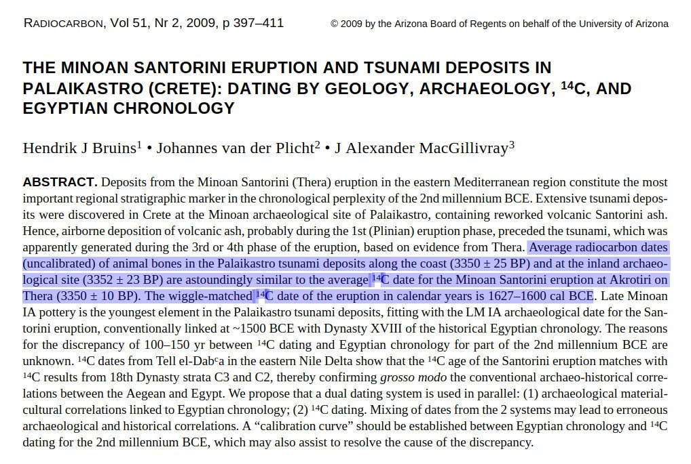

https://sci-hub.ru/10.1017/s003382220005579x

## Crete Tsunami

Another one from Crete.

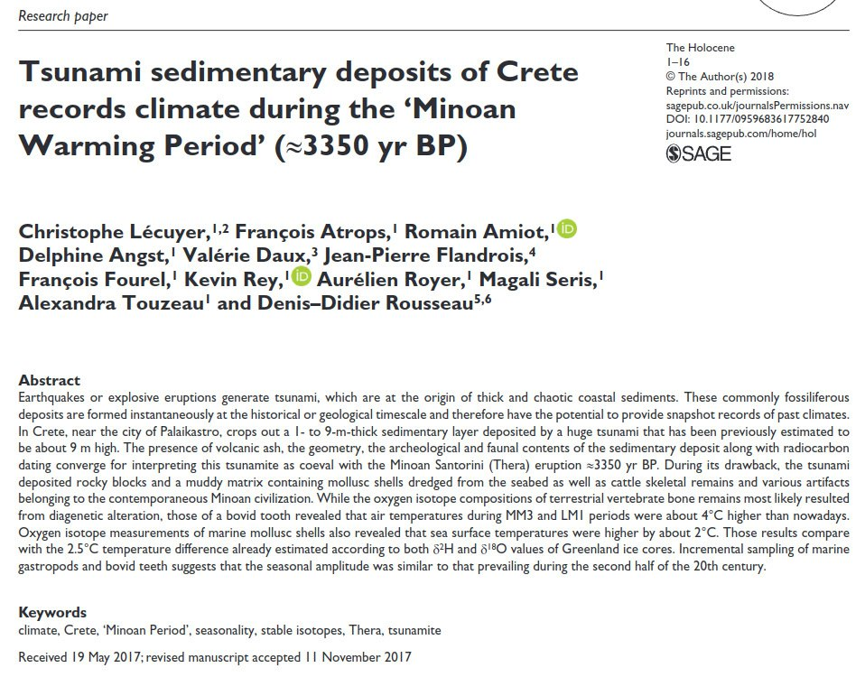

https://sci-hub.ru/10.1177/0959683617752840

## East Mediterranean Flood Deposits

Another paper exploring mega tsunami evidence from cores across the eastern Med, with some special attention given to the wave that hit the north coast of Africa.

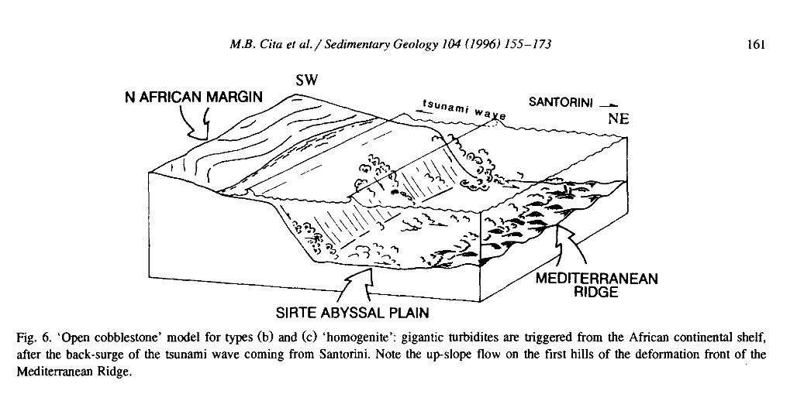
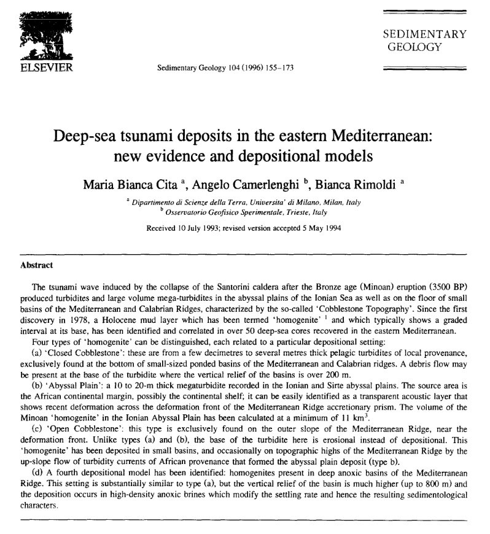

"It is remarkable that the authors here suggest that the Santorini "explosion" in the Aegean and the resulting tsunami affected the Ionian. Ionian is the sea on the *other* side of Greece. The unspoken assumption here is that the wave and ejecta traversed the whole country-peninsula, therefore we talk about a continent level effect. It does not compute, or the true cause hides in plain sight. I do not dispute the eruption(s) of course but they are not the cause, rather the effect, of the flip."

[1] https://sci-hub.ru/10.1016/0037-0738(95)00126-3

## Iceland Flood Deposits

An Icelandic megaflood series dated to have peaked around 3500 BP. That's a long way from the Mediterranean.

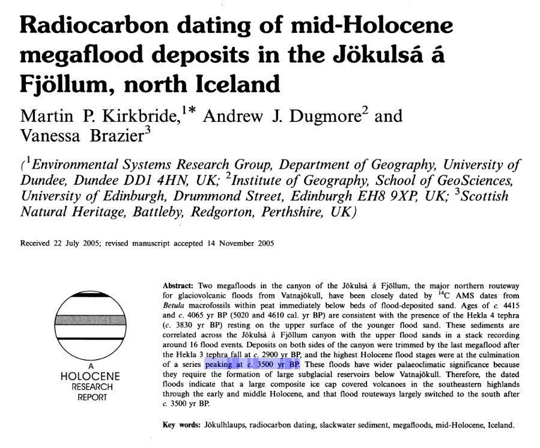

[1] https://sci-hub.ru/10.1191/0959683606hl956rr

## English Channel (hard copy here)

Streamlined islands and the English Channel megaflood hypothesis. The megaflood "islands" lying at the bottom of the English Channel along with the lost lintels.

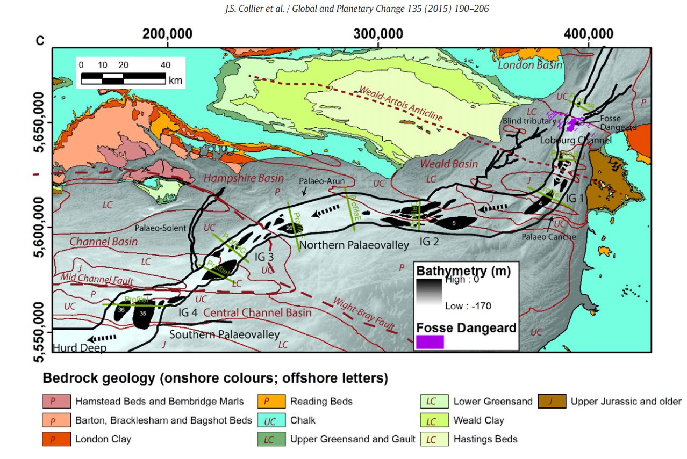
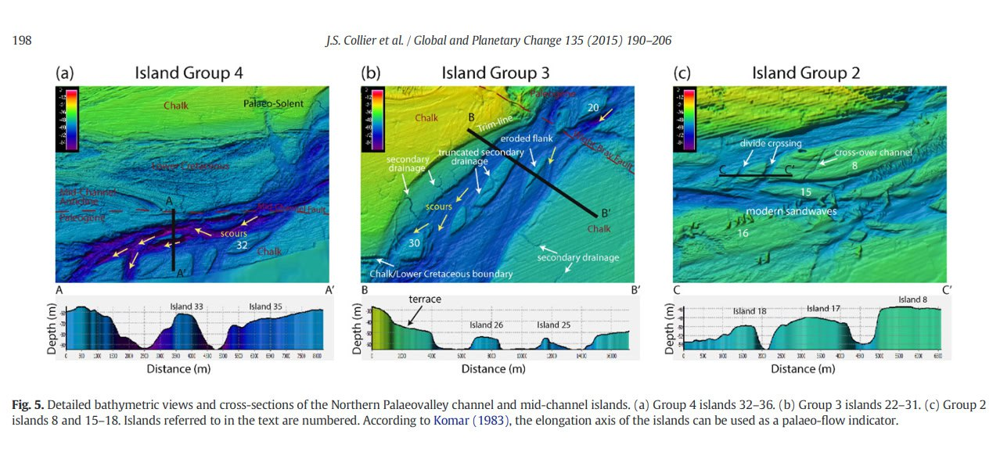
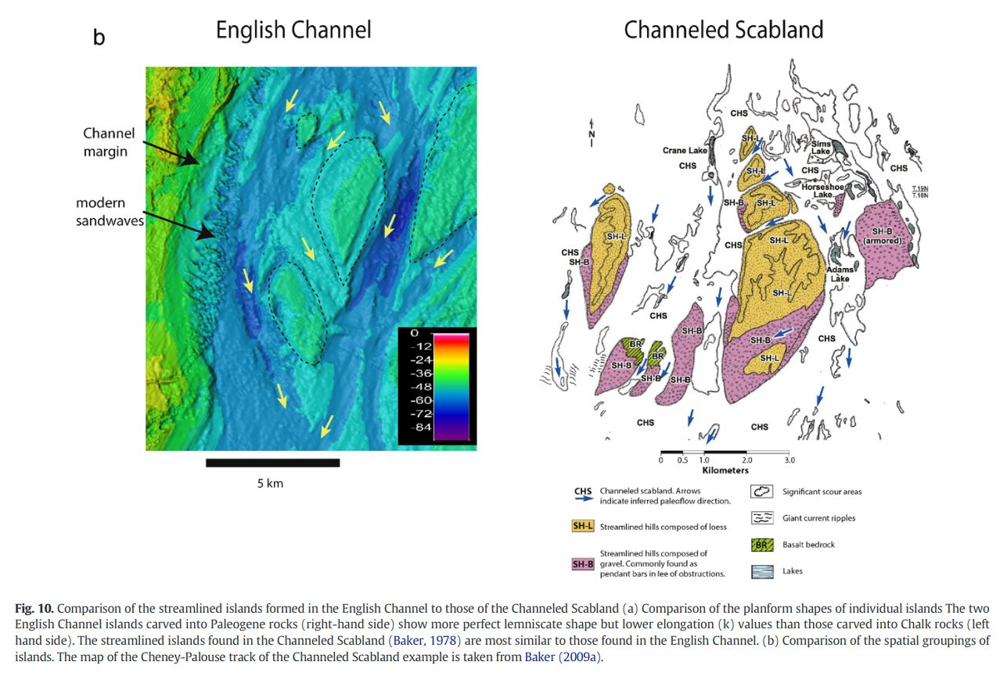

[1] https://sci-hub.ru/10.1016/j.gloplacha.2015.11.004

The Weichselian glacial limit is the ice sheet that supposedly laid down the land that makes up the East Yorkshire coast (Holderness). The whole boundary looks very confused and doesn't make a lot of sense compared to the other 2 limits that show lines of ice sheets that encroached evenly from the North. I wonder if they are basing it on sediment deposits which were actually laid down by a deluge.

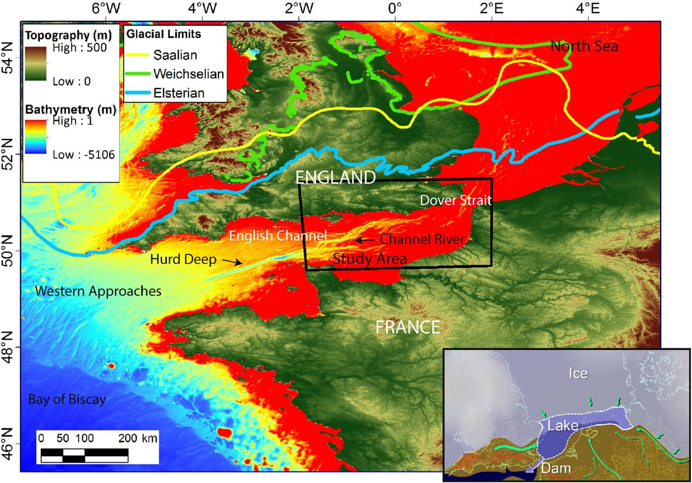

"A good question. I know that many of these lines are mapped according to the extremity of found markers, such as erratics, moraines, erosion, loess etc. The scale of the Isles' anticlines is quite amazing - almost as though they're very large sedimentary deposits from some earlier time. The sheer amount of dead stuff buried in the ground everywhere definitely reinforces the idea." [2]

This "plunge pool" is big enough to swallow a small city.

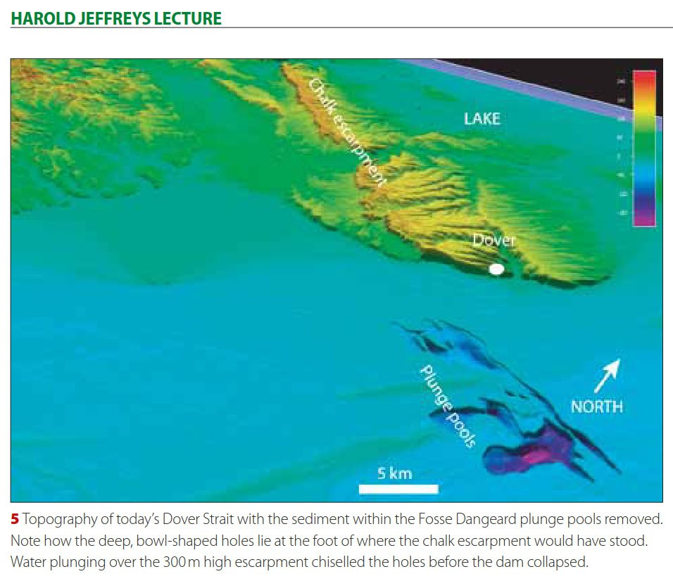

Wow. So the deluge smashed a hole in the chalk hills that used to run between England and France?

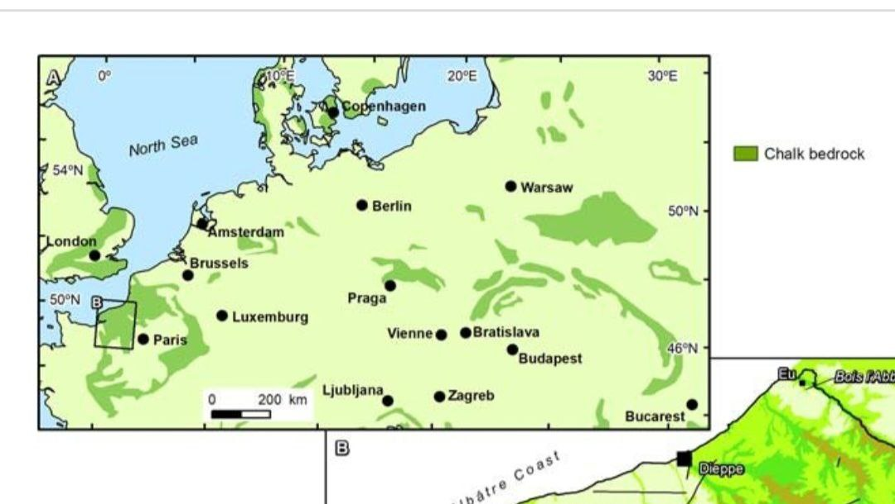

## Garth Tsunami 3500 BC? Evidence doesn't support

"This paper evaluates to what extent archaeological settlement sites from the Norwegian west coast exhibit traces
of a paleotsunami impact in the mid-4th mill BCE. The timing of the Garth tsunami (~3500 cal BCE), as inferred
from lake basins in Eastern Shetland and in Western Norway, coincides with the Early-Middle Neolithic tran-
sition in the Western Norwegian chronology. Before and after the Garth tsunami, the west coast of Norway was
populated by hunter-fisher-gatherers highly adapted to a marine environment. If the Garth tsunami had a direct
impact on coastal settlements, the event could become an important mediating factor for research on the Early-
Middle Neolithic transition in this region. The paper investigates radiocarbon dates and stratigraphic evidence
from 15 coastal settlement sites. It applies Bayesian sequence calculation to test for congruence between site
activity phases and the tsunami event, and a Monte Carlo based frequency analysis to test for population fluc-
tuations. Results from these analyses do not support the hypothesis of a catastrophic impact on the hunter-fisher-
gatherer population in Western Norway."

https://sci-hub.ru/10.1016/j.jasrep.2020.102464

## Lisbon Tsunami

Lisbon. Tsunami c.3600 BP

"The well-known 1755 CE Lisbon tsunami caused widespread destruction along the Iberian and northern Moroccan coastlines. Being affected by the powerful 1755 CE Lisbon tsunami, the southwestern Algarve shelf provides environments for detecting offshore tsunami imprints. Our multidisciplinary investigations (hydroacoustics, sedimentology, geochemistry, radiocarbon dating) of the Holocene sediments have revealed tsunami deposits linked to this tsunami and a ca. 3600 cal yr BP event. The latter event is until now unidentified in Portugal. Both event deposits contrast with the background shelf sedimentation by their coarser grain size, element composition, internal structure, and erosive base, making them discernible in the sub-bottom data and cores. Especially the ca. 3600 cal yr BP deposit is exceptionally well-preserved at one of the coring sites. The clear differentiation into several sections enables further insights into offshore tsunami transport and depositional processes. This study demonstrates that the record and preservation of tsunami deposits were possible on the Algarve shelf in specific locations sheltered from possible alterations. Our findings extend the tsunami catalogs of Portugal with a previously unknown tsunami dated to ca. 3600 cal yr BP."

https://www.sciencedirect.com/science/article/abs/pii/S0037073823000416

## Very high energy sedimentation (supratidal hurricane deposits) and Mid-Holocene highstand on carbonate platforms, Andros, Bahamas: An alternative view (hard copy here)

"On the basis of 14C dates, I conclude that the whole area was flooded about 5000 years BP and then was covered by the subtidal greyish mud facies, rich in Peneroplids, in the area of Deep Creek (north of the study area), Pelican Creek and Wide Opening (southeast of the study area). The level of this paleo-Great Bahama Bank Sea continued to rise until 3500 years BP and then slowly fell asymptotically toward the present-day level."

## Mid-Holocene environmental changes in the Bay of Skaill, Mainland Orkney, Scotland: an integrated geomorphological, sedimentological and stratigraphical study

Layers of shells separated by a layer of silt at around 3200 BC.

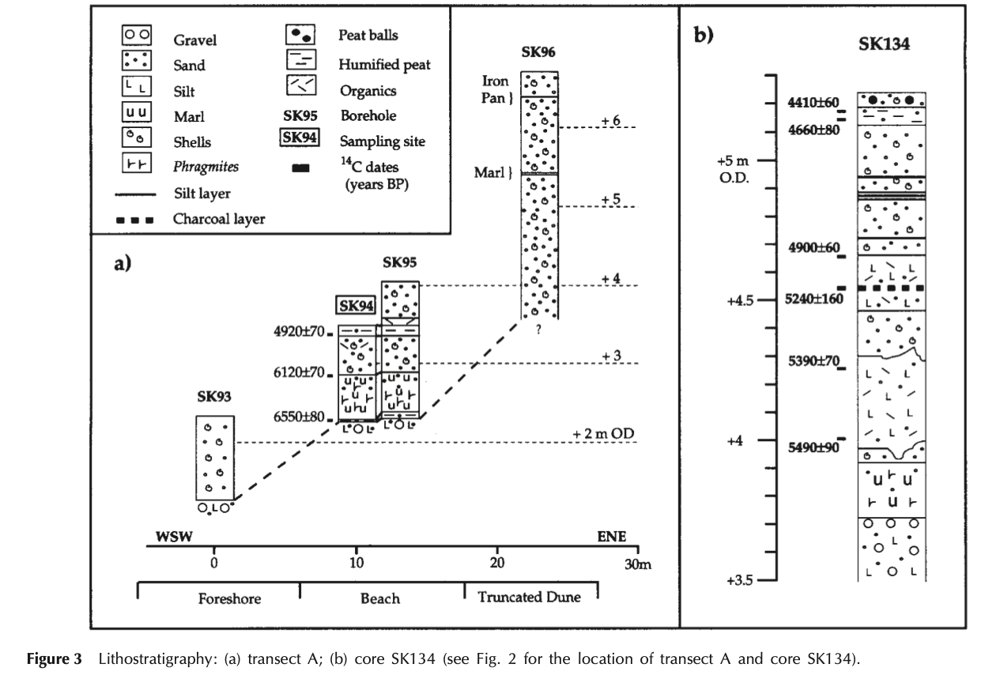

A gap in organic material between 4000 and 3000 BC. I personally think it's more likely that a sediment deposit closer to 3000 BC wiped out some of the older deposits, creating the 1000 year gap.

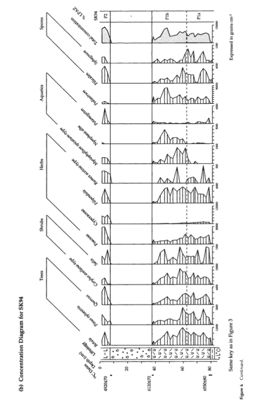

## Citations

1. Uriel's Machine
2. https://nobulart.com