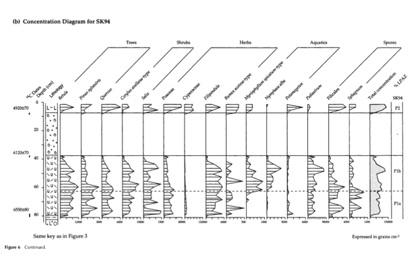

# Sediment Deposits

## Answers in Genesis

Great read, Answers in Genesis: https://assets.answersresearchjournal.org/doc/v12/coconino_sandstone.pdf

## East Mediterranean Flood Deposits

Another paper exploring mega tsunami evidence from cores across the eastern Med, with some special attention given to the wave that hit the north coast of Africa.

"It is remarkable that the authors here suggest that the Santorini "explosion" in the Aegean and the resulting tsunami affected the Ionian. Ionian is the sea on the *other* side of Greece. The unspoken assumption here is that the wave and ejecta traversed the whole country-peninsula, therefore we talk about a continent level effect. It does not compute, or the true cause hides in plain sight. I do not dispute the eruption(s) of course but they are not the cause, rather the effect, of the flip."

[1] https://sci-hub.ru/10.1016/0037-0738(95)00126-3

## Iceland Flood Deposits

An Icelandic megaflood series dated to have peaked around 3500 BP. That's a long way from the Mediterranean.

[1] https://sci-hub.ru/10.1191/0959683606hl956rr

## English Channel (hard copy here)

Streamlined islands and the English Channel megaflood hypothesis. The megaflood "islands" lying at the bottom of the English Channel along with the lost lintels.

[1] https://sci-hub.ru/10.1016/j.gloplacha.2015.11.004

The Weichselian glacial limit is the ice sheet that supposedly laid down the land that makes up the East Yorkshire coast (Holderness). The whole boundary looks very confused and doesn't make a lot of sense compared to the other 2 limits that show lines of ice sheets that encroached evenly from the North. I wonder if they are basing it on sediment deposits which were actually laid down by a deluge.

"A good question. I know that many of these lines are mapped according to the extremity of found markers, such as erratics, moraines, erosion, loess etc. The scale of the Isles' anticlines is quite amazing - almost as though they're very large sedimentary deposits from some earlier time. The sheer amount of dead stuff buried in the ground everywhere definitely reinforces the idea." [2]

This "plunge pool" is big enough to swallow a small city.

Wow. So the deluge smashed a hole in the chalk hills that used to run between England and France?

### Beneath the water of the...

Beneath the water of the English Channel lies evidence of two megaflood events. [1] Catastrophic flooding origin of shelf valley systems in the English Channel, Gupta et al (2007) https://t.co/QVkZlKzNEn https://t.co/QQcC55f8BI

## Garth Tsunami 3500 BC? Evidence doesn't support

"This paper evaluates to what extent archaeological settlement sites from the Norwegian west coast exhibit traces
of a paleotsunami impact in the mid-4th mill BCE. The timing of the Garth tsunami (~3500 cal BCE), as inferred
from lake basins in Eastern Shetland and in Western Norway, coincides with the Early-Middle Neolithic tran-
sition in the Western Norwegian chronology. Before and after the Garth tsunami, the west coast of Norway was
populated by hunter-fisher-gatherers highly adapted to a marine environment. If the Garth tsunami had a direct
impact on coastal settlements, the event could become an important mediating factor for research on the Early-
Middle Neolithic transition in this region. The paper investigates radiocarbon dates and stratigraphic evidence
from 15 coastal settlement sites. It applies Bayesian sequence calculation to test for congruence between site
activity phases and the tsunami event, and a Monte Carlo based frequency analysis to test for population fluc-
tuations. Results from these analyses do not support the hypothesis of a catastrophic impact on the hunter-fisher-
gatherer population in Western Norway."

https://sci-hub.ru/10.1016/j.jasrep.2020.102464

## Lisbon Tsunami

Lisbon. Tsunami c.3600 BP

"The well-known 1755 CE Lisbon tsunami caused widespread destruction along the Iberian and northern Moroccan coastlines. Being affected by the powerful 1755 CE Lisbon tsunami, the southwestern Algarve shelf provides environments for detecting offshore tsunami imprints. Our multidisciplinary investigations (hydroacoustics, sedimentology, geochemistry, radiocarbon dating) of the Holocene sediments have revealed tsunami deposits linked to this tsunami and a ca. 3600 cal yr BP event. The latter event is until now unidentified in Portugal. Both event deposits contrast with the background shelf sedimentation by their coarser grain size, element composition, internal structure, and erosive base, making them discernible in the sub-bottom data and cores. Especially the ca. 3600 cal yr BP deposit is exceptionally well-preserved at one of the coring sites. The clear differentiation into several sections enables further insights into offshore tsunami transport and depositional processes. This study demonstrates that the record and preservation of tsunami deposits were possible on the Algarve shelf in specific locations sheltered from possible alterations. Our findings extend the tsunami catalogs of Portugal with a previously unknown tsunami dated to ca. 3600 cal yr BP."

https://www.sciencedirect.com/science/article/abs/pii/S0037073823000416

## Very high energy sedimentation (supratidal hurricane deposits) and Mid-Holocene highstand on carbonate platforms, Andros, Bahamas: An alternative view (hard copy here)

"On the basis of 14C dates, I conclude that the whole area was flooded about 5000 years BP and then was covered by the subtidal greyish mud facies, rich in Peneroplids, in the area of Deep Creek (north of the study area), Pelican Creek and Wide Opening (southeast of the study area). The level of this paleo-Great Bahama Bank Sea continued to rise until 3500 years BP and then slowly fell asymptotically toward the present-day level."

https://www.sciencedirect.com/science/article/abs/pii/S0037073806003320

## Mid-Holocene environmental changes in the Bay of Skaill, Mainland Orkney, Scotland: an integrated geomorphological, sedimentological and stratigraphical study (Skara Brae)

Layers of shells separated by a layer of silt at around 3300 to 2900 BC, and a deposit from 4000 to 3000 BC.

Here you see the shells separated by silt along with a charcoal layer, on the right:

Here you see a gap in organic material between 4000 and 3000 BC. I personally think it's more likely that a sediment deposit closer to 3000 BC wiped out some of the older deposits, creating the 1000 year gap.

https://www.researchgate.net/publication/230509248_Mid-Holocene_environmental_changes_in_the_Bay_of_Skaill_Mainland_Orkney_Scotland_An_integrated_geomorphological_sedimentological_and_stratigraphical_study

## North Dakota flood deposit

Extraterrestrial impact ejecta found in the gills of fish that died in the Chicxulub event, over 3,000 km from the impact. This is a fascinating paper. Some of the strongest evidence yet presented for catastrophic global extinction-level impact events.

This impact is dated to a very, very long time ago.

https://annas-archive.org/md5/02ed24cd1785fa4f69f60837deb81863

https://www.pnas.org/doi/epdf/10.1073/pnas.1817407116

This paper contains excellent proof of massive seiche occurring four times (two flow reversals) laying down METERS of debris in a matter of hours.

If the water retreats away from you during the initial move, then its almost certainly going to come back from whence it went to. Same thing applies if you're in the path of the first movement - vast amounts are going to run back off of the land after the initial wave. There's no getting away from this anywhere really. Chan describes it best.

## Lençóis Maranhenses National Park, Brazil

"Have you ever heard of a desert with more water than sand?"

https://x.com/AMAZlNGNATURE/status/1815397395435278535?t=tAntSVsUEkdtxMZH0EzQOQ&s=19

## TWO "marine incursion" events in southwestern Australia at 7340 and 3550 YBP.
"In early 2021 several tree stumps embedded in a remnant peat deposit were found in the intertidal zone of Wharton Beach, southwestern Australia by Esperance Tjaltjraak Rangers. Attempts were made to identify the tree using both dendrochronological and anthracological methods but were limited by the lack of reference information from tree species in the southwestern Australia. Radiocarbon dates from one stump indicates the tree lived for approximately 200years, growing into the peaty sediments sometime before ca. 7340 cal yrs BP and died directly or indirectly as a result of marine transgression. The peat deposit is dated to 7608–7429 cal yrs BP but its exposed seaward edge was unconformably underlain by younger sand, dated by OSL to around 3550 years, which may have intruded as a result of a storm event."
[1] https://journals.sagepub.com/doi/pdf/10.1177/09596836231157067

## Canada Bog Outwash Deposit Dating

Sequential Newfoundland bog outwash deposits dating to the 3700 year planetary harmonic (V) at 3610±100 BP and 7400±150 BP as reported in Geological Survey of Canada, Radiocarbon Dates I and II (1963) [1][2]. Added to the Events Database [3].
[1] https://x.com/nobulart/status/1826653555400298541
[2] https://archive.org/details/31761108187352
[3] https://docs.google.com/spreadsheets/d/12wWdujQop8mkRSnj3LgZ5VSc_cAVShsOyCXYEofj664/

## The Deep (https://nobulart.com/the-deep/)

In July 1947 a Swedish deep-sea expedition left Göteborg on the Albatross for a fifteen-month journey around the world to investigate the bottom of the seas on the seventeen thousand miles of the ship’s course with the help of a newly constructed vacuum core sampler. In the sediment that covers the rocky bottom of the oceans the expedition found, in the words of its leader, H.Pettersson, director of the Oceanographic Institute at Göteborg, “evidence of great catastrophes that have altered the face of the earth.”
https://nobulart.com/the-deep

Could a micronova account for this meteroric dust?

I had the thought, arising from the SAFIRE experiements, that Nickel is a major byproduct of plasma reactions. Very likely the reason that space debris is nickel-rich. Yes. It could be.

### GPT Summary

Immanuel Velikovsky's Earth in Upheaval explores geological evidence of cataclysmic events that have shaped Earth's oceans and continents. The 1949 expedition to the Mid-Atlantic Ridge led by Professor M. Ewing uncovered prehistoric beach sand miles beneath the ocean, suggesting that land masses had either sunk drastically or the sea level had been far lower in the past. Additionally, the surprisingly thin sediment layers in the ocean basins contradicted assumptions about their accumulation over millions of years, while the thick sediment on the Ridge's flanks indicated more recent geological activity. These findings suggested dramatic upheavals, including volcanic eruptions and tectonic shifts that reshaped the ocean floor.

Further evidence from global expeditions, such as the Swedish Albatross journey, revealed volcanic layers, meteoric dust, and other signs of past catastrophes. The sediments and red clays of ocean floors bore traces of cosmic and terrestrial upheavals, including meteoric showers, volcanic explosions, and massive tectonic movements. These events likely caused tidal waves and dramatic alterations to Earth's surface. Velikovsky connects these findings to a broader pattern of violent disruptions, underscoring the Earth's dynamic and tumultuous history, far from the stable processes often assumed in conventional geology.

## Citations

1. Uriel's Machine
2. https://nobulart.com