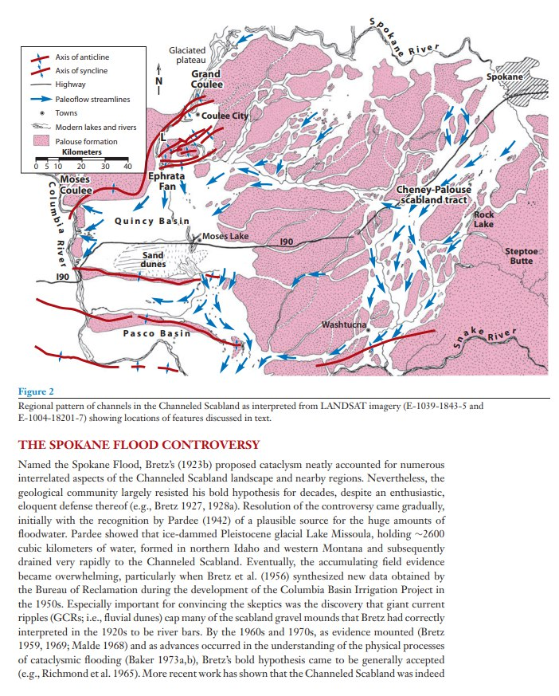
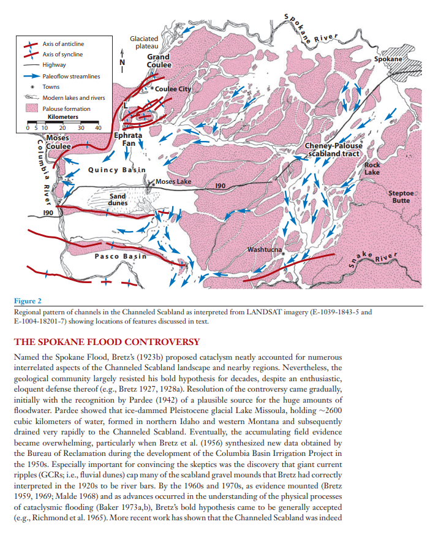

# Channelled Scablands

## Scablands flood deposits

The Channelled Scablands. 

Evidence of a deluge which has been put on ice. A widely accepted thesis, published exactly 100 years after Reliquoæ Diluvianæ, relegated to the deepfreeze along with every other item of non-uniforitarium evidence. Giant Current Ripples 60m wide and 2m high, created by water flows 50m deep, which carried boulders the size of churches kilometers across the landscape. Not once, but at least five times.

https:// (https://t.co/KT2XAP4jWl)geo.umass.edu/climate/papers (https://t.co/KT2XAP4jWl)2/Baker_retrospective_2009.pdf (https://t.co/KT2XAP4jWl)

The Mount St. Helens S-Set [red line] in the gravel bar illustration was laid down just before the Younger Dryas Boundary, so we have three lesser floods before then, and at least two major ones since the YDB.

Potential explanation for the Scablands flood deposits based on the ECDO. The "Set S" tephta is an ash layer from Mt. Saint Helens and is a temporal marker for the termination of the Younger Dryas.

https://www.geo.umass.edu/climate/papers2/Baker_retrospective_2009.pdf

Video: https://youtu.be/NYA6GF1uAa8

### Revisiting the Channelled Scablands flood...

Revisiting the Channelled Scablands flood deposit sequence through the lens of the 3,700-year cycle. The "Set S" tephta is an ash layer from Mt. Saint Helens and is a temporal marker for the termination of the Younger Dryas. [1] https://t.co/lKpgDHwlWx [2] https://t.co/yE2ML0rhdX… https://t.co/VPioThnB8S https://t.co/7nhRmPhhYO

### "Scabland channel ways [..] experienced...

"Scabland channel ways [..] experienced very deep flood flows. As a consequence, scabland bars are tens of meters in height, with an internal structure of foreset bedding. Some of the bars display an accretionary internal structure that indicates a history of multiple emplacing… https://t.co/COpwC2tbhO

### The Channelled Scablands. Evidence of...

The Channelled Scablands. Evidence of a deluge which has been put on ice. A widely accepted thesis, published exactly 100 years after Reliquoæ Diluvianæ, relegated to the deepfreeze along with every other item of non-uniforitarium evidence. https://t.co/lKpgDHwlWx https://t.co/OqKe6brzU4

### https://t.co/lKpgDHwlWx https://t.co/WxP3h5f86c

https://t.co/lKpgDHwlWx https://t.co/WxP3h5f86c

### We're going to take a...

We're going to take a look at these next. "In recent years, however, cataclysmic flood landscapes with many similarities to the Channeled Scabland have increasingly been documented in many parts of the world (Baker 1997, 2002, 2007). Spectacular examples of GCRs [Giant Current…