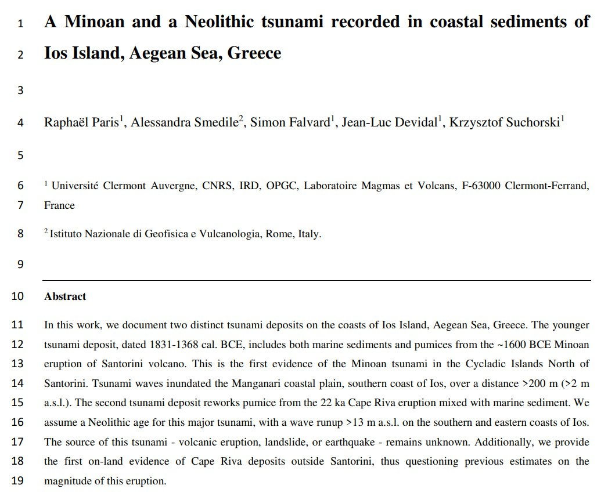
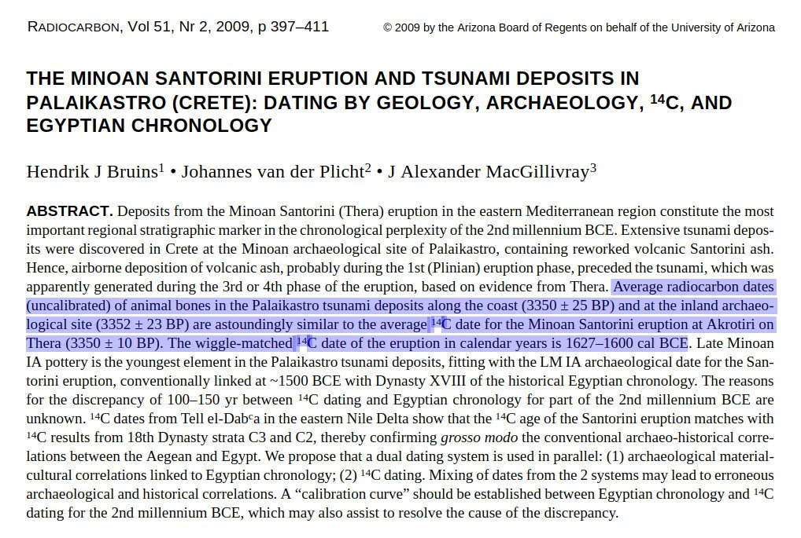
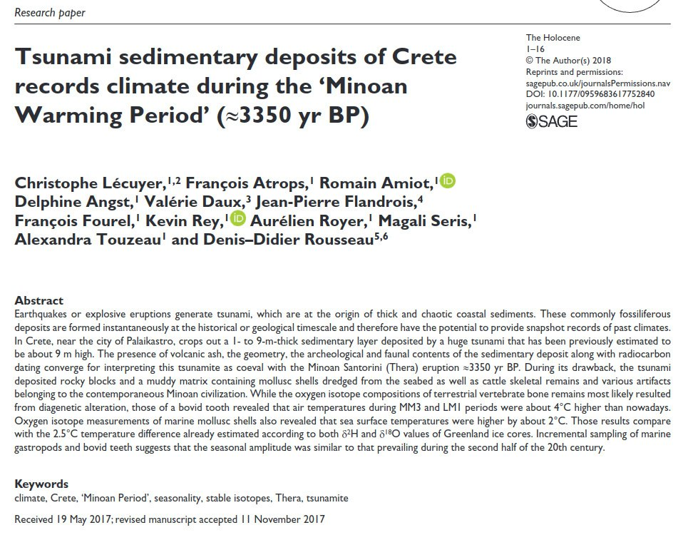

# Crete Flood/tsunami deposits

## A Minoan and a Neolithic tsunami recorded in coastal sediments of Ios Island, Aegean Sea, Greece

"In this work, we document two distinct tsunami deposits on the coasts of Ios Island, Aegean Sea, Greece. The younger tsunami deposit, dated 1831–1368 cal. BCE, includes both marine sediments and pumices from the ∼1600 BCE Minoan eruption of Santorini volcano. This is the first evidence of the Minoan tsunami in the Cycladic Islands North of Santorini. Tsunami waves inundated the Manganari coastal plain, southern coast of Ios, over a distance >200 m (>2 m a.s.l.). The second tsunami deposit reworks pumice from the 22 ka Cape Riva eruption mixed with marine sediment. We assume a Neolithic age for this major tsunami, with a wave runup >13 m a.s.l. on the southern and eastern coasts of Ios. The source of this tsunami - volcanic eruption, landslide, or earthquake - remains unknown. Additionally, we provide the first on-land evidence of Cape Riva deposits outside Santorini, thus questioning previous estimates on the magnitude of this eruption."

https://www.sciencedirect.com/science/article/abs/pii/S0025322722001797

## 1350 BC Crete Tsunami

Palaikastro. Crete Tsunami.

https://sci-hub.ru/10.1017/s003382220005579x

## 1350 BC Crete Tsunami

Another one from Crete.

https://sci-hub.ru/10.1177/0959683617752840